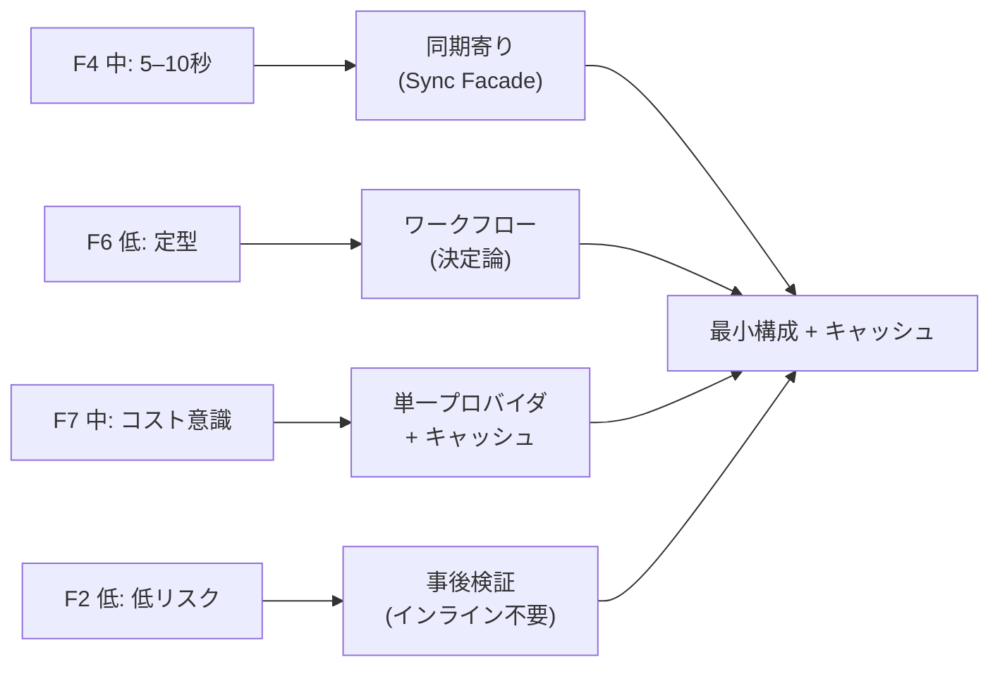
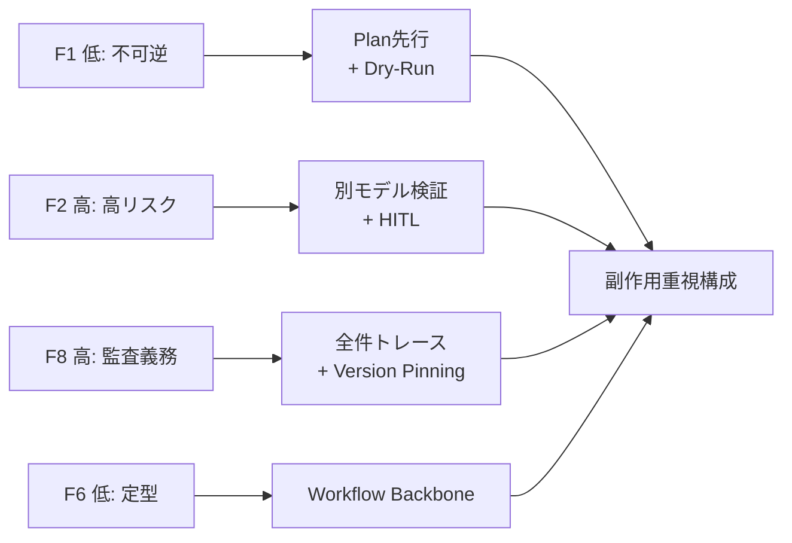
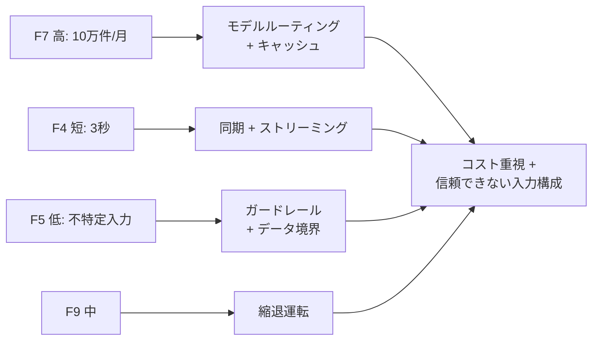

# 通し例（Worked Examples）

!!! abstract "一言"
    3つの具体システムで「フォース評価 → 二者択一 → ダイヤル → 複合構成 → ADR」を一気通貫で示す。

## この章の目的

[意思決定の進め方](decision-flow.md) の①〜⑤を、具体的なシステムを題材にして実演する。「フォースが二者択一とダイヤルを経て、パターン選定を駆動する」という因果の流れを、矢印で追っていく。

---

## 例1: 社内ドキュメントRAGチャットボット

### 文脈

社内のドキュメント（Confluence/Notion）を検索し、社員の質問に回答するチャットボット。社内ユーザー約500人、月間数千クエリ。

### フォース評価

| フォース | 評価 | 根拠 |
|---------|------|------|
| F1 可逆性 | **高** | 読み取り専用。副作用なし |
| F2 失敗コスト | **低** | 誤回答でも業務に致命的でない |
| F3 リクエスト価値 | **低** | 大量の軽い質問 |
| F4 レイテンシ予算 | **中** | 5–10秒で返したい |
| F5 入力の信頼度 | **高** | 社内ユーザーのみ |
| F6 タスクの変動性 | **低** | 検索＋要約の定型パターン |
| F7 コスト感度 | **中** | 月額予算あり |
| F8 説明責任 | **低** | 社内ツール |
| F9 プロバイダ信頼度 | **中** | 単一プロバイダで開始 |

### 意思決定

| 二者択一 | 選択 | 効いたフォース |
|---------|------|--------------|
| 同期↔非同期 | **同期**（Sync Facade で超過時は非同期昇格） | F4 中 |
| ワークフロー↔エージェント | **ワークフロー** | F6 低 |
| RAG↔FT | **RAG** | ドキュメント更新頻度が高い |
| 単一↔マルチプロバイダ | **単一** | F9 中（まだ問題なし） |
| インライン↔事後検証 | **事後** | F2 低 |

| ダイヤル | 設定値 | 根拠 |
|---------|--------|------|
| タイムアウト | 同期8秒 / 非同期2分 | F4 中 |
| 検索 top-k | 10 | 精度とレイテンシのバランス |
| キャッシュ類似度閾値 | 0.95 | F7 中でコスト削減 |
| トレースサンプリング率 | 10% | F8 低 |

### 採用パターン

[最小構成](../reference-architectures.md) + キャッシュ層:

- [#58 Sync Facade](../patterns/01-execution/58-sync-facade-over-async-core.md) — 同期/非同期ハイブリッド
- [#24 Context Pack / Assembly](../patterns/05-memory-context/24-context-pack-assembly.md) — RAG
- [#14 Structured Output Contract](../patterns/03-io-contract/14-structured-output-contract.md) — 出力構造化
- [#38 Semantic Result Cache](../patterns/08-cost-scaling/38-semantic-result-cache.md) — 類似クエリ再利用
- [#32 Agent Trace](../patterns/07-observability/32-agent-trace.md) — 最低限の観測

### 再評価条件

- F7 が高に変わったら（QPS 10倍超）→ モデルルーティング [#37] を追加
- F8 が高に変わったら（監査要件追加）→ トレース100%化、Version Pinning [#33] を追加

---

## 例2: 決済補助エージェント

### 文脈

ECサイトの決済処理を補助するエージェント。注文内容の確認、在庫照会、決済API呼び出し、確認メール送信を行う。

### フォース評価

| フォース | 評価 | 根拠 |
|---------|------|------|
| F1 可逆性 | **低** | 決済・メール送信は不可逆 |
| F2 失敗コスト | **高** | 誤課金は返金対応・信頼毀損 |
| F3 リクエスト価値 | **高** | 1件が数千〜数万円の取引 |
| F4 レイテンシ予算 | **中** | 30秒程度は許容 |
| F5 入力の信頼度 | **中** | 認証済みユーザーだが自然言語入力 |
| F6 タスクの変動性 | **低** | 注文→確認→決済→通知の固定フロー |
| F7 コスト感度 | **低** | 取引額に対してLLMコストは微小 |
| F8 説明責任 | **高** | 決済記録の保持義務 |
| F9 プロバイダ信頼度 | **中** | 可用性は重要だが、障害時は人間にフォールバック |

### 意思決定

| 二者択一 | 選択 | 効いたフォース |
|---------|------|--------------|
| 同期↔非同期 | **非同期** | F4 中（30秒超もありうる） |
| Plan↔ReAct | **Plan先行** | F1 低・F2 高 |
| ワークフロー↔エージェント | **ワークフロー** | F6 低 |
| インライン↔事後検証 | **インライン** | F2 高 |
| 同一↔別モデル検証 | **別モデル** | F2 高 |

| ダイヤル | 設定値 | 根拠 |
|---------|--------|------|
| チェックポイント頻度 | 毎ステップ | F1 低 |
| 自律性レベル | 低（決済前は必ず人間承認） | F2 高 |
| トレースサンプリング率 | 100% | F8 高 |
| ガードレール厳しさ | 高（金額異常検知） | F2 高 |

### 採用パターン

[副作用重視構成](../reference-architectures.md):

- [#1 Request-to-Job Gateway](../patterns/01-execution/01-request-to-job-gateway.md) — 非同期受付
- [#3 Workflow Backbone](../patterns/01-execution/03-workflow-backbone-agent-node.md) — 決定論的フロー
- [#4 Agent Saga](../patterns/01-execution/04-agent-saga.md) — 補償トランザクション
- [#15 Inverted Structured Output](../patterns/03-io-contract/15-inverted-structured-output.md) — LLMは判断のみ
- [#19 Dry-Run First](../patterns/04-tools-mcp/19-dry-run-first-tool-execution.md) — 模擬実行
- [#28 Verifier Agent](../patterns/06-reliability/28-verifier-agent-critic.md) — 別モデル検証
- [#31 Human Approval](../patterns/06-reliability/31-human-approval-checkpoint.md) — 決済前承認
- [#32 Agent Trace](../patterns/07-observability/32-agent-trace.md) + [#33 Version Pinning](../patterns/07-observability/33-version-pinning.md) — 監査証跡

### 再評価条件

- F7 が高に変わったら（取引量急増）→ ルーティング [#37] とキャッシュ [#38] を追加
- F9 が低に変わったら → フォールバック [#40] を追加

---

## 例3: 大量カスタマーサポートボット

### 文脈

月間10万件の問い合わせを処理するカスタマーサポートチャットボット。FAQ回答、注文状況照会、返品手続き案内を行う。エンドユーザーが直接利用。

### フォース評価

| フォース | 評価 | 根拠 |
|---------|------|------|
| F1 可逆性 | **中** | FAQ回答は可逆、返品手続きは一部不可逆 |
| F2 失敗コスト | **中** | 誤案内はクレームにつながるが致命的ではない |
| F3 リクエスト価値 | **低** | 大量の定型問い合わせ |
| F4 レイテンシ予算 | **短** | 3秒以内で初回応答 |
| F5 入力の信頼度 | **低** | 不特定エンドユーザーの自然言語 |
| F6 タスクの変動性 | **中** | 定型FAQと非定型相談の混在 |
| F7 コスト感度 | **高** | 10万件/月のスケール |
| F8 説明責任 | **中** | 顧客対応記録の保持 |
| F9 プロバイダ信頼度 | **中** | ダウンタイムは顧客体験に直結 |

### 意思決定

| 二者択一 | 選択 | 効いたフォース |
|---------|------|--------------|
| 同期↔非同期 | **同期**（ストリーミング併用） | F4 短 |
| シングル↔マルチエージェント | **シングル** + ルーティング | F7 高 |
| RAG↔FT | **RAG** | FAQ更新頻度 |
| Fail-fast↔縮退 | **縮退** | F9 中 |
| 構造化↔自由出力 | **ハイブリッド**（内部は構造化、ユーザー向けは自由） | F5 低 |

| ダイヤル | 設定値 | 根拠 |
|---------|--------|------|
| タイムアウト | 同期5秒 | F4 短 |
| モデル階層閾値 | 信頼度0.85以上で小モデル | F7 高 |
| キャッシュ類似度閾値 | 0.93 | F7 高（ヒット率重視） |
| ガードレール厳しさ | 中〜高 | F5 低 |
| トレースサンプリング率 | 5% | F7 高 + F8 中 |
| 検索 top-k | 5 | F4 短（速度優先） |

### 採用パターン

[コスト重視構成](../reference-architectures.md) + [信頼できない入力構成](../reference-architectures.md):

- [#37 Semantic Gateway](../patterns/08-cost-scaling/37-semantic-gateway-cost-aware-router.md) — 難易度別ルーティング
- [#38 Semantic Result Cache](../patterns/08-cost-scaling/38-semantic-result-cache.md) — FAQ類似クエリの再利用
- [#56 Adaptive Effort](../patterns/08-cost-scaling/56-adaptive-effort.md) — 計算量調整
- [#40 Fallback](../patterns/08-cost-scaling/40-fallback-graceful-degradation.md) — 障害時の縮退
- [#13 NL Boundary Adapter](../patterns/03-io-contract/13-natural-language-boundary-adapter.md) — 入力構造化
- [#42 Data Boundary Firewall](../patterns/09-security/42-data-boundary-firewall.md) — PII検査
- [#29 Guardrail Sidecar](../patterns/06-reliability/29-guardrail-sidecar-self-correction.md) — 出力検査
- [#7 Streaming Progress](../patterns/01-execution/07-streaming-progress.md) — 逐次応答

### 再評価条件

- F2 が高に変わったら（返品手続きの自動実行を追加）→ Agent Saga [#4]、Human Approval [#31] を追加
- F8 が高に変わったら（規制対応）→ トレース100%化、Policy-as-Code [#30] を追加

---

## まとめ

3つの例に共通する流れは以下のとおりである。

1. まず**フォースを評価**して、「高い」ものを特定する
2. 高いフォースが **二者択一の選択を決定** する（たとえば F2高→Plan先行、F7高→ルーティングなど）
3. 二者択一の選択が **ダイヤルの値域を制約** する（たとえば同期→タイムアウト短、マルチ→予算N倍など。→ [相互作用](interactions.md)）
4. パターンは **決定の結果として選ばれる語彙** であり、出発点ではない

因果は常に **フォース → 決定 → パターン** の向きで流れる。この流れを [ADR](adr-template.md) に記録し、フォースが変わったら再評価する。

## 関連ページ

- [意思決定の進め方](decision-flow.md) — このページが実演するワークフロー
- [フォース別逆引き](by-force.md) — フォースから引く場合の辞書
- [リファレンスアーキテクチャ](../reference-architectures.md) — 複合構成のテンプレート
- [意思決定記録（ADR）](adr-template.md) — 記録のフォーマット
