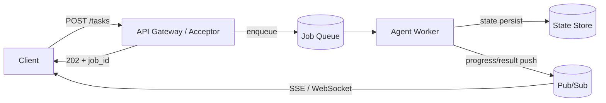

# #1 Request-to-Job Gateway

!!! abstract "TL;DR"
    Accept a single request not as a synchronous API call but as an **asynchronous job**, decoupling the actual processing from the web lifecycle.

<!-- BEGIN:GEN:meta -->

Metadata (machine-readable) — #1 Request-to-Job Gateway

| Field | Value |
|------|-----|
| **ID** | 1 |
| **Category** | 01-execution — Execution, Session & Orchestration |
| **Forces** | `[F4]`, `[F1]` |
| **Dials** | timeout |
| **Tradeoffs** | sync-vs-async, push-vs-pull |
| **Related Patterns** | #2, #7, #58 |
| **When to Use** | Multi-step research, content generation, analysis, and other tasks that take seconds to minutes |
| **When Not to Use** | F4=low (tasks that can complete synchronously within a few seconds) |
| **Element Technologies** | FastAPI, Next.js API Routes, SQS, Cloud Pub/Sub, Kafka, Cloud Tasks, Celery, Redis, PostgreSQL, SSE, WebSocket |

<!-- END:GEN:meta -->

## Overview

When you delegate research or document creation to an AI agent, it is not uncommon for processing to take several minutes or more. If you wait synchronously as with a normal HTTP request, the connection will be severed by load balancer or proxy timeouts.

In this pattern, instead of returning a synchronous response to the user's request, a `session_id` / `job_id` is immediately issued and a `202 Accepted` is returned. The actual processing is handed off to a queue or workflow engine, and worker pools execute it in the background. Progress and final results are received via polling, SSE, WebSocket, or Webhook. The web tier handles only "acceptance," scaling independently from the agent execution tier.

!!! info "Position in Decision Framework"
    - **Driving Forces**: `[F4]` Latency Budget, `[F1]` Reversibility
    - **Related Decisions**: [Tuning Dials](../../decisions/tuning-dials.md) — Timeout / [Tradeoffs](../../decisions/tradeoffs.md) — Sync ↔ Async, Push ↔ Pull
    - **Decision Flow**: [Decision Flow](../../decisions/decision-flow.md)

## Design

The acceptance API enqueues the job into a queue (SQS / Pub/Sub / Redis Stream, etc.) and persists its state as `pending → running → (partial) → done / failed / timeout` in an external store. Intermediate tokens and progress are streamed through a separate channel.

## Problem Solved

This eliminates the problem of long-running sessions (seconds to tens of minutes) monopolizing HTTP connections and being severed by load balancer or proxy timeouts. Additionally, because the web tier and agent tier can scale independently, request bursts are easier to absorb. Cases such as failure, re-execution, interruption, and human approval waiting can all be naturally handled as job state transitions.

## When to Use / When Not to Use

- **When to Use**: Suitable for research, document creation, code generation, data analysis, and other tasks that involve multiple steps or external lookups before completion.
- **When Not to Use**: Not suited for autocomplete or simple classification that should return within hundreds of milliseconds to a few seconds, or for synchronous transactions.

## Element Technologies

- Acceptance: FastAPI / Next.js API Routes, API Gateway
- Queue / Execution: SQS, Google Pub/Sub, Kafka, Cloud Tasks, Celery, Redis Queue
- State: PostgreSQL / Redis (combined with [#2 Durable Agent Session](02-durable-agent-session.md))
- Notification: SSE, WebSocket, Webhook

## Tuning (Dials)

- **Sync wait threshold** (when combined with [#58 Sync Facade](58-sync-facade-over-async-core.md)) — Too short increases the frequency of async promotion, making UX cumbersome. Too long leads to connection monopolization / Deciding factor: `[F4]` / Guideline: 5–10 seconds. → [Tuning Dials](../../decisions/tuning-dials.md)

## Selection (Tradeoffs)

- **Sync ↔ Async** — Whether the expected processing time exceeds the user's wait tolerance `[F4][F1]`. Default: reads that finish in seconds are sync; multi-step tasks are async. → [Tradeoff Selection Criteria](../../decisions/tradeoffs.md)
- **Push (SSE/Webhook) ↔ Pull (Polling)** — Whether real-time progress is needed; whether the client can maintain a persistent connection `[F4][F7]`. → [Tradeoff Selection Criteria](../../decisions/tradeoffs.md)

## Related Patterns

- [#2 Durable Agent Session](02-durable-agent-session.md) — Persists accepted job state for resumability
- [#7 Streaming Progress](07-streaming-progress.md) — Returns progress to the user during async execution
- [#58 Sync Facade over Async Core](58-sync-facade-over-async-core.md) — A hybrid that returns sync if short, promotes to async if threshold is exceeded

## References

- (Add references, SDK documentation, etc. as needed)
