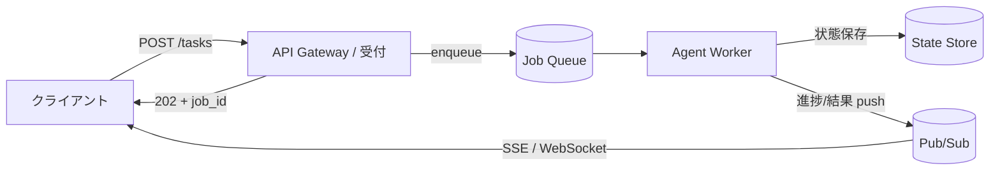

# #1 Request-to-Job Gateway｜非同期受付ゲートウェイ

!!! abstract "一言"
    1リクエストを同期APIでなく**非同期ジョブ**として受け付け、実処理をWebのライフサイクルから切り離す。

## 概要

AIエージェントにリサーチや資料作成を任せると、処理に数分以上かかることも珍しくない。これを通常のHTTPリクエストのように同期で待つと、ロードバランサやプロキシのタイムアウトで途中切断されてしまう。

このパターンでは、ユーザーからのリクエストに対して同期レスポンスを返すのではなく、受付時に `session_id` / `job_id` を即座に発行して `202 Accepted` を返す。実処理はキューやワークフローエンジンへ渡し、ワーカー群が背後で実行する。進捗と最終結果は polling・SSE・WebSocket・Webhook で受け取る。Web層は「受付」だけを担い、エージェント実行層と独立にスケールする。

!!! info "意思決定上の位置づけ"
    - **必要にするフォース**: `[F4]` レイテンシ予算・`[F1]` 可逆性
    - **関与する決定**: [程度（ダイヤル）](../../decisions/tuning-dials.md) の タイムアウト / [相反](../../decisions/tradeoffs.md) の 同期↔非同期・プッシュ↔プル
    - **意思決定の進め方**: [意思決定の進め方](../../decisions/decision-flow.md)

## 設計

受付APIはジョブをキュー（SQS / Pub/Sub / Redis Stream など）に投入し、その状態を `pending → running → (partial) → done / failed / timeout` として外部ストアに永続化する。中間トークンや進捗は別チャネルを通じてストリーミングする。

## 解決する課題

長時間にわたるセッション（数秒〜数十分）がHTTPコネクションを占有し、ロードバランサやプロキシのタイムアウトで切断される問題を解消できる。また、Web層とエージェント層を独立にスケールできるため、リクエストのバーストも吸収しやすくなる。失敗・再実行・中断・人間承認待ちといったケースも、ジョブの状態遷移として自然に扱えるようになる。

## 向き / 不向き

- **向き**: リサーチ・資料作成・コード生成・データ分析など、完了までに複数ステップや外部検索を伴うタスクに適している。
- **不向き**: 数百ミリ秒〜数秒で返したいオートコンプリートや単純分類、同期トランザクションには向かない。

## 要素技術

- 受付: FastAPI / Next.js API Routes、API Gateway
- キュー / 実行: SQS・Google Pub/Sub・Kafka・Cloud Tasks・Celery・Redis Queue
- 状態: PostgreSQL / Redis（[#2 Durable Agent Session](02-durable-agent-session.md) と組み合わせる）
- 通知: SSE・WebSocket・Webhook

## 調整（程度）

- **同期待機の閾値**（[#58 Sync Facade](58-sync-facade-over-async-core.md) と併用する場合）— 短すぎると非同期化の頻度が上がりUXが煩雑になる。一方、長すぎるとコネクション占有につながる / 決め手 `[F4]` / 目安: 5〜10秒。→ [程度ダイヤル](../../decisions/tuning-dials.md)

## 選定（相反）

- **同期 ↔ 非同期** — 想定処理時間がユーザーの待機耐性を超えるか `[F4][F1]`。デフォルト: 秒で終わる読み取りは同期、複数ステップは非同期。→ [相反の選定基準](../../decisions/tradeoffs.md)
- **プッシュ（SSE/Webhook）↔ プル（ポーリング）** — リアルタイム進捗が要るか、クライアントが常時接続を張れるか `[F4][F7]`。→ [相反の選定基準](../../decisions/tradeoffs.md)

## 関連パターン

- [#2 Durable Agent Session](02-durable-agent-session.md) — 受け付けたジョブの状態を永続化し再開可能にする
- [#7 Streaming Progress](07-streaming-progress.md) — 非同期実行中の進捗をユーザーへ返す
- [#58 Sync Facade over Async Core](58-sync-facade-over-async-core.md) — 短ければ同期、超えたら非同期へ昇格させるハイブリッド

## 参考

- （必要に応じて出典・SDKドキュメント等を記載）
