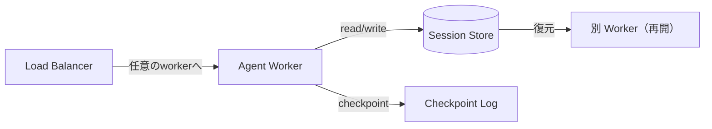

# #2 Durable Agent Session｜耐久エージェントセッション

!!! abstract "一言"
    エージェントの実行状態を外部ストアに永続化し、プロセス障害・再起動・中断後も途中から再開できるようにする。

<!-- BEGIN:GEN:meta -->

メタデータ（機械可読） — #2 Durable Agent Session｜耐久エージェントセッション

| 項目 | 値 |
|------|-----|
| **ID** | 2 |
| **カテゴリ** | 01-execution — 実行・セッション・オーケストレーション |
| **フォース** | `[F1]` |
| **ダイヤル** | checkpoint-frequency |
| **二者択一** | in-context-vs-external |
| **関連パターン** | #1, #6, #4, #32 |
| **向き** | マルチステップの研究・コード生成・データパイプライン、ローリングデプロイ環境 |
| **不向き** | 単発LLM呼び出し; シリアライズコストが利益を上回るリアルタイム対話 |
| **要素技術** | Redis, PostgreSQL, DynamoDB, Temporal, Azure Durable Functions, JSON/Protobuf |

<!-- END:GEN:meta -->

## 概要

エージェントが数十分かけて調査を進めている途中でプロセスがクラッシュしたら、最初からやり直しになる――これは本番環境では許容できない。

このパターンでは、エージェントのセッション状態（会話履歴、中間結果、ステップカウンタ、取得済みコンテキスト）をインメモリではなく外部の耐久ストアに書き出す。これにより、プロセスが落ちてもストアから状態を復元し、最後のチェックポイントから再開できるようになる。また、ステートレスなワーカーが任意のセッションをピックアップできるため、スケールアウトやローリングデプロイとも両立しやすい。

!!! info "意思決定上の位置づけ"
    - **必要にするフォース**: `[F1]` 可逆性
    - **関与する決定**: [程度（ダイヤル）](../../decisions/tuning-dials.md) の チェックポイント頻度
    - **意思決定の進め方**: [意思決定の進め方](../../decisions/decision-flow.md)

## 設計

セッション状態は各ステップの完了時にストアへ書き出す（チェックポイント）。キーは `session_id` で、TTLを付けて古いセッションを自動的に失効させる。復元時は最新のチェックポイントを読み込み、副作用のあるステップについては冪等キーを用いて重複実行を防ぐ。

## 解決する課題

エージェントの実行は数分〜数十分に及ぶことがあり、その間にプロセスクラッシュやデプロイ、スポットインスタンスの回収などが起こりうる。もし状態がメモリ上にしかなければ、ユーザーは最初からやり直さなければならない。`[F1]` 可逆性の観点から、途中成果を失わずに再開できることは本番運用の前提条件である。

## 向き / 不向き

- **向き**: マルチステップのリサーチ・コード生成・データパイプラインなど、完了まで時間がかかり途中成果に価値があるタスクに適している。ローリングデプロイ中もセッションを継続したい場合にも有効である。
- **不向き**: 1回のLLM呼び出しで完結する単純なQ&Aには過剰な仕組みとなる。また、状態の直列化コストがレイテンシに見合わないリアルタイム対話にも向かない。

## 要素技術

- ストア: Redis（高速・揮発リスクあり）、PostgreSQL / DynamoDB（耐久性優先）
- チェックポイント: Temporal Workflow の続行、Durable Functions の checkpoint、独自実装ならステップ完了ごとにUPSERT
- 冪等性: 副作用ステップに冪等キーを付与し、再実行時に二重処理を防止
- 直列化: セッション状態のJSON/Protobuf化。LLMの生トークンストリームは保存対象外とし、要約を保存

## 調整（程度）

- **チェックポイント頻度** — 毎ステップ記録するとI/Oオーバーヘッドが増加する。一方、粗すぎると障害時の手戻りが大きくなる / 決め手 `[F1]` / 目安: 副作用を伴うステップの前後は必須とし、読み取りのみのステップは数ステップおきにする。→ [程度ダイヤル](../../decisions/tuning-dials.md)

## 関連パターン

- [#1 Request-to-Job Gateway](01-request-to-job-gateway.md) — 受付層から分離された非同期ジョブの状態をこのパターンで永続化する
- [#6 Interruptible Agent](06-interruptible-agent.md) — 中断指示を受けた後、このパターンの状態から再開する
- [#4 Agent Saga](04-agent-saga.md) — 永続化された状態があるからこそ補償トランザクションが実行できる
- [#32 Agent Trace](../07-observability/32-agent-trace.md) — チェックポイントログはトレースの一部として監査にも使える

## 参考

- Temporal.io Workflow の Durable Execution モデル
- Azure Durable Functions のチェックポイント機構
