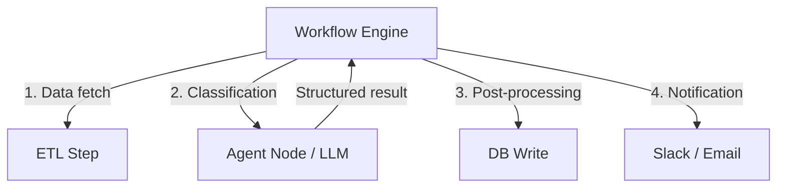

# #3 Workflow Backbone + Agent Node

!!! abstract "TL;DR"
    A deterministic workflow engine controls the overall execution order, delegating only judgment-requiring nodes to LLM agents.

<!-- BEGIN:GEN:meta -->

Metadata (machine-readable) — #3 Workflow Backbone + Agent Node

| Field | Value |
|------|-----|
| **ID** | 3 |
| **Category** | 01-execution — Execution, Session & Orchestration |
| **Forces** | `[F6]`, `[F8]` |
| **Dials** | — |
| **Tradeoffs** | workflow-vs-agent |
| **Related Patterns** | #59, #11, #5, #14 |
| **When to Use** | Embedding AI judgment into fixed procedures, regulated industries requiring reproducibility |
| **When Not to Use** | F6=high (exploratory tasks); when procedures change dynamically |
| **Element Technologies** | Temporal, Airflow, Step Functions, Prefect, Hatchet, LangGraph, OpenAI Agents SDK |

<!-- END:GEN:meta -->

## Overview

The majority of business flows like "fetch data, classify, write to DB, notify" are routine processing — AI judgment is needed only for specific steps. Yet if the entire flow is entrusted to an agent, execution order reproducibility is lost, making both auditing and cost management difficult.

In this pattern, a workflow engine (DAG executor) serves as the backbone, executing routine steps deterministically. Only nodes that require LLM judgment — classification, summarization, planning, etc. — are delegated to agents. Because the backbone controls overall progress, audit log capture and retry control can be handled by existing workflow technology.

!!! info "Position in Decision Framework"
    - **Driving Forces**: `[F6]` Task Variability, `[F8]` Accountability & Regulation
    - **Related Decisions**: [Tradeoffs](../../decisions/tradeoffs.md) — Workflow ↔ Agent
    - **Decision Flow**: [Decision Flow](../../decisions/decision-flow.md)

## Design

Agent nodes are invoked as workflow tasks with contractualized input and output schemas. Timeouts, retries, and fallbacks are defined on the workflow side.

## Problem Solved

When the agent controls everything, step ordering becomes non-deterministic, making `[F8]` auditing and reproduction difficult. Furthermore, routing routine processing through the LLM unnecessarily increases cost `[F7]` and latency. By keeping the backbone deterministic and localizing probabilistic judgment, both accountability and efficiency are achieved.

## When to Use / When Not to Use

- **When to Use**: Suitable when business flows are relatively fixed and AI judgment needs to be injected into only some steps. Also effective in regulated industries where process reproducibility is required.
- **When Not to Use**: Not suited for exploratory work where task procedures cannot be predetermined (research, free-form coding, etc.). When step count or order changes dynamically, consider combining with [#59 Workflow-Agent Spectrum Selector](59-workflow-agent-spectrum-selector.md).

## Element Technologies

- Workflow Engine: Temporal, Airflow, Step Functions, Prefect, Hatchet
- Agent Node: LangGraph single node, OpenAI Agents SDK handoff target
- Contract: Define I/O with [#14 Structured Output Contract](../03-io-contract/14-structured-output-contract.md) typing

## Selection (Tradeoffs)

- **Deterministic Workflow ↔ Autonomous Agent** — When task variability `[F6]` is low, lean toward backbone; when high, lean toward agent. Default: if a procedure repeats 3+ times identically, make it a backbone step. → [Tradeoff Selection Criteria](../../decisions/tradeoffs.md)

## Related Patterns

- [#59 Workflow-Agent Spectrum Selector](59-workflow-agent-spectrum-selector.md) — A meta-pattern for selecting the ratio of backbone to autonomy per sub-task
- [#11 Deterministic Core, Probabilistic Edge](../02-composition/11-deterministic-core-probabilistic-edge.md) — The same principle applied at the system composition level
- [#5 Time-Budgeted Agent Loop](05-time-budgeted-agent-loop.md) — Controls agent node runaway with loop budgets
- [#14 Structured Output Contract](../03-io-contract/14-structured-output-contract.md) — The means to contractualize inter-node I/O

## References

- Temporal Workflow Patterns
- AWS Step Functions + Bedrock Agent integration
