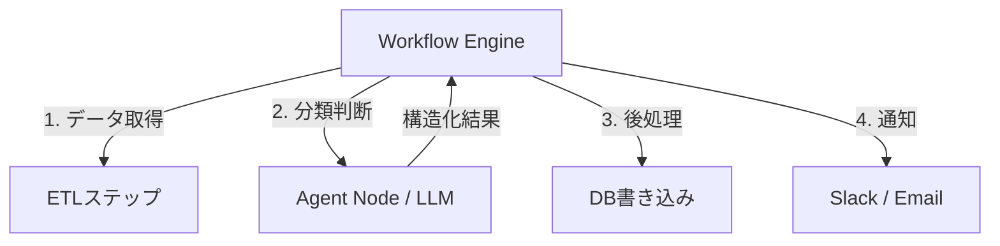

# #3 Workflow Backbone + Agent Node｜決定論骨格＋ノード

!!! abstract "一言"
    全体の実行順序は決定論的なワークフローエンジンが制御し、判断が必要なノードだけをLLMエージェントに委譲します。

<!-- BEGIN:GEN:meta -->

メタデータ（機械可読） — #3 Workflow Backbone + Agent Node｜決定論骨格＋ノード

| 項目 | 値 |
|------|-----|
| **ID** | 3 |
| **カテゴリ** | 01-execution — 実行・セッション・オーケストレーション |
| **フォース** | `[F6]`, `[F8]` |
| **ダイヤル** | — |
| **二者択一** | workflow-vs-agent, orchestration-vs-choreography |
| **関連パターン** | #59, #11, #5, #14 |
| **向き** | 固定手順にAI判断を組み込む場面、規制業種で再現性が必要 |
| **不向き** | F6=高（探索的タスク）; 手順が動的に変化する場合 |
| **要素技術** | Temporal, Airflow, Step Functions, Prefect, Hatchet, LangGraph, OpenAI Agents SDK |

<!-- END:GEN:meta -->

## 概要

「データを取得して、分類して、DBに書き込んで、通知する」といった業務フローの大半は定型処理であり、AI判断が必要なのは一部のステップだけです。それなのにフロー全体をエージェントに委ねると、順序の再現性が失われ、監査もコスト管理も難しくなります。

このパターンでは、ワークフローエンジン（DAG実行器）が骨格となり、定型ステップを決定論的に実行します。そのうえで、LLMの判断力が必要なノード――分類、要約、計画立案など――だけをエージェントに委ねます。骨格が全体の進行を制御するため、監査ログの取得やリトライ制御は既存のワークフロー技術で対応できます。

!!! info "意思決定上の位置づけ"
    - **必要にするフォース**: `[F6]` タスクの変動性・`[F8]` 説明責任・規制
    - **関与する決定**: [相反](../../decisions/tradeoffs.md) の ワークフロー↔エージェント
    - **意思決定の進め方**: [意思決定の進め方](../../decisions/decision-flow.md)

## 設計

エージェントノードはワークフローの1タスクとして呼ばれ、入力スキーマと出力スキーマが契約化されています。タイムアウト・リトライ・フォールバックはワークフロー側で定義します。

## 解決する課題

エージェントに全体制御を任せると、ステップの順序が非決定的になり、`[F8]` 監査や再現が困難になります。さらに、定型処理までLLMに通すとコスト `[F7]` とレイテンシが不必要に増えてしまいます。骨格を決定論的に組み、確率的な判断だけを局所化することで、説明責任と効率を両立できます。

## 向き / 不向き

- **向き**: 業務フローが比較的固定されており、一部のステップだけにAI判断を差し込みたいケースに適しています。規制産業でプロセスの再現性が求められる場合にも有効です。
- **不向き**: タスクの手順自体が事前に決まらない探索的な作業（リサーチ、自由形式のコーディングなど）には向きません。ステップ数や順序が動的に変わる場合は [#59 Workflow-Agent Spectrum Selector](59-workflow-agent-spectrum-selector.md) と併用して判断するとよいでしょう。

## 要素技術

- ワークフローエンジン: Temporal、Airflow、Step Functions、Prefect、Hatchet
- エージェントノード: LangGraph の単一ノード、OpenAI Agents SDK のハンドオフ先
- 契約: 入出力を [#14 Structured Output Contract](../03-io-contract/14-structured-output-contract.md) で型定義

## 選定（相反）

- **決定論ワークフロー ↔ 自律エージェント** — タスクの変動性 `[F6]` が低ければ骨格寄り、高ければエージェント寄り。デフォルト: 手順が3回以上同じなら骨格化。→ [相反の選定基準](../../decisions/tradeoffs.md)

## 関連パターン

- [#59 Workflow-Agent Spectrum Selector](59-workflow-agent-spectrum-selector.md) — サブタスク単位で骨格と自律の比率を選定するメタパターン
- [#11 Deterministic Core, Probabilistic Edge](../02-composition/11-deterministic-core-probabilistic-edge.md) — 同じ原則をシステム構成レベルで適用したもの
- [#5 Time-Budgeted Agent Loop](05-time-budgeted-agent-loop.md) — エージェントノードの暴走をループ予算で制御する
- [#14 Structured Output Contract](../03-io-contract/14-structured-output-contract.md) — ノード間の入出力を契約化する手段

## 参考

- Temporal Workflow Patterns
- AWS Step Functions + Bedrock Agent 統合
