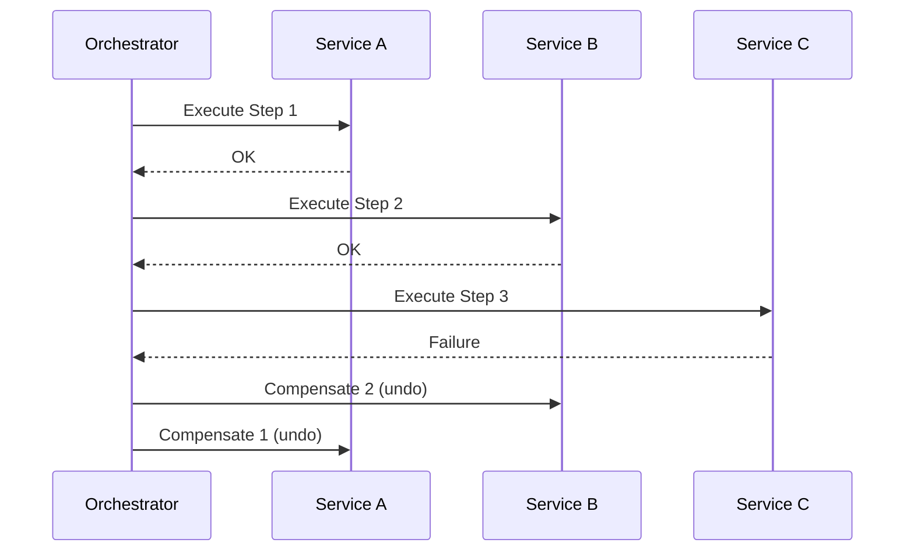

# #4 Agent Saga

!!! abstract "TL;DR"
    When an agent causes side effects across multiple external systems, **compensating actions** roll back already-executed steps if a later step fails.

<!-- BEGIN:GEN:meta -->

Metadata (machine-readable) — #4 Agent Saga

| Field | Value |
|------|-----|
| **ID** | 4 |
| **Category** | 01-execution — Execution, Session & Orchestration |
| **Forces** | `[F1]`, `[F2]` |
| **Dials** | checkpoint-frequency |
| **Tradeoffs** | — |
| **Related Patterns** | #2, #19, #31, #1 |
| **When to Use** | Chains of writes to multiple external systems (calendar → ticket → email) |
| **When Not to Use** | Read-only operations; single-service DB transactions; physically irreversible operations |
| **Element Technologies** | Temporal, Step Functions, idempotency keys |

<!-- END:GEN:meta -->

## Overview

Consider a scenario where an agent automatically executes "calendar reservation → ticket creation → email sending." If the email send fails, only the reservation and ticket remain, creating an inconsistency. The sent email cannot be recalled, and the reservation must be manually cancelled.

The Saga pattern pre-defines compensating actions for each step (cancel reservation, close ticket, send correction email) and executes them in reverse order upon failure. This applies the distributed transaction Saga pattern to the agent context.

!!! info "Position in Decision Framework"
    - **Driving Forces**: `[F1]` Reversibility, `[F2]` Failure Cost
    - **Decision Flow**: [Decision Flow](../../decisions/decision-flow.md)

## Design

The orchestrator (workflow engine or the agent itself) maintains a stack of executed steps and fires compensations in reverse order upon failure detection. Each compensating action is also designed to be idempotent.

## Problem Solved

LLM agents tend to operate in a "try it and fix if it fails" manner, but side effects to external systems cannot be undone. In chains of operations with low `[F1]` reversibility — email sending, payments, API writes — intermediate failures lead to high `[F2]` failure costs (double billing, inconsistent data). By explicitly designing compensations, a safety net is secured against irreversible side-effect chains.

## When to Use / When Not to Use

- **When to Use**: Suitable for tasks involving writes to multiple external services, especially when distributed transactions across services are unavailable.
- **When Not to Use**: Unnecessary for read-only processing. Also unnecessary when writes to a single service can use the DB's own transactions. Note that compensations cannot be defined for completely irreversible side effects (physical operations, etc.).

## Element Technologies

- Orchestration: Temporal Saga, Step Functions Catch/Compensate, custom compensation stack
- Compensation Definition: Codify `do` / `compensate` pairs for each step
- Idempotency: Attach idempotency keys to compensating actions to prevent double-undo on retry
- Recording: Log all execution and compensation steps in [#32 Agent Trace](../07-observability/32-agent-trace.md)

## Tuning (Dials)

- **Compensation granularity** — Defining per-step increases development cost. On the other hand, coarse grouping can lead to incomplete rollbacks / Deciding factor: `[F2]` / Guideline: define individually for high-cost side effects; group low-cost ones together. → [Tuning Dials](../../decisions/tuning-dials.md)

## Related Patterns

- [#2 Durable Agent Session](02-durable-agent-session.md) — Persisted state enables tracking the source of compensation execution
- [#19 Dry-Run First Tool Execution](../04-tools-mcp/19-dry-run-first-tool-execution.md) — Simulate side effects first to reduce risk before entering the Saga
- [#31 Human Approval Checkpoint](../06-reliability/31-human-approval-checkpoint.md) — Insert human approval before high-cost side effects, making compensation itself unnecessary
- [#1 Request-to-Job Gateway](01-request-to-job-gateway.md) — Controls the lifecycle of the entire Saga by managing it as an async job

## References

- Saga Pattern (Garcia-Molina & Salem, 1987)
- Temporal Saga Tutorial
