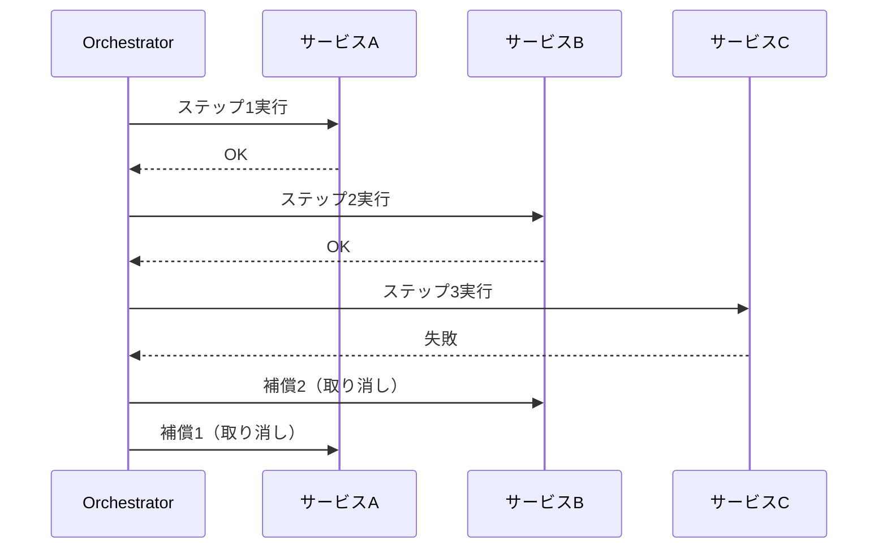

# #4 Agent Saga｜補償トランザクション

!!! abstract "一言"
    エージェントが複数の外部システムに副作用を起こす際、途中で失敗したら既に実行済みのステップを**補償アクション**で巻き戻す。

## 概要

エージェントが「カレンダー予約 → チケット作成 → メール送信」のように複数の副作用を連鎖させるとき、途中ステップの失敗で不整合が生じる。Sagaパターンでは各ステップに対応する補償アクション（予約取り消し、チケットクローズ、訂正メール送信）を事前に定義し、失敗時に逆順で実行する。分散トランザクションのSagaパターンをエージェント文脈に適用したもの。

## 設計

オーケストレータ（ワークフローエンジンまたはエージェント自身）が実行済みステップのスタックを保持し、失敗検知で補償を逆順に発火する。各補償アクションも冪等に設計する。

## 解決する課題

LLMエージェントは「やってみてダメなら直す」動作になりがちだが、外部副作用は `undo` できない。メール送信、決済、API書き込みなど `[F1]` 可逆性が低い操作の連鎖では、途中失敗が `[F2]` 高い失敗コスト（二重請求、不整合データ）を生む。補償を明示的に設計することで、不可逆な副作用連鎖の安全ネットを張る。

## 向き / 不向き

- **向き**: 複数外部サービスへの書き込みを伴うタスク。特にサービス間で分散トランザクションが使えない場合。
- **不向き**: 読み取り専用の処理。単一サービスへの書き込みでDB自体のトランザクションが使える場合。完全に不可逆な副作用（物理的な操作など）には補償が定義できない。

## 要素技術

- オーケストレーション: Temporal Saga、Step Functions の Catch/Compensate、自前の補償スタック
- 補償定義: ステップごとに `do` / `compensate` のペアをコード化
- 冪等性: 補償アクションにも冪等キーを付与し、再試行で二重取り消しを防止
- 記録: 実行・補償の全ステップを [#32 Agent Trace](../07-observability/32-agent-trace.md) に残す

## 調整（程度）

- **補償の粒度** — ステップごとに定義すると開発コスト増 ⇔ 粗いとロールバックが不完全 / 決め手 `[F2]` / 目安: 失敗コストが高い副作用は個別に、低いものはまとめて。→ [程度ダイヤル](../../decisions/tuning-dials.md)

## 関連パターン

- [#2 Durable Agent Session](02-durable-agent-session.md) — 永続化された状態があるから補償の実行元を追跡できる
- [#19 Dry-Run First Tool Execution](../04-tools-mcp/19-dry-run-first-tool-execution.md) — 副作用をまず模擬実行し、Sagaに入る前にリスクを下げる
- [#31 Human Approval Checkpoint](../06-reliability/31-human-approval-checkpoint.md) — 高コスト副作用の前に人間承認を挟み、補償自体を不要にする
- [#1 Request-to-Job Gateway](01-request-to-job-gateway.md) — 非同期ジョブとして管理することでSaga全体のライフサイクルを制御する

## 参考

- Saga パターン（Garcia-Molina & Salem, 1987）
- Temporal Saga チュートリアル
