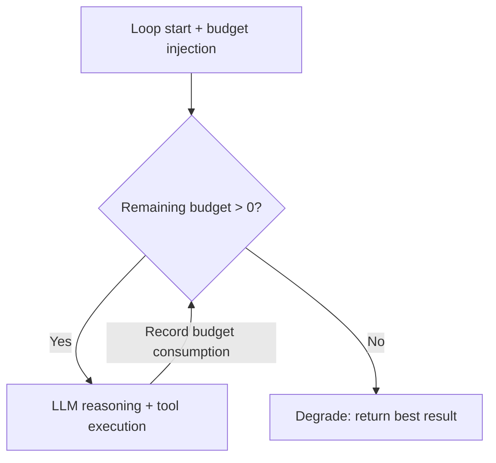

# #5 Time-Budgeted Agent Loop

!!! abstract "TL;DR"
    Set budget caps on the agent's reasoning loop — **time, step count, token consumption, and cost** — and force termination or graceful degradation before the limit is exceeded.

<!-- BEGIN:GEN:meta -->

Metadata (machine-readable) — #5 Time-Budgeted Agent Loop

| Field | Value |
|------|-----|
| **ID** | 5 |
| **Category** | 01-execution — Execution, Session & Orchestration |
| **Forces** | `[F7]`, `[F3]` |
| **Dials** | budget-cap, timeout |
| **Tradeoffs** | — |
| **Related Patterns** | #55, #6, #37 |
| **When to Use** | Cost limits in SaaS, fairness in multi-tenant environments |
| **When Not to Use** | Batch jobs where "use as much as needed" is the policy (though a cost cap is always recommended) |
| **Element Technologies** | Framework callback/middleware, LLM usage API, tool call counter |

<!-- END:GEN:meta -->

## Overview

You asked an agent to "research this technology," and it kept reading related papers endlessly, consuming hundreds of API calls and tens of thousands of tokens — if such runaway happens in production, both cost and latency become uncontrollable.

An agent's ReAct / Plan-Execute loop is inherently non-deterministic in its termination condition, and infinite loops or unexpected deep dives can occur. This pattern injects a budget (wall-clock time, max steps, cumulative tokens, API call count, cost cap) at loop start and checks remaining budget at each iteration. When the budget is exceeded, the system degrades to one of: "return the best answer so far," "summarize and terminate," or "escalate to a human."

!!! info "Position in Decision Framework"
    - **Driving Forces**: `[F7]` Cost Sensitivity & Scale, `[F3]` Per-Request Value
    - **Related Decisions**: [Tuning Dials](../../decisions/tuning-dials.md) — Timeout, Budget Cap
    - **Decision Flow**: [Decision Flow](../../decisions/decision-flow.md)

## Design

The budget is held as a struct, with consumption added after each LLM call and tool execution. The remaining budget is also included in the prompt so the LLM itself is aware of "how many steps remain."

## Problem Solved

Agent runaway can cause `[F7]` cost explosions or `[F3]` over-investment in low-value requests. Furthermore, it risks exhausting downstream service rate limits or starving other requests of resources. By explicitly setting budgets, upper bounds on cost and latency can be guaranteed.

## When to Use / When Not to Use

- **When to Use**: Suitable when you need to guarantee cost and latency upper bounds in user-facing services. Also effective for ensuring fairness across tenants in multi-tenant environments.
- **When Not to Use**: Can be excessive for batch processing where tasks can "take as long as they need." However, even in such cases, setting at least a cost cap is recommended.

## Element Technologies

- Budget Management: Inject at each step via framework callbacks / middleware
- Measurement: Get token counts from LLM API response `usage` fields; count tool invocations
- Notification: Output warning logs at 80% budget consumption; display remaining budget to users via [#7 Streaming Progress](07-streaming-progress.md)
- Cascade: For budget allocation to child agents, see [#55 Deadline & Budget Cascade](55-deadline-budget-cascade.md)

## Tuning (Dials)

- **Budget size** — Too small prevents reaching useful answers. Too large negates cost control / Deciding factors: `[F3]``[F7]` / Guideline: set cost cap at 10–30% of expected revenue per request. → [Tuning Dials](../../decisions/tuning-dials.md)

## Related Patterns

- [#55 Deadline & Budget Cascade](55-deadline-budget-cascade.md) — The specific mechanism for propagating budgets from parent to child
- [#6 Interruptible Agent](06-interruptible-agent.md) — Also handles external interruptions beyond budget exhaustion
- [#37 Semantic Gateway & Cost-Aware Router](../08-cost-scaling/37-semantic-gateway-cost-aware-router.md) — Varies budget allocation based on request difficulty

## References

- OpenAI Agents SDK `max_turns` parameter
- LangGraph `recursion_limit` setting
