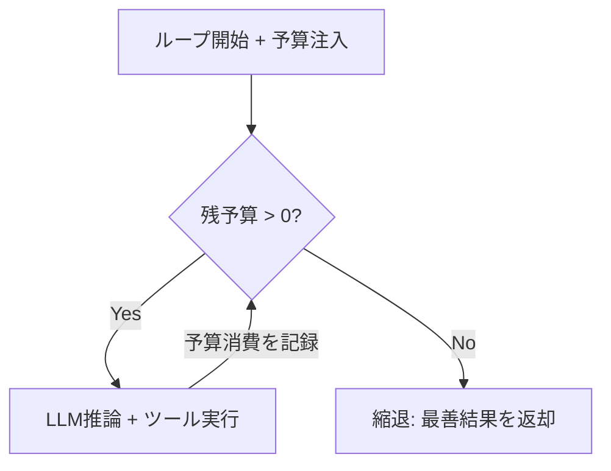

# #5 Time-Budgeted Agent Loop｜予算付きループ

!!! abstract "一言"
    エージェントの推論ループに**時間・ステップ回数・トークン消費・金額**の予算上限を設定し、超過前に強制終了または縮退させる。

## 概要

エージェントに「この技術を調べて」と頼んだら、関連論文を延々と読み続けて数百回のAPI呼び出しと数万トークンを消費していた――そんな暴走が本番で起きたら、コストもレイテンシも制御不能になる。

エージェントの ReAct / Plan-Execute ループは、本質的に終了条件が不確定であり、無限ループや想定外の深掘りが起こりうる。このパターンでは、ループ開始時に予算（wall-clock時間、最大ステップ数、累積トークン数、API呼び出し回数、金額上限）を注入し、各イテレーションで残予算をチェックする。予算を超過した場合は、「現時点の最善回答を返す」「要約して終了する」「人間にエスカレーションする」のいずれかに縮退させる。

!!! info "意思決定上の位置づけ"
    - **必要にするフォース**: `[F7]` コスト感度・スケール・`[F3]` 1リクエストの価値
    - **関与する決定**: [程度（ダイヤル）](../../decisions/tuning-dials.md) の タイムアウト・予算上限
    - **意思決定の進め方**: [意思決定の進め方](../../decisions/decision-flow.md)

## 設計

予算は構造体として保持し、LLM呼び出し・ツール実行ごとに消費量を加算する。残予算はプロンプトにも含め、LLM自身にも「あと何ステップか」を認識させる。

## 解決する課題

エージェントが暴走すると、`[F7]` コスト爆発や `[F3]` 低価値リクエストへの過剰投資を引き起こしかねない。さらに、下流サービスのレート制限を食い潰したり、他のリクエストのリソースを奪ったりする恐れもある。予算を明示的に設けることで、コストとレイテンシの上界を保証できる。

## 向き / 不向き

- **向き**: ユーザー向けサービスでコスト・レイテンシの上限を保証したい場合に適している。また、マルチテナント環境でテナント間の公平性を担保したい場合にも有効である。
- **不向き**: バッチ処理で「かかるだけかかってよい」タスクには過剰となりうる。ただし、その場合でも金額上限だけは設けておくことを推奨する。

## 要素技術

- 予算管理: フレームワークのコールバック / ミドルウェアで各ステップに差し込み
- 計測: LLM APIレスポンスの `usage` フィールドからトークン数を取得、ツール呼び出し回数をカウント
- 通知: 予算の80%消費時に警告ログを出力し、[#7 Streaming Progress](07-streaming-progress.md) で残予算をユーザーに表示
- カスケード: 子エージェントへの予算配分は [#55 Deadline & Budget Cascade](55-deadline-budget-cascade.md) を参照

## 調整（程度）

- **予算サイズ** — 小さすぎると有用な回答に到達できない。一方、大きすぎるとコスト制御の意味がなくなる / 決め手 `[F3]``[F7]` / 目安: リクエスト当たりの期待収益の10〜30%をコスト上限にする。→ [程度ダイヤル](../../decisions/tuning-dials.md)

## 関連パターン

- [#55 Deadline & Budget Cascade](55-deadline-budget-cascade.md) — 親から子への予算伝播の具体的な仕組み
- [#6 Interruptible Agent](06-interruptible-agent.md) — 予算切れ以外に外部からの中断にも対応する
- [#37 Semantic Gateway & Cost-Aware Router](../08-cost-scaling/37-semantic-gateway-cost-aware-router.md) — リクエストの難易度に応じて予算配分を変える

## 参考

- OpenAI Agents SDK の `max_turns` パラメータ
- LangGraph の `recursion_limit` 設定
