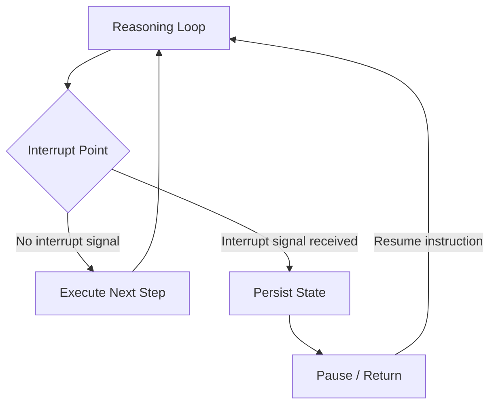

# #6 Interruptible Agent

!!! abstract "TL;DR"
    Safely stop a running agent from the outside, enabling course correction and resumption.

<!-- BEGIN:GEN:meta -->

Metadata (machine-readable) — #6 Interruptible Agent

| Field | Value |
|------|-----|
| **ID** | 6 |
| **Category** | 01-execution — Execution, Session & Orchestration |
| **Forces** | `[F4]` |
| **Dials** | — |
| **Tradeoffs** | — |
| **Related Patterns** | #2, #5, #31, #7 |
| **When to Use** | Long-running interactive agents, scenarios where humans change direction mid-execution |
| **When Not to Use** | Sub-second completion tasks; ultra-low-latency paths where flag-check overhead is unacceptable |
| **Element Technologies** | Redis Pub/Sub, DB flag, WebSocket, graceful shutdown |

<!-- END:GEN:meta -->

## Overview

The user thinks "I'd rather search with different criteria," yet the agent keeps running with the old instructions and won't stop — this wastes cost and may even produce incorrect side effects.

This pattern introduces **interrupt points** into the agent's reasoning loop, allowing it to receive cancel signals or direction changes from outside. On interruption, the current step is safely completed (or rolled back), state is persisted, and the agent stops. After the user corrects the direction, execution can resume from the same session. An "unstoppable agent" is the most dangerous entity in production, and interruptibility is an essential safety valve.

!!! info "Position in Decision Framework"
    - **Driving Forces**: `[F4]` Latency Budget
    - **Decision Flow**: [Decision Flow](../../decisions/decision-flow.md)

## Design

Checkpoints are inserted between each step, polling or receiving an interrupt flag (Redis / DB / in-memory) via events. Post-interrupt session state is persisted via [#2 Durable Agent Session](02-durable-agent-session.md).

## Problem Solved

If users realize they "gave the wrong instruction" but cannot stop the agent, wasted cost and incorrect side effects accumulate. From the `[F4]` perspective, it is natural for users to want to change direction while waiting for results, and being unable to accommodate this severely degrades UX. From an operational standpoint, the ability to forcibly stop a runaway agent is fundamental to incident response.

## When to Use / When Not to Use

- **When to Use**: Suitable for long-running tasks, interactive agents, and scenarios where humans may change direction mid-execution. Also effective for multi-step processing with side effects.
- **When Not to Use**: Unnecessary for single-shot inference that completes in seconds. Also not suited for ultra-low-latency requirements where the interrupt overhead (flag checking) is not justified.

## Element Technologies

- Interrupt Signal: Redis Pub/Sub, DB flag, WebSocket message, Kubernetes graceful shutdown signal
- State Persistence: Shares checkpoint mechanism with [#2 Durable Agent Session](02-durable-agent-session.md)
- UI Integration: Place "Stop" and "Revise Direction" buttons in [#49 Agent Workbench](../11-ux/49-agent-workbench.md)
- Frameworks: LangGraph `interrupt` / `Command(resume=...)`, Temporal Cancellation

## Related Patterns

- [#2 Durable Agent Session](02-durable-agent-session.md) — State persistence foundation for resuming after interruption
- [#5 Time-Budgeted Agent Loop](05-time-budgeted-agent-loop.md) — Automatic interruption via budget exhaustion is one form of this
- [#31 Human Approval Checkpoint](../06-reliability/31-human-approval-checkpoint.md) — Approval waiting is a planned form of interrupt point
- [#7 Streaming Progress](07-streaming-progress.md) — Because progress is visible, users can interrupt at the right time

## References

- LangGraph Human-in-the-loop documentation
- Temporal Workflow Cancellation
