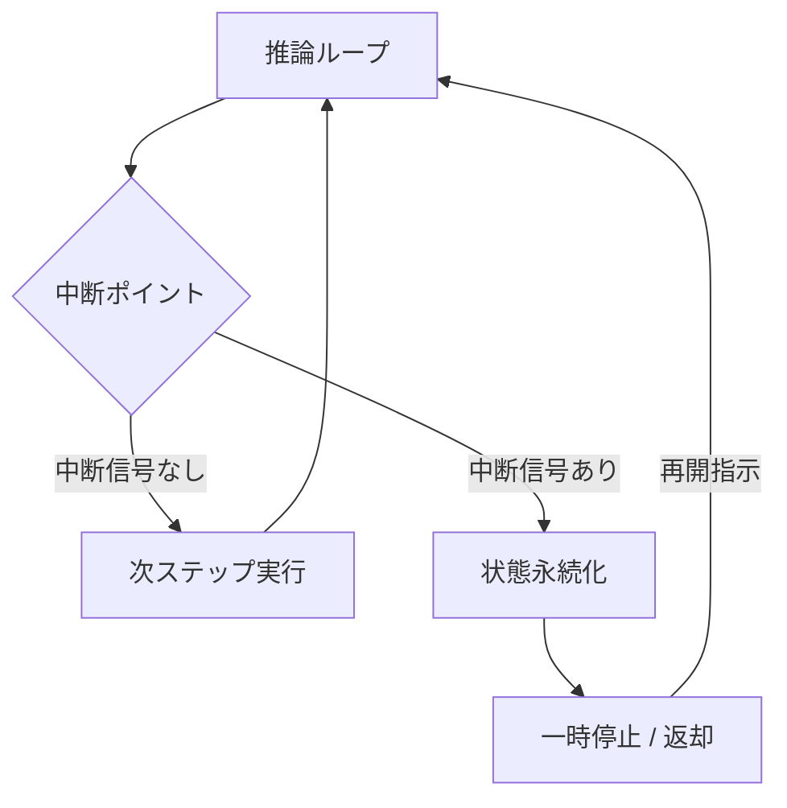

# #6 Interruptible Agent｜中断可能エージェント

!!! abstract "一言"
    実行中のエージェントを外部から安全に停止し、方針修正や再開を可能にする。

<!-- BEGIN:GEN:meta -->

メタデータ（機械可読） — #6 Interruptible Agent｜中断可能エージェント

| 項目 | 値 |
|------|-----|
| **ID** | 6 |
| **カテゴリ** | 01-execution — 実行・セッション・オーケストレーション |
| **フォース** | `[F4]` |
| **ダイヤル** | — |
| **二者択一** | — |
| **関連パターン** | #2, #5, #31, #7 |
| **向き** | 長時間稼働のインタラクティブエージェント、人間が途中で方針変更する場面 |
| **不向き** | サブ秒完了タスク; フラグチェックのオーバーヘッドが許容できない超低レイテンシパス |
| **要素技術** | Redis Pub/Sub, DB flag, WebSocket, graceful shutdown |

<!-- END:GEN:meta -->

## 概要

ユーザーが「やっぱり違う条件で調べてほしい」と思ったのに、エージェントが止まらずに古い指示のまま走り続けている――そんな状況は無駄なコスト消費だけでなく、誤った副作用まで生みかねない。

このパターンでは、エージェントの推論ループに**中断ポイント**を設け、外部からのキャンセル信号や方針変更を受け取れるようにする。中断時には、現在のステップを安全に完了（またはロールバック）したうえで、状態を永続化して停止する。ユーザーが方針を修正した後は、同じセッションから再開できる。「止められないエージェント」は本番運用で最も危険な存在であり、中断可能性は安全弁として欠かせない。

!!! info "意思決定上の位置づけ"
    - **必要にするフォース**: `[F4]` レイテンシ予算
    - **意思決定の進め方**: [意思決定の進め方](../../decisions/decision-flow.md)

## 設計

各ステップ間にチェックポイントを挿入し、中断フラグ（Redis / DB / インメモリ）をポーリングまたはイベントで受信する。中断後のセッション状態は [#2 Durable Agent Session](02-durable-agent-session.md) で永続化する。

## 解決する課題

ユーザーが「間違った指示を出した」と気づいても、エージェントを止められなければ無駄なコスト消費や誤った副作用が蓄積してしまう。`[F4]` の観点では、ユーザーが結果を待つ間に方針を変えたくなるのは自然なことであり、それに応えられないとUXが著しく低下する。また運用の面でも、暴走したエージェントを強制停止できることはインシデント対応の基本である。

## 向き / 不向き

- **向き**: 長時間実行タスクや対話的なエージェント、人間が途中で方針を変えうるシナリオに適している。マルチステップで副作用を伴う処理にも有効である。
- **不向き**: 数秒で完結する単発推論には不要である。また、中断のオーバーヘッド（フラグチェック）がレイテンシに見合わない超低レイテンシ要件にも向かない。

## 要素技術

- 中断信号: Redis Pub/Sub、DB フラグ、WebSocket メッセージ、Kubernetes の graceful shutdown シグナル
- 状態保存: [#2 Durable Agent Session](02-durable-agent-session.md) と共通のチェックポイント機構
- UI連携: [#49 Agent Workbench](../11-ux/49-agent-workbench.md) に「停止」「方針修正」ボタンを配置
- フレームワーク: LangGraph の `interrupt` / `Command(resume=...)` 、Temporal の Cancellation

## 関連パターン

- [#2 Durable Agent Session](02-durable-agent-session.md) — 中断後に再開するための状態永続化基盤
- [#5 Time-Budgeted Agent Loop](05-time-budgeted-agent-loop.md) — 予算超過による自動的な中断の一形態
- [#31 Human Approval Checkpoint](../06-reliability/31-human-approval-checkpoint.md) — 承認待ちは計画的な中断ポイントの一種
- [#7 Streaming Progress](07-streaming-progress.md) — 進捗が見えるからこそユーザーは適切なタイミングで中断できる

## 参考

- LangGraph Human-in-the-loop ドキュメント
- Temporal Workflow Cancellation
