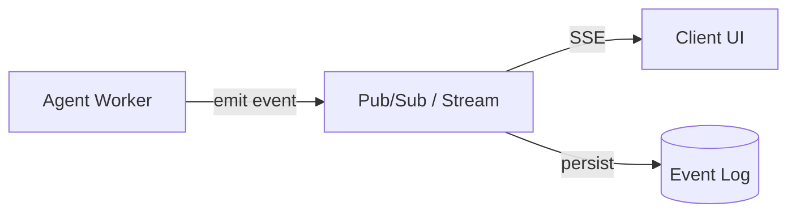

# #7 Streaming Progress

!!! abstract "TL;DR"
    Deliver the agent's execution progress to the client incrementally as auditable summaries.

<!-- BEGIN:GEN:meta -->

Metadata (machine-readable) — #7 Streaming Progress

| Field | Value |
|------|-----|
| **ID** | 7 |
| **Category** | 01-execution — Execution, Session & Orchestration |
| **Forces** | `[F4]` |
| **Dials** | — |
| **Tradeoffs** | push-vs-pull |
| **Related Patterns** | #1, #6, #32 |
| **When to Use** | Tasks over 5 seconds, interactive user monitoring, regulatory trace logs |
| **When Not to Use** | Sub-second processing; batch silent mode |
| **Element Technologies** | SSE, WebSocket, gRPC streaming, Redis Streams, Kafka, JSON Lines |

<!-- END:GEN:meta -->

## Overview

If the screen goes unresponsive for 2 minutes after delegating research to an agent, users become anxious, wondering "did it freeze?" and feel compelled to reload the browser. Even if processing is progressing smoothly, what cannot be seen cannot be communicated.

This pattern delivers step completions, tool invocations, and intermediate decisions as structured progress messages in real-time. The key distinction from plain token streaming is that it sends *semantic* progress — "what was intended, what was executed, and what was returned."

!!! info "Position in Decision Framework"
    - **Driving Forces**: `[F4]` Latency Budget
    - **Related Decisions**: [Tradeoffs](../../decisions/tradeoffs.md) — Push ↔ Pull
    - **Decision Flow**: [Decision Flow](../../decisions/decision-flow.md)

## Design

The worker emits structured events (step name, I/O summary, elapsed time, remaining budget) at each step. Events are delivered to the client via SSE/WebSocket through Pub/Sub, while simultaneously accumulated in a persistent store to serve as audit logs. The client renders them as progress bars or step lists.

## Problem Solved

From a `[F4]` latency budget perspective, the user's perceived wait time is significantly improved simply by "being able to see progress." Additionally, combining progress visibility with [#6 Interruptible Agent](06-interruptible-agent.md) enables "knowing what's happening so you can stop at the right time." From an audit perspective, incremental recording of the agent's reasoning process also facilitates post-hoc review.

## When to Use / When Not to Use

- **When to Use**: Suitable for tasks taking over 5 seconds. Also effective for scenarios where users monitor interactively, or where regulations require process recording.
- **When Not to Use**: Not suited for sub-second processing (streaming overhead becomes dominant). Similarly for batch processing where real-time display is unnecessary, though log recording remains useful.

## Element Technologies

- Delivery: SSE (Server-Sent Events), WebSocket, gRPC Server Streaming
- Intermediate Layer: Redis Streams, Kafka, Google Pub/Sub
- Format: JSON Lines format sending `{step, action, summary, elapsed_ms, budget_remaining}`
- UI: [#49 Agent Workbench](../11-ux/49-agent-workbench.md) step list / timeline view

## Tuning (Dials)

- **Progress granularity** — Token-level risks bandwidth overuse and confidential data leakage. On the other hand, step-level only can result in long silences / Deciding factor: `[F4]` / Guideline: use tool invocation granularity as the baseline; send heartbeats if silence exceeds 10 seconds. → [Tuning Dials](../../decisions/tuning-dials.md)

## Related Patterns

- [#1 Request-to-Job Gateway](01-request-to-job-gateway.md) — Uses this pattern as the channel for returning async job progress
- [#6 Interruptible Agent](06-interruptible-agent.md) — Visible progress enables users to make interrupt decisions
- [#32 Agent Trace](../07-observability/32-agent-trace.md) — Persists streamed progress events as traces

## References

- A2A (Agent-to-Agent) Protocol Task Status Streaming
- OpenAI Streaming API usage chunks
