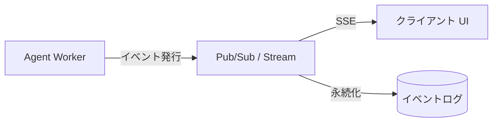

# #7 Streaming Progress｜進捗ストリーミング

!!! abstract "一言"
    エージェントの実行過程を、監査可能な要約として逐次クライアントへ配信する。

## 概要

長時間実行するエージェントが「何をしているか分からない」状態はユーザーの離脱と不信を招く。このパターンでは、ステップ完了・ツール呼び出し・中間判断などのイベントを構造化された進捗メッセージとしてリアルタイムに配信する。単なるトークンストリーミングではなく、「何を意図し、何を実行し、何が返ったか」のセマンティックな進捗を送る。

## 設計

ワーカーは各ステップで構造化イベント（ステップ名、入出力の要約、所要時間、残予算）を発行する。イベントはPub/Sub経由でクライアントへSSE/WebSocketで配信されると同時に、永続ストアに蓄積されて監査ログとなる。クライアント側では進捗バーやステップリストとして描画する。

## 解決する課題

`[F4]` レイテンシ予算の観点で、ユーザーの体感待ち時間は「進捗が見える」だけで大幅に改善される。また、進捗の可視化は [#6 Interruptible Agent](06-interruptible-agent.md) と組み合わせることで「今何をしているか分かるから、適切に止められる」という操作性を実現する。監査の観点でも、エージェントの推論過程が逐次記録されることで事後レビューが容易になる。

## 向き / 不向き

- **向き**: 実行が5秒以上かかるタスク。ユーザーが対話的に監視するシナリオ。規制要件で過程の記録が求められる場合。
- **不向き**: サブ秒で完結する処理（ストリーミングのオーバーヘッドが支配的になる）。バッチ処理でリアルタイム表示が不要な場合（ただしログ記録は有用）。

## 要素技術

- 配信: SSE（Server-Sent Events）、WebSocket、gRPC Server Streaming
- 中間層: Redis Streams、Kafka、Google Pub/Sub
- フォーマット: JSON Lines 形式で `{step, action, summary, elapsed_ms, budget_remaining}` を送出
- UI: [#49 Agent Workbench](../11-ux/49-agent-workbench.md) のステップリスト / タイムラインビュー

## 調整（程度）

- **進捗の粒度** — トークン単位だと帯域過多・機密漏洩リスク ⇔ ステップ単位だけでは長時間沈黙が生じる / 決め手 `[F4]` / 目安: ツール呼び出し単位＋10秒以上沈黙が続いたらハートビート。→ [程度ダイヤル](../../decisions/tuning-dials.md)

## 関連パターン

- [#1 Request-to-Job Gateway](01-request-to-job-gateway.md) — 非同期ジョブの進捗を返すチャネルとしてこのパターンを使う
- [#6 Interruptible Agent](06-interruptible-agent.md) — 進捗が見えることでユーザーが中断判断をできるようになる
- [#32 Agent Trace](../07-observability/32-agent-trace.md) — ストリーミングした進捗イベントをトレースとして永続化する

## 参考

- A2A（Agent-to-Agent）プロトコルの Task Status Streaming
- OpenAI Streaming API の usage チャンク
