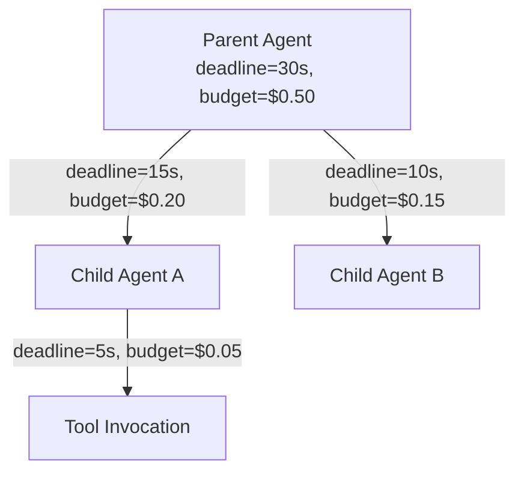

# #55 Deadline & Budget Cascade

!!! abstract "TL;DR"
    Proportionally distribute and propagate the parent agent's deadline and budget across the entire call tree of child agents and tool invocations.

<!-- BEGIN:GEN:meta -->

Metadata (machine-readable) — #55 Deadline & Budget Cascade

| Field | Value |
|------|-----|
| **ID** | 55 |
| **Category** | 01-execution — Execution, Session & Orchestration |
| **Forces** | `[F7]`, `[F3]` |
| **Dials** | budget-cap |
| **Tradeoffs** | — |
| **Related Patterns** | #5, #9, #37 |
| **When to Use** | Multi-agent compositions, recursive tool invocations, strict SaaS cost limits |
| **When Not to Use** | Single agent one-shot; lightweight tasks where overhead exceeds benefit |
| **Element Technologies** | gRPC metadata, HTTP header context, context objects |

<!-- END:GEN:meta -->

## Overview

If the parent agent's deadline is 30 seconds but one child agent consumes 25 seconds, the remaining child agents and subsequent processing are left with no time. In multi-agent compositions, this kind of budget exhaustion easily occurs.

This pattern has the parent explicitly pass its remaining deadline and remaining budget (tokens, cost, steps) to children, and children operate only within those bounds. This applies the same concept as gRPC deadline propagation to the agent call tree.

!!! info "Position in Decision Framework"
    - **Driving Forces**: `[F7]` Cost Sensitivity & Scale, `[F3]` Per-Request Value
    - **Related Decisions**: [Tuning Dials](../../decisions/tuning-dials.md) — Budget Cap
    - **Decision Flow**: [Decision Flow](../../decisions/decision-flow.md)

## Design

Each invocation passes `{deadline, token_budget, cost_budget, max_steps}` as context. Children must not exceed the received budget, and if they further delegate, they apportion from the remainder. Deadlines are passed as wall-clock timestamps to minimize clock-skew impact.

## Problem Solved

If child agents do not have individual budgets, a single child's runaway can exhaust the entire budget. For example, if the parent's deadline is 30 seconds but a child uses 25, the parent has insufficient time remaining for subsequent processing. Therefore, `[F7]` cost control and `[F3]` investment ratio management per request value need to be consistently maintained across the entire tree.

## When to Use / When Not to Use

- **When to Use**: Suitable for multi-agent compositions or configurations where agents recursively invoke tools. Also effective for SaaS requiring strict per-request cost caps.
- **When Not to Use**: Unnecessary for single-agent compositions completing in one LLM call. Also not suited for ultra-lightweight tasks where budget propagation overhead is disproportionate to actual processing.

## Element Technologies

- Context Propagation: gRPC metadata / HTTP headers / agent framework context objects
- Apportioning Strategy: Equal division, importance-weighted division, first-come-first-served (pool-based)
- On Excess: Timeout exception, degradation (return partial results), [#51 Agent-to-Human Escalation](../11-ux/51-agent-to-human-escalation.md)

## Tuning (Dials)

- **Budget apportioning ratio** — Equal distribution may starve important children of budget. On the other hand, too much skew may prevent minor children from operating / Deciding factor: `[F3]` / Guideline: set initial ratios based on past consumption data and adjust dynamically. → [Tuning Dials](../../decisions/tuning-dials.md)

## Related Patterns

- [#5 Time-Budgeted Agent Loop](05-time-budgeted-agent-loop.md) — Each node runs its loop within the received budget
- [#9 Supervisor & Specialist Agents](../02-composition/09-supervisor-specialist-agents.md) — A typical application where the supervisor distributes budgets to specialists
- [#37 Semantic Gateway & Cost-Aware Router](../08-cost-scaling/37-semantic-gateway-cost-aware-router.md) — Considers cost budget during routing

## References

- gRPC Deadline Propagation design philosophy
- OpenTelemetry Baggage for context propagation
