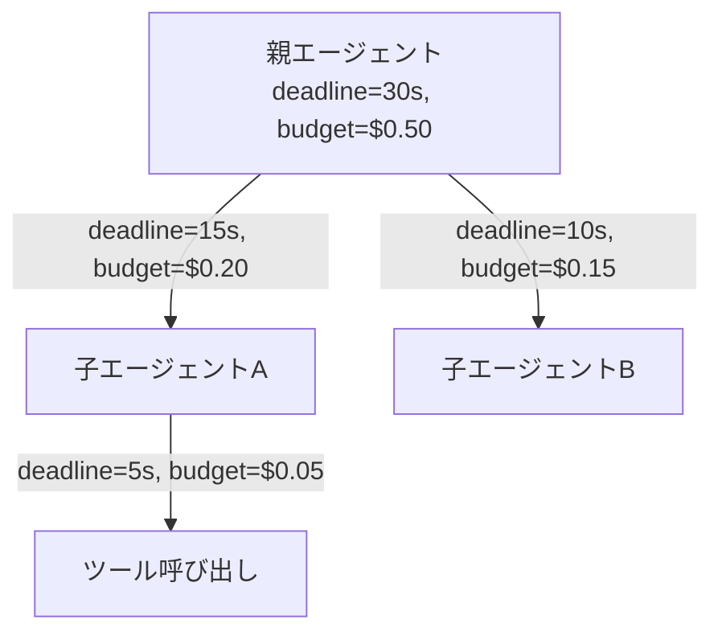

# #55 Deadline & Budget Cascade｜期限・予算のカスケード

!!! abstract "一言"
    親エージェントが持つ期限と予算を、子エージェント・ツール呼び出しの呼出ツリー全体に按分・伝播する。

## 概要

マルチエージェント構成では、親が子に処理を委譲するたびに予算の一部が消費される。このパターンでは、親が自身の残り期限（deadline）と残予算（トークン・金額・ステップ数）を子に明示的に渡し、子はその範囲内でのみ動作する。gRPCのdeadline propagationと同じ考え方をエージェントの呼出ツリーに適用したもの。

!!! info "意思決定上の位置づけ"
    - **必要にするフォース**: `[F7]` コスト感度・スケール・`[F3]` 1リクエストの価値
    - **関与する決定**: [程度（ダイヤル）](../../decisions/tuning-dials.md) の 予算上限
    - **意思決定の進め方**: [意思決定の進め方](../../decisions/decision-flow.md)

## 設計

各呼び出しで `{deadline, token_budget, cost_budget, max_steps}` をコンテキストとして渡す。子は受け取った予算を超えてはならず、自身がさらに委譲する場合は残りから按分する。deadlineはwall-clock時刻で渡し、クロックスキューの影響を受けにくくする。

## 解決する課題

子エージェントが個別に予算を持たない場合、1つの子の暴走が全体の予算を食い潰す。また親の期限が30秒なのに子が25秒使ってしまうと、親に残された時間では後続処理ができない。`[F7]` コスト制御と `[F3]` リクエスト価値に対する投資比率の管理を、ツリー全体で整合的に行う必要がある。

## 向き / 不向き

- **向き**: マルチエージェント構成や、エージェントがツールを再帰的に呼び出す構成。リクエスト当たりのコスト上限を厳密に管理したいSaaS。
- **不向き**: 単一エージェントが1回のLLM呼び出しで完結する構成。予算伝播のオーバーヘッドが実処理に比べて大きすぎる超軽量タスク。

## 要素技術

- コンテキスト伝播: gRPC metadata / HTTP header / エージェントフレームワークの context オブジェクト
- 按分戦略: 均等分割、重要度ベースの重み付き分割、first-come-first-served（プール型）
- 超過時動作: タイムアウト例外の送出、縮退（部分結果で返却）、[#51 Agent-to-Human Escalation](../11-ux/51-agent-to-human-escalation.md)

## 調整（程度）

- **予算の按分比率** — 均等だと重要な子に足りない ⇔ 偏りすぎると軽微な子が動けない / 決め手 `[F3]` / 目安: 過去の消費実績を元に初期比率を決め、動的に調整。→ [程度ダイヤル](../../decisions/tuning-dials.md)

## 関連パターン

- [#5 Time-Budgeted Agent Loop](05-time-budgeted-agent-loop.md) — 各ノードが受け取った予算内でループを回す
- [#9 Supervisor & Specialist Agents](../02-composition/09-supervisor-specialist-agents.md) — 統括役が専門役へ予算を配分する典型的な適用先
- [#37 Semantic Gateway & Cost-Aware Router](../08-cost-scaling/37-semantic-gateway-cost-aware-router.md) — ルーティング時にコスト予算を考慮する

## 参考

- gRPC Deadline Propagation の設計思想
- OpenTelemetry Baggage による context 伝播
