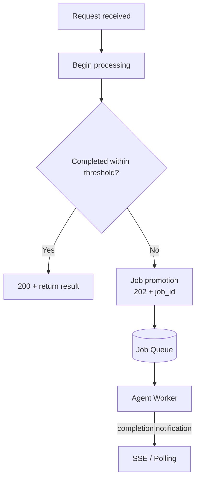

# #58 Sync Facade over Async Core

!!! abstract "TL;DR"
    Return short-lived requests as synchronous responses, automatically promoting to an asynchronous job when a threshold is exceeded.

<!-- BEGIN:GEN:meta -->

Metadata (machine-readable) — #58 Sync Facade over Async Core

| Field | Value |
|------|-----|
| **ID** | 58 |
| **Category** | 01-execution — Execution, Session & Orchestration |
| **Forces** | `[F4]`, `[F1]` |
| **Dials** | timeout |
| **Tradeoffs** | sync-vs-async |
| **Related Patterns** | #1, #2, #7 |
| **When to Use** | Hybrid workloads where light greetings and heavy research coexist on the same endpoint |
| **When Not to Use** | Uniformly fast or slow workloads; clients designed exclusively for async |
| **Element Technologies** | FastAPI asyncio.wait_for, Next.js AbortController |

<!-- END:GEN:meta -->

## Overview

Requiring polling or WebSocket connections when a user simply sends "Hello" to a chatbot is overly cumbersome. On the other hand, making heavy research tasks wait synchronously leads to timeouts. When the same endpoint handles both light and heavy processing, a uniform API design inevitably sacrifices one or the other.

In this pattern, the sync facade starts processing first, and if it completes within the threshold time, the response is returned directly. When it appears the threshold will be exceeded, the work is promoted to a background job, returning `202 Accepted + job_id` and switching to async mode.

!!! info "Position in Decision Framework"
    - **Driving Forces**: `[F4]` Latency Budget, `[F1]` Reversibility
    - **Related Decisions**: [Tuning Dials](../../decisions/tuning-dials.md) — Timeout / [Tradeoffs](../../decisions/tradeoffs.md) — Sync ↔ Async
    - **Decision Flow**: [Decision Flow](../../decisions/decision-flow.md)

## Design

The threshold is configurable, and the facade runs a timer and processing concurrently. On promotion, the in-progress state is handed off directly to the worker (via [#2 Durable Agent Session](02-durable-agent-session.md) for cross-process handoffs).

## Problem Solved

From the `[F4]` latency budget perspective, users have a dual expectation: "I want immediate things back immediately, but I can wait for longer ones." A uniform API design forces a sacrifice of one or the other. This pattern provides an optimal UX for the client while maintaining `[F1]` durability through the backend's async architecture.

## When to Use / When Not to Use

- **When to Use**: Suitable for APIs where light queries and heavy processing coexist on the same endpoint. For example, chatbot responses where simple greetings are sync and research tasks are async.
- **When Not to Use**: Unnecessary when processing time is consistently uniform (all short or all long). If the client is designed exclusively for async mode, [#1 Request-to-Job Gateway](01-request-to-job-gateway.md) is sufficient.

## Element Technologies

- Facade: FastAPI + asyncio.wait_for, Next.js API Routes + AbortController
- Promotion: Serialize session state and enqueue on threshold excess
- Client: SDK / frontend logic that auto-switches to polling or SSE upon receiving `202`

## Tuning (Dials)

- **Sync wait threshold** — Too short causes many requests to be promoted to async, making UX cumbersome. Too long increases connection monopolization and timeout risks / Deciding factor: `[F4]` / Guideline: 5–10 seconds. Also consider CDN and load balancer timeout settings. → [Tuning Dials](../../decisions/tuning-dials.md)

## Selection (Tradeoffs)

- **Sync ↔ Async** — This pattern is effective when the processing time distribution straddles the threshold. If processing time is consistently short or long, lean toward one side `[F4]`. → [Tradeoff Selection Criteria](../../decisions/tradeoffs.md)

## Related Patterns

- [#1 Request-to-Job Gateway](01-request-to-job-gateway.md) — The async execution infrastructure that promoted jobs land in
- [#2 Durable Agent Session](02-durable-agent-session.md) — Used for state handoff during promotion
- [#7 Streaming Progress](07-streaming-progress.md) — Progress notification after async promotion

## References

- A2A Protocol sync/async hybrid design
