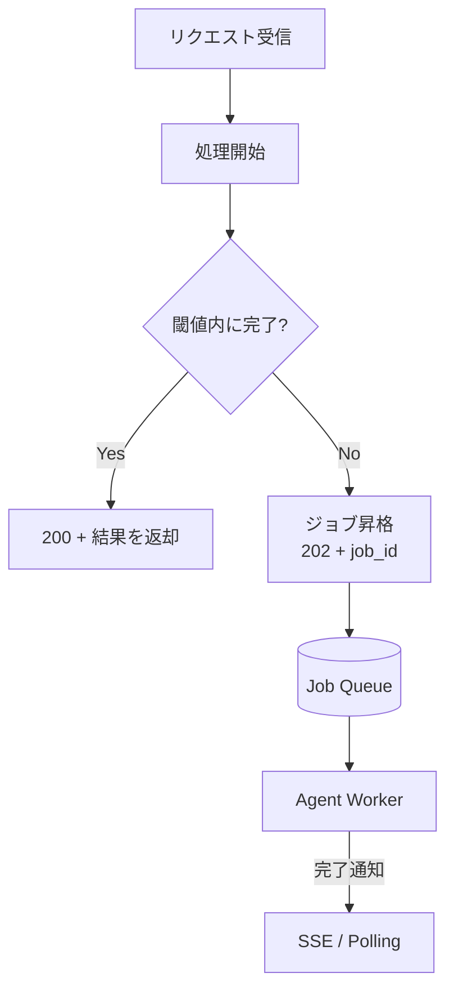

# #58 Sync Facade over Async Core｜同期ファサード

!!! abstract "一言"
    短時間で終わるリクエストは同期レスポンスで返し、閾値を超えたら自動的に非同期ジョブへ昇格させる。

<!-- BEGIN:GEN:meta -->

メタデータ（機械可読） — #58 Sync Facade over Async Core｜同期ファサード

| 項目 | 値 |
|------|-----|
| **ID** | 58 |
| **カテゴリ** | 01-execution — 実行・セッション・オーケストレーション |
| **フォース** | `[F4]`, `[F1]` |
| **ダイヤル** | timeout |
| **二者択一** | sync-vs-async |
| **関連パターン** | #1, #2, #7 |
| **向き** | 軽い挨拶と重い調査が同じエンドポイントに混在するハイブリッドワークロード |
| **不向き** | 一様に高速または低速; 全非同期専用クライアント設計 |
| **要素技術** | FastAPI asyncio.wait_for, Next.js AbortController |

<!-- END:GEN:meta -->

## 概要

チャットボットに「こんにちは」と送ったのにポーリングやWebSocket接続を要求されるのは煩雑すぎる。かといって、重い調査タスクを同期で待たせるとタイムアウトする。同じエンドポイントに軽い処理と重い処理が混在する場合、一律のAPI設計ではどちらかを犠牲にせざるを得ない。

このパターンでは、同期ファサードがまず処理を開始し、閾値時間内に完了すればそのままレスポンスを返す。超えそうになった場合はバックグラウンドジョブに昇格させ、`202 Accepted + job_id` を返して非同期モードに切り替える。

!!! info "意思決定上の位置づけ"
    - **必要にするフォース**: `[F4]` レイテンシ予算・`[F1]` 可逆性
    - **関与する決定**: [程度（ダイヤル）](../../decisions/tuning-dials.md) の タイムアウト / [相反](../../decisions/tradeoffs.md) の 同期↔非同期
    - **意思決定の進め方**: [意思決定の進め方](../../decisions/decision-flow.md)

## 設計

閾値は設定可能にし、ファサード内部ではタイマーと処理を並行して走らせる。昇格時には進行中の状態をそのままワーカーに引き継ぐ（プロセス間なら [#2 Durable Agent Session](02-durable-agent-session.md) 経由）。

## 解決する課題

`[F4]` レイテンシ予算の観点で、ユーザーは「すぐ返るものはすぐ欲しいが、長いものは待てる」という二面的な期待を持っている。一律のAPI設計ではどちらかを犠牲にせざるを得ない。このパターンを用いることで、クライアントに最適なUXを提供しつつ、バックエンドの非同期アーキテクチャによる `[F1]` 耐久性も維持できる。

## 向き / 不向き

- **向き**: 同一エンドポイントに軽いクエリと重い処理が混在するAPIに適している。たとえばチャットボットの応答で、単純な挨拶は同期、調査タスクは非同期といった使い分けに向いている。
- **不向き**: 処理時間が常に一定（すべて短い、またはすべて長い）の場合には不要である。クライアントが非同期モード専用に設計されている場合は [#1 Request-to-Job Gateway](01-request-to-job-gateway.md) で十分である。

## 要素技術

- ファサード: FastAPI + asyncio.wait_for、Next.js API Routes + AbortController
- 昇格: 閾値超過時にセッション状態をシリアライズしてキューへ投入
- クライアント: `202` 受信時にポーリングまたはSSEに自動切り替えするSDK / フロントエンドロジック

## 調整（程度）

- **同期待機の閾値** — 短すぎると多くのリクエストが非同期化されてUXが煩雑になる。一方、長すぎるとコネクション占有やタイムアウトのリスクが高まる / 決め手 `[F4]` / 目安: 5〜10秒。CDNやロードバランサのタイムアウト設定も考慮する。→ [程度ダイヤル](../../decisions/tuning-dials.md)

## 選定（相反）

- **同期 ↔ 非同期** — 処理時間の分布が閾値をまたぐ場合にこのパターンが有効。処理時間が安定して短い／長いなら一方に寄せる `[F4]`。→ [相反の選定基準](../../decisions/tradeoffs.md)

## 関連パターン

- [#1 Request-to-Job Gateway](01-request-to-job-gateway.md) — 昇格先の非同期実行基盤
- [#2 Durable Agent Session](02-durable-agent-session.md) — 昇格時の状態引き継ぎに使う
- [#7 Streaming Progress](07-streaming-progress.md) — 非同期昇格後の進捗通知

## 参考

- A2A プロトコルの同期/非同期ハイブリッド設計
