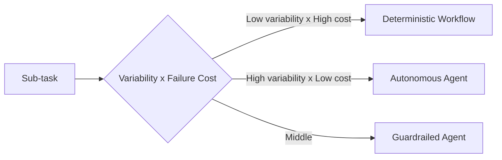

# #59 Workflow-Agent Spectrum Selector

!!! abstract "TL;DR"
    A meta-pattern that selects the optimal execution form for each sub-task along the spectrum of "deterministic workflow ↔ autonomous agent."

<!-- BEGIN:GEN:meta -->

Metadata (machine-readable) — #59 Workflow–Agent Spectrum Selector

| Field | Value |
|------|-----|
| **ID** | 59 |
| **Category** | 01-execution — Execution, Session & Orchestration |
| **Forces** | `[F6]`, `[F2]` |
| **Dials** | — |
| **Tradeoffs** | workflow-vs-agent |
| **Related Patterns** | #3, #11, #57, #48 |
| **When to Use** | System design with multiple sub-tasks, tasks mixing routine and exploratory work |
| **When Not to Use** | Single-task trivial cases; everything clearly routine or clearly exploratory |
| **Element Technologies** | Scoring matrix, dynamic classifier |

<!-- END:GEN:meta -->

## Overview

"Should we build it rigidly with a workflow, or let the agent handle it freely?" — it is not uncommon for this debate to go in circles within a team. In reality, routine billing processing and exploratory research coexist in the same system, and a uniform approach tends to sacrifice one side.

This pattern evaluates task variability `[F6]` and failure cost `[F2]` for each sub-task, selecting whether to execute it as a deterministic workflow, a guardrailed agent, or an autonomous agent. It can be used as a design-time decision framework or configured as a runtime dynamic switching mechanism.

!!! info "Position in Decision Framework"
    - **Driving Forces**: `[F6]` Task Variability, `[F2]` Failure Cost
    - **Related Decisions**: [Tradeoffs](../../decisions/tradeoffs.md) — Workflow ↔ Agent, Single ↔ Multi-Agent
    - **Decision Flow**: [Decision Flow](../../decisions/decision-flow.md)

## Design

Position on the spectrum is determined using the following axes:

| Decision Axis | Workflow-leaning | Agent-leaning |
|--------|-----------------|-----------------|
| Procedure variability `[F6]` | Routine, known | Exploratory, unknown |
| Failure cost `[F2]` | High (irreversible) | Low (retryable) |
| Accountability `[F8]` | Audit required | Best-effort acceptable |

## Problem Solved

Debating "workflow or agent" as a binary choice leads to divided opinions that are hard to resolve. Applying a uniform approach either wastes cost on routine tasks by using agents or loses flexibility by forcing exploratory tasks into workflows. Having selection criteria based on `[F6]` and `[F2]` turns the discussion into quantitative decision-making.

## When to Use / When Not to Use

- **When to Use**: Suitable for the initial design phase of systems comprising multiple sub-tasks. Also effective when incrementally introducing agents into existing workflows, or when building team consensus on "where to apply AI."
- **When Not to Use**: Unnecessary for simple systems with only one sub-task. Also not applicable when all tasks are clearly routine or clearly exploratory, making the judgment trivial.

## Element Technologies

- Design-time: Score each sub-task on `[F6]``[F2]` and place it in the table above
- Runtime dynamic switching: A task classifier (lightweight LLM or rule-based) scores and dynamically determines which nodes in [#3 Workflow Backbone + Agent Node](03-workflow-backbone-agent-node.md) to agentify
- Phased migration: Use [#48 Strangler Fig](../10-deployment/48-strangler-fig.md) to incrementally agentify existing workflow nodes

## Selection (Tradeoffs)

- **Deterministic ↔ Autonomous** — The higher the variability `[F6]` and the lower the failure cost `[F2]`, the more autonomous. The reverse favors deterministic. The middle ground uses guardrailed agents. → [Tradeoff Selection Criteria](../../decisions/tradeoffs.md)

## Related Patterns

- [#3 Workflow Backbone + Agent Node](03-workflow-backbone-agent-node.md) — The "workflow-leaning" implementation on the spectrum
- [#11 Deterministic Core, Probabilistic Edge](../02-composition/11-deterministic-core-probabilistic-edge.md) — The same principle expressed at the system composition level
- [#57 Autonomy Ladder](../06-reliability/57-autonomy-ladder.md) — An operational pattern for gradually increasing agent autonomy based on track record
- [#48 Strangler Fig](../10-deployment/48-strangler-fig.md) — Used for phased agent introduction from existing systems

## References

- Anthropic "Building effective agents" guide — workflow-agent spectrum
