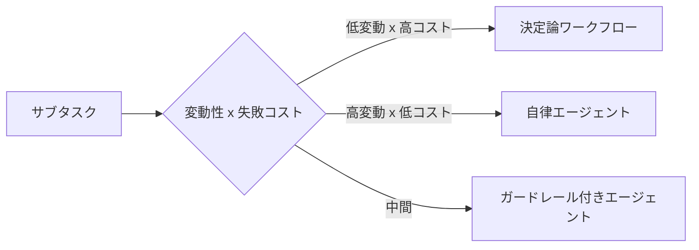

# #59 Workflow-Agent Spectrum Selector｜選定メタ

!!! abstract "一言"
    サブタスクごとに「決定論ワークフロー ↔ 自律エージェント」のスペクトラム上で最適な実行形態を選定するメタパターン。

<!-- BEGIN:GEN:meta -->

メタデータ（機械可読） — #59 Workflow–Agent Spectrum Selector｜選定メタ

| 項目 | 値 |
|------|-----|
| **ID** | 59 |
| **カテゴリ** | 01-execution — 実行・セッション・オーケストレーション |
| **フォース** | `[F6]`, `[F2]` |
| **ダイヤル** | — |
| **二者択一** | workflow-vs-agent |
| **関連パターン** | #3, #11, #57, #48 |
| **向き** | 複数サブタスクのシステム設計、定型と探索が混在するタスク |
| **不向き** | 単一タスクの自明なケース; 全て明確に定型または探索 |
| **要素技術** | スコアリングマトリクス, 動的分類器 |

<!-- END:GEN:meta -->

## 概要

「ワークフローで固く組むべきか、エージェントに自由に任せるべきか」――チーム内でこの議論が堂々巡りになることは少なくない。実際には、定型の請求処理と探索的なリサーチが同じシステムに同居しており、一律のアプローチでは片方が犠牲になりがちである。

このパターンでは、サブタスクごとにタスクの変動性 `[F6]` と失敗コスト `[F2]` を評価し、決定論的ワークフロー・ガードレール付きエージェント・自律エージェントのいずれで実行するかを選定する。設計時の判断フレームワークとして使えるほか、実行時に動的に切り替える仕組みとしても構成できる。

!!! info "意思決定上の位置づけ"
    - **必要にするフォース**: `[F6]` タスクの変動性・`[F2]` 失敗コスト
    - **関与する決定**: [相反](../../decisions/tradeoffs.md) の ワークフロー↔エージェント・シングル↔マルチエージェント
    - **意思決定の進め方**: [意思決定の進め方](../../decisions/decision-flow.md)

## 設計

スペクトラム上の位置付けを以下の軸で判断する。

| 判断軸 | ワークフロー寄り | エージェント寄り |
|--------|-----------------|-----------------|
| 手順の変動性 `[F6]` | 定型・既知 | 探索的・未知 |
| 失敗コスト `[F2]` | 高い（不可逆） | 低い（やり直し可） |
| 説明責任 `[F8]` | 監査必須 | ベストエフォート可 |

## 解決する課題

「ワークフローかエージェントか」を二項対立で議論すると、チーム内で意見が分かれて決着しにくい。また一律に適用すると、定型タスクにエージェントを使って無駄なコストを払うか、探索的なタスクをワークフローに押し込んで柔軟性を失うことになりがちである。`[F6]` と `[F2]` を軸にした選定基準を持つことで、議論を定量的な判断に落とし込めるようになる。

## 向き / 不向き

- **向き**: 複数のサブタスクからなるシステムの初期設計フェーズに適している。既存ワークフローにエージェントを段階導入する場合や、チーム内で「どこにAIを入れるか」の合意を形成したい場合にも有効である。
- **不向き**: サブタスクが1つしかない単純なシステムには不要である。また、全タスクが明らかに定型、または明らかに探索的で判断が自明な場合にも適さない。

## 要素技術

- 設計時: サブタスクごとに `[F6]``[F2]` をスコアリングし、上記の表で配置を決める
- 実行時動的切替: タスク分類器（軽量LLMまたはルールベース）がスコアリングし、[#3 Workflow Backbone + Agent Node](03-workflow-backbone-agent-node.md) のどのノードをエージェント化するかを動的に決定
- 段階移行: [#48 Strangler Fig](../10-deployment/48-strangler-fig.md) で既存ワークフローのノードを順次エージェント化

## 選定（相反）

- **決定論 ↔ 自律** — `[F6]` 変動性が高くかつ `[F2]` 失敗コストが低いほど自律寄り。逆は決定論寄り。中間はガードレール付きエージェント。→ [相反の選定基準](../../decisions/tradeoffs.md)

## 関連パターン

- [#3 Workflow Backbone + Agent Node](03-workflow-backbone-agent-node.md) — スペクトラムの「ワークフロー寄り」の実装
- [#11 Deterministic Core, Probabilistic Edge](../02-composition/11-deterministic-core-probabilistic-edge.md) — 同じ原則をシステム構成レベルで表現したもの
- [#57 Autonomy Ladder](../06-reliability/57-autonomy-ladder.md) — 実績に応じてエージェントの自律度を段階的に上げる運用パターン
- [#48 Strangler Fig](../10-deployment/48-strangler-fig.md) — 既存システムからの段階的なエージェント導入に使う

## 参考

- Anthropic "Building effective agents" ガイドの workflow-agent スペクトラム
