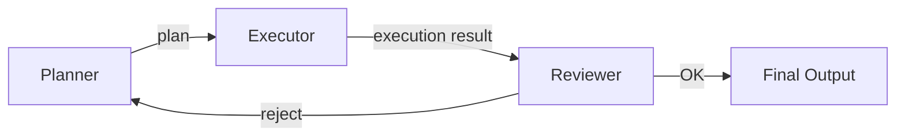

# #8 Planner-Executor-Reviewer

!!! abstract "TL;DR"
    Separate planning, execution, and review into **distinct roles** to structurally suppress a single agent's overconfidence and oversights.

<!-- BEGIN:GEN:meta -->

Metadata (machine-readable) — #8 Planner-Executor-Reviewer

| Field | Value |
|------|-----|
| **ID** | 8 |
| **Category** | 02-composition — Agent Composition & Division of Labor |
| **Forces** | `[F2]`, `[F3]` |
| **Dials** | self-correction-loops |
| **Tradeoffs** | plan-vs-react |
| **Related Patterns** | #10, #28, #50, #5 |
| **When to Use** | Code generation → testing → fixing, report fact-checking, multi-step research with clear verification criteria |
| **When Not to Use** | Simple Q&A; computational overhead exceeds the task itself; F4=low (real-time) |
| **Element Technologies** | LangGraph, CrewAI, LLM/rule-based verification |

<!-- END:GEN:meta -->

## Overview

Even on human teams, when the same person who wrote a proposal also reviews it, oversights and biases tend to slip through. The same happens with LLMs — having a single LLM "think, do, and verify" everything creates a structural conflict of interest where it validates its own plans.

Planner-Executor-Reviewer separates Plan, Execute, and Review into independent roles — potentially different models or prompts. The Planner generates a step sequence, the Executor carries out tool calls and side effects, and the Reviewer verifies results and either rejects or approves them.

!!! info "Position in Decision Framework"
    - **Driving Forces**: `[F2]` Failure Cost, `[F3]` Per-Request Value
    - **Related Decisions**: [Tradeoffs](../../decisions/tradeoffs.md) — Plan ↔ ReAct
    - **Decision Flow**: [Decision Flow](../../decisions/decision-flow.md)

## Design

The Planner handles task decomposition and ordering, outputting a structured plan (JSON or step list). The Executor executes the plan step by step, recording each step's result. The Reviewer cross-checks execution results against the plan's intent and quality criteria, rejecting with reasons and sending back to the Planner if unsatisfactory. The rejection loop has a retry limit, combined with [#5 Time-Budgeted Agent Loop](../01-execution/05-time-budgeted-agent-loop.md) to prevent runaway.

## Problem Solved

In scenarios where `[F2]` failure cost is high, this prevents a single agent's "thought it was done" syndrome. Because planning and verification are independent, the Executor's mistakes and the Planner's logical leaps can be caught from a third-party perspective. The higher the `[F3]` per-request value, the more the token cost invested in this separation is justified.

## When to Use / When Not to Use

- **When to Use**: Suitable for code generation → testing → fixing, report creation → fact-checking, multi-step research tasks where verification criteria can be explicitly stated.
- **When Not to Use**: Not suited for single-shot Q&A or classification where the overhead of separating planning and verification outweighs the task itself. Also not compatible with low-latency `[F4]` requirements.

## Element Technologies

- Planner: Returns plans in JSON/YAML via structured output ([#14 Structured Output Contract](../03-io-contract/14-structured-output-contract.md))
- Executor: Tool invocation infrastructure (LangGraph, CrewAI, custom loop)
- Reviewer: Combination of separate prompt / separate model / rule-based verification
- Loop Control: Max retry count, timeout

## Tuning (Dials)

- **Verification strictness** — Loosening the Reviewer's pass criteria helps the loop converge faster but risks missing errors. Too strict prevents convergence / Deciding factor: `[F2]` / Guideline: rejection limit of 2–3 rounds. → [Tuning Dials](../../decisions/tuning-dials.md)

## Related Patterns

- [#10 Agent Ensemble & Debate](10-agent-ensemble-debate.md) — A variant that extends verification into a debate format
- [#28 Verifier Agent / Critic](../06-reliability/28-verifier-agent-critic.md) — Generalizes the Reviewer into a standalone verification agent
- [#50 Editable Plan](../11-ux/50-editable-plan.md) — Humans edit the Planner's output before passing to the Executor
- [#5 Time-Budgeted Agent Loop](../01-execution/05-time-budgeted-agent-loop.md) — Prevents rejection loop runaway
