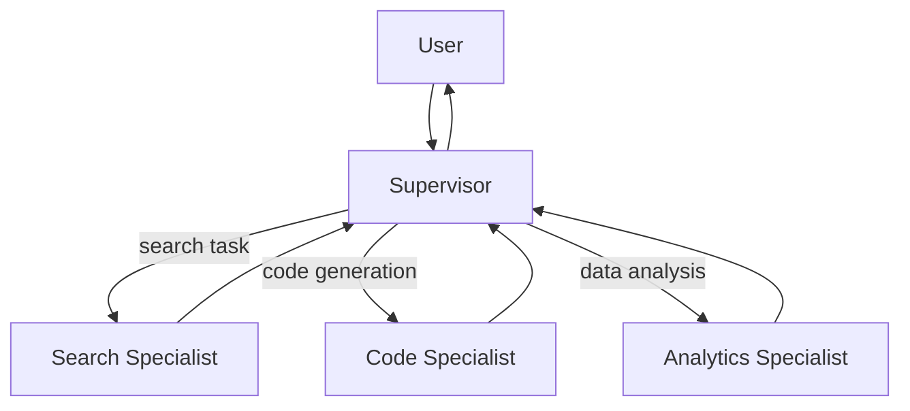

# #9 Supervisor & Specialist Agents

!!! abstract "TL;DR"
    A Supervisor agent decomposes tasks and **delegates them to Specialist agents**.

<!-- BEGIN:GEN:meta -->

Metadata (machine-readable) — #9 Supervisor & Specialist Agents

| Field | Value |
|------|-----|
| **ID** | 9 |
| **Category** | 02-composition — Agent Composition & Division of Labor |
| **Forces** | `[F6]`, `[F7]` |
| **Dials** | — |
| **Tradeoffs** | single-vs-multi-agent |
| **Related Patterns** | #8, #12, #47, #37 |
| **When to Use** | Diverse task types (FAQ/technical/billing), multimodal, separable domain expertise |
| **When Not to Use** | Few task types; specialization benefit is thin; tight coupling between specialists |
| **Element Technologies** | LangGraph conditional routing, OpenAI Swarm, custom routing |

<!-- END:GEN:meta -->

## Overview

Consider a customer support scenario where "technical questions," "billing inquiries," and "return procedures" all arrive at the same endpoint. Assigning everything to a single general-purpose agent causes prompt bloat, wasting context window and diluting expertise simultaneously.

Supervisor-Specialist separates the system into a Supervisor that handles routing and quality management, and Specialist agents specialized in specific domains. The Supervisor interprets the task's intent, selects and invokes the appropriate Specialist, then integrates and returns the results.

!!! info "Position in Decision Framework"
    - **Driving Forces**: `[F6]` Task Variability, `[F7]` Cost Sensitivity & Scale
    - **Related Decisions**: [Tradeoffs](../../decisions/tradeoffs.md) — Single ↔ Multi-Agent
    - **Decision Flow**: [Decision Flow](../../decisions/decision-flow.md)

## Design

The Supervisor holds metadata about each Specialist's capabilities, cost, and latency, selecting delegation targets based on the task. Each Specialist has a prompt, toolset, and potentially a dedicated model optimized for its domain. The Supervisor verifies and integrates Specialist outputs, re-delegating to another Specialist if needed.

## Problem Solved

In environments with high `[F6]` task variability, a single prompt cannot handle diverse expertise needs. Each Specialist can be independently tuned, evaluated, and swapped, making `[F7]` cost optimization easier. Specifically, lightweight models can be assigned to Specialists for simple tasks, while large models handle domains requiring high accuracy.

## When to Use / When Not to Use

- **When to Use**: Suitable for customer support (FAQ / technical / billing specialization), multimodal processing (image / text / audio specialization), and internal tool integration (separate Specialists for Slack / Jira / DB).
- **When Not to Use**: Excessive when there are only 1–2 task types and the benefit of specialization is thin. Also, if dependencies between Specialists become tightly coupled, the Supervisor's routing logic grows complex, increasing maintenance costs.

## Element Technologies

- Supervisor: LangGraph conditional branching, OpenAI Swarm, custom routing
- Specialist Registration: Manage capabilities, cost, and SLA via [#47 Agent Capability Registry](../10-deployment/47-agent-capability-registry.md)
- Model Selection: Dynamic routing combined with [#37 Semantic Gateway](../08-cost-scaling/37-semantic-gateway-cost-aware-router.md)
- Communication: Function calls, message queues, A2A protocol

## Selection (Tradeoffs)

- **Single General-Purpose Agent ↔ Supervisor-Specialist** — If task types are few and homogeneous, a general-purpose agent suffices. When types are many and expertise depth varies, specialization pays off `[F6]`. → [Tradeoff Selection Criteria](../../decisions/tradeoffs.md)

## Related Patterns

- [#8 Planner-Executor-Reviewer](08-planner-executor-reviewer.md) — A similar structure that separates roles by function axis (plan/execute/verify)
- [#12 Blackboard](12-blackboard.md) — A means to coordinate Specialists loosely via shared state
- [#47 Agent Capability Registry](../10-deployment/47-agent-capability-registry.md) — Manages Specialist capabilities as metadata
