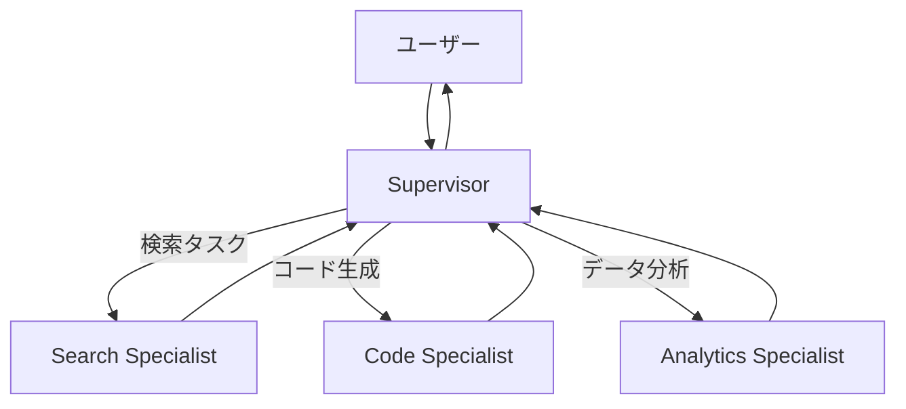

# #9 Supervisor & Specialist Agents｜統括と専門

!!! abstract "一言"
    統括エージェント（Supervisor）がタスクを分解し、**専門エージェント（Specialist）**へ委譲します。

<!-- BEGIN:GEN:meta -->

メタデータ（機械可読） — #9 Supervisor & Specialist Agents｜統括と専門

| 項目 | 値 |
|------|-----|
| **ID** | 9 |
| **カテゴリ** | 02-composition — エージェント構成・分担 |
| **フォース** | `[F6]`, `[F7]` |
| **ダイヤル** | — |
| **二者択一** | single-vs-multi-agent |
| **関連パターン** | #8, #12, #47, #37 |
| **向き** | 多様なタスク種別（FAQ/技術/請求）、マルチモーダル、ドメイン専門性が分離可能 |
| **不向き** | タスク種別が少ない; 専門化の利益が薄い; 専門家間の密結合 |
| **要素技術** | LangGraph conditional routing, OpenAI Swarm, カスタムルーティング |

<!-- END:GEN:meta -->

## 概要

カスタマーサポートで「技術的な質問」「請求の問い合わせ」「返品手続き」が同じ窓口に届く場面を考えてみましょう。1つの汎用エージェントにすべてを任せると、プロンプトが肥大化し、コンテキスト窓の浪費と専門性の希薄化が同時に起きてしまいます。

Supervisor-Specialist は、ルーティングと品質管理を担う Supervisor と、特定ドメインに特化した Specialist 群に分ける構成です。Supervisor はタスクの意図を解釈し、適切な Specialist を選択・呼び出したうえで、結果を統合して返します。

!!! info "意思決定上の位置づけ"
    - **必要にするフォース**: `[F6]` タスクの変動性・`[F7]` コスト感度・スケール
    - **関与する決定**: [相反](../../decisions/tradeoffs.md) の シングル↔マルチエージェント
    - **意思決定の進め方**: [意思決定の進め方](../../decisions/decision-flow.md)

## 設計

Supervisor は各 Specialist の能力・コスト・レイテンシをメタデータとして保持し、タスクに応じて委譲先を選択します。Specialist は自身のドメインに最適化されたプロンプト・ツールセット・場合によっては専用モデルを持ちます。Supervisor は Specialist の出力を検証・統合し、必要なら別の Specialist へ再委譲します。

## 解決する課題

`[F6]` タスクの変動性が高い環境で、単一プロンプトでは対応しきれない多様な専門性を構造的に扱えます。各 Specialist を独立にチューニング・評価・差し替えできるため、`[F7]` コスト最適化もしやすくなります。具体的には、軽量タスクには小型モデルの Specialist を、高精度が必要な領域には大型モデルを割り当てるといった使い分けが可能になります。

## 向き / 不向き

- **向き**: カスタマーサポート（FAQ / 技術 / 請求で専門分化）、マルチモーダル処理（画像 / テキスト / 音声の専門分化）、社内ツール統合（Slack / Jira / DB を別 Specialist で扱う）などに適しています。
- **不向き**: タスク種別が1〜2種で分化の恩恵が薄い場合には過剰な構成となります。また、Specialist 間の依存が密結合になると、Supervisor のルーティングロジックが複雑化して保守コストが上がりやすくなります。

## 要素技術

- Supervisor: LangGraph の条件分岐・OpenAI Swarm・自前ルーティング
- Specialist 登録: [#47 Agent Capability Registry](../10-deployment/47-agent-capability-registry.md) で能力・コスト・SLA を台帳管理
- モデル選択: [#37 Semantic Gateway](../08-cost-scaling/37-semantic-gateway-cost-aware-router.md) と組み合わせた動的ルーティング
- 通信: 関数呼び出し・メッセージキュー・A2A プロトコル

## 選定（相反）

- **単一汎用エージェント ↔ Supervisor-Specialist** — タスク種別が少なく均質なら汎用で十分。種別が多い・専門性の深さが異なる場合に分化が効く `[F6]`。→ [相反の選定基準](../../decisions/tradeoffs.md)

## 関連パターン

- [#8 Planner-Executor-Reviewer](08-planner-executor-reviewer.md) — 役割を機能軸（計画/実行/検証）で分ける類似構造です
- [#12 Blackboard](12-blackboard.md) — Specialist 間を疎結合に協調させる共有状態の手段です
- [#47 Agent Capability Registry](../10-deployment/47-agent-capability-registry.md) — Specialist の能力をメタデータで管理します
