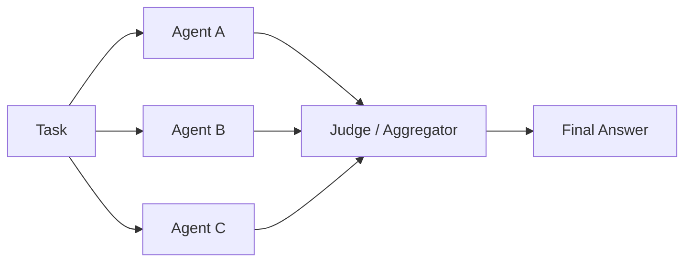

# #10 Agent Ensemble & Debate

!!! abstract "TL;DR"
    Have **multiple agents solve the same problem**, then improve answer robustness through consensus or debate.

<!-- BEGIN:GEN:meta -->

Metadata (machine-readable) — #10 Agent Ensemble & Debate

| Field | Value |
|------|-----|
| **ID** | 10 |
| **Category** | 02-composition — Agent Composition & Division of Labor |
| **Forces** | `[F2]`, `[F3]` |
| **Dials** | best-of-n |
| **Tradeoffs** | same-vs-different-model |
| **Related Patterns** | #8, #28, #37 |
| **When to Use** | High-risk decisions (medical, financial), accuracy verification, high-value disagreement detection |
| **When Not to Use** | High-volume low-cost requests (N-fold cost); subjective creative work; F4=strict (synchronous) |
| **Element Technologies** | Parallel asyncio/thread pool, model mix, voting/scoring |

<!-- END:GEN:meta -->

## Overview

In medical judgments and financial risk assessments, concluding based on a single expert's opinion is high-risk. The same applies to LLMs — a single agent's answer is susceptible to model bias and hallucination.

Agent Ensemble gives the same task to multiple agents (different models, prompts, temperature settings, etc.) and aggregates the results. Aggregation methods include majority vote, scoring, or Debate (convergence through mutual criticism). This can be understood as applying machine learning ensemble techniques at the agent level.

!!! info "Position in Decision Framework"
    - **Driving Forces**: `[F2]` Failure Cost, `[F3]` Per-Request Value
    - **Related Decisions**: [Tuning Dials](../../decisions/tuning-dials.md) — Best-of-N / [Tradeoffs](../../decisions/tradeoffs.md) — Same ↔ Different Model Verification
    - **Decision Flow**: [Decision Flow](../../decisions/decision-flow.md)

## Design

Each agent generates answers independently. The Judge (or Aggregator) compares the answer set, selecting or synthesizing the final answer based on agreement level, evidence quality, and logical consistency. In the Debate variant, agents critique each other's answers and converge over several rounds of discussion.

## Problem Solved

For `[F2]` high-failure-cost decisions (medical, legal, financial decision support), this distributes the risk of depending on a single model's confidence level. The higher the `[F3]` per-request value, the more tolerable the cost of multiple inference runs. Additionally, disagreement between agents itself serves as an indicator of problem difficulty or ambiguity, useful as a basis for human escalation decisions.

## When to Use / When Not to Use

- **When to Use**: Suitable for double-checking high-risk decisions, code generation correctness verification, fact-checking research, and quantifying answer confidence.
- **When Not to Use**: Not suited for high-volume low-unit-price requests (cost multiplies by N). Also not appropriate for subjective creative generation where a "correct answer" is hard to define, or for strict synchronous latency `[F4]` requirements.

## Element Technologies

- Parallel Execution: asyncio, thread pool, workflow engine for parallel agent launch
- Diversity: Model mixing (GPT-4o + Claude + Gemini), temperature parameter variance, prompt variants
- Aggregation: Majority vote, weighted voting, LLM-as-Judge, Elo rating
- Debate: Structured criticism rounds (converge in 2–3 rounds)

## Tuning (Dials)

- **Agent count and round count** — More increases robustness, but cost and latency scale linearly. Too few lacks diversity and diminishes the value of consensus / Deciding factors: `[F3][F7]` / Guideline: 3 agents, 2 rounds. → [Tuning Dials](../../decisions/tuning-dials.md)

## Selection (Tradeoffs)

- **Single Agent + Verifier ↔ Ensemble** — If you want to verify while containing costs, [#28 Verifier Agent](../06-reliability/28-verifier-agent-critic.md) may suffice. When disagreement detection and diverse perspectives are needed, use Ensemble `[F2][F3]`. → [Tradeoff Selection Criteria](../../decisions/tradeoffs.md)

## Related Patterns

- [#8 Planner-Executor-Reviewer](08-planner-executor-reviewer.md) — An alternative approach to quality improvement through role separation
- [#28 Verifier Agent / Critic](../06-reliability/28-verifier-agent-critic.md) — A lightweight alternative using a single verifier
- [#37 Semantic Gateway & Cost-Aware Router](../08-cost-scaling/37-semantic-gateway-cost-aware-router.md) — Dynamic optimization of model selection
