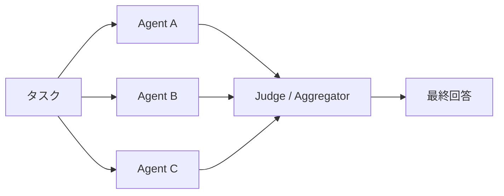

# #10 Agent Ensemble & Debate｜アンサンブル・討論

!!! abstract "一言"
    同じ問いを**複数エージェントで解き、合議・討論**を経て回答の頑健性を高めます。

<!-- BEGIN:GEN:meta -->

メタデータ（機械可読） — #10 Agent Ensemble & Debate｜アンサンブル・討論

| 項目 | 値 |
|------|-----|
| **ID** | 10 |
| **カテゴリ** | 02-composition — エージェント構成・分担 |
| **フォース** | `[F2]`, `[F3]` |
| **ダイヤル** | best-of-n |
| **二者択一** | same-vs-different-model, single-vs-multi-agent |
| **関連パターン** | #8, #28, #37 |
| **向き** | 高リスク判断（医療・金融）、正確性検証、不一致検出が高価値 |
| **不向き** | 大量低コストリクエスト（N倍コスト）; 主観的クリエイティブ; F4=厳格（同期） |
| **要素技術** | 並列 asyncio/thread pool, モデルミックス, 投票/スコアリング |

<!-- END:GEN:meta -->

## 概要

医療判断や金融リスク評価で、1人の専門家の意見だけで結論を出すのはリスクが高いです。LLMでも同じで、単一エージェントの回答はモデルのバイアスやハルシネーションに左右されやすくなります。

Agent Ensemble は、複数のエージェント（異なるモデル・プロンプト・温度設定など）に同じタスクを与え、結果を集約する手法です。集約方法には多数決（Majority Vote）、スコアリング、または Debate（相互批判による収束）があります。これは機械学習のアンサンブル手法をエージェントレベルに適用したものと捉えられます。

!!! info "意思決定上の位置づけ"
    - **必要にするフォース**: `[F2]` 失敗コスト・`[F3]` 1リクエストの価値
    - **関与する決定**: [程度（ダイヤル）](../../decisions/tuning-dials.md) の Best-of-N / [相反](../../decisions/tradeoffs.md) の 同一↔別モデル検証
    - **意思決定の進め方**: [意思決定の進め方](../../decisions/decision-flow.md)

## 設計

各エージェントは独立に回答を生成します。Judge（またはAggregator）は回答群を比較し、一致度・根拠の質・論理整合性を基に最終回答を選択または合成します。Debate 変種では、エージェント同士が互いの回答を批判し、数ラウンドの議論を経て収束させます。

## 解決する課題

`[F2]` 失敗コストが高い判断（医療・法務・金融の意思決定支援など）において、単一モデルの確信度に依存するリスクを分散できます。`[F3]` 1リクエストの価値が高いほど、複数回の推論コストは許容しやすくなります。また、エージェント間の不一致そのものが問題の難しさや曖昧さの指標となり、人間エスカレーションの判断材料としても活用できます。

## 向き / 不向き

- **向き**: 高リスク判断の二重チェック、コード生成の正当性検証、事実確認が必要なリサーチ、回答の確信度を定量化したい場面に適しています。
- **不向き**: 大量の低単価リクエストには向きません（コストが N 倍になります）。また、回答が主観的で「正解」が定義しにくいクリエイティブ生成や、レイテンシが厳しい同期処理 `[F4]` にも適しません。

## 要素技術

- 並列実行: asyncio・スレッドプール・ワークフローエンジンでエージェントを並列起動
- 多様性の確保: モデル混合（GPT-4o + Claude + Gemini）、温度パラメータの分散、プロンプト変種
- 集約: 多数決・加重投票・LLM-as-Judge・Elo レーティング
- Debate: 構造化された批判ラウンド（2〜3ラウンドで収束させる）

## 調整（程度）

- **エージェント数とラウンド数** — 多いほど頑健になりますが、コスト・レイテンシが線形に増加します。一方、少なすぎると多様性が不足し合議の意味が薄れます / 決め手 `[F3][F7]` / 目安: 3体・2ラウンド。→ [程度ダイヤル](../../decisions/tuning-dials.md)

## 選定（相反）

- **単一エージェント＋Verifier ↔ Ensemble** — コストを抑えつつ検証したいなら [#28 Verifier Agent](../06-reliability/28-verifier-agent-critic.md) で十分な場合もある。不一致の検出と多様な視点が要るなら Ensemble `[F2][F3]`。→ [相反の選定基準](../../decisions/tradeoffs.md)

## 関連パターン

- [#8 Planner-Executor-Reviewer](08-planner-executor-reviewer.md) — 役割分離による品質向上の別アプローチです
- [#28 Verifier Agent / Critic](../06-reliability/28-verifier-agent-critic.md) — 単一検証器による軽量な代替です
- [#37 Semantic Gateway & Cost-Aware Router](../08-cost-scaling/37-semantic-gateway-cost-aware-router.md) — モデル選択の動的最適化です
