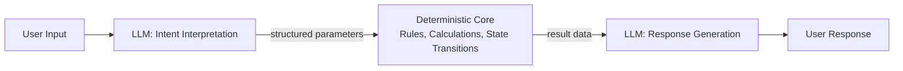

# #11 Deterministic Core, Probabilistic Edge

!!! abstract "TL;DR"
    Build the system's core logic with **deterministic code**, using LLMs only for peripheral interpretation, generation, and summarization.

<!-- BEGIN:GEN:meta -->

Metadata (machine-readable) — #11 Deterministic Core, Probabilistic Edge

| Field | Value |
|------|-----|
| **ID** | 11 |
| **Category** | 02-composition — Agent Composition & Division of Labor |
| **Forces** | `[F2]`, `[F8]` |
| **Dials** | — |
| **Tradeoffs** | prompt-vs-code |
| **Related Patterns** | #3, #14, #30 |
| **When to Use** | Finance, insurance, medical protocols — where exact amounts and logic are mandatory |
| **When Not to Use** | Exploratory research; creative generation; rules too ambiguous to codify |
| **Element Technologies** | Drools/OPA, rule engines, state machines, template+LLM |

<!-- END:GEN:meta -->

## Overview

If an LLM were tasked with insurance claim amounts or loan approval decisions, the same input might return different amounts each time. This is unacceptable for business operations. "Processing that must not be wrong" and "processing that requires flexibility" are fundamentally different.

Deterministic Core, Probabilistic Edge keeps business rules, state transitions, amount calculations, and authorization decisions in conventional code where certainty is mandatory, while limiting LLM usage to natural language interpretation, unstructured data classification, and user-facing text generation — areas requiring flexibility.

!!! info "Position in Decision Framework"
    - **Driving Forces**: `[F2]` Failure Cost, `[F8]` Accountability & Regulation
    - **Related Decisions**: [Tradeoffs](../../decisions/tradeoffs.md) — Workflow ↔ Agent, Prompt ↔ Code Control
    - **Decision Flow**: [Decision Flow](../../decisions/decision-flow.md)

## Design

The input-side LLM converts natural language to structured parameters ([#14 Structured Output Contract](../03-io-contract/14-structured-output-contract.md)), the deterministic core executes business logic, and the output-side LLM formats results for humans. The core can be tested with conventional unit tests, type checking, and formal verification, and audit logs can be deterministically maintained.

## Problem Solved

This eliminates the risk of entrusting `[F2]` high-failure-cost processing (financial transactions, medical decisions, legal procedures) to LLM probabilistic output. From the `[F8]` accountability and regulation perspective, it enables explaining "why that result was produced" through the deterministic core's code path. Even if the LLM portion fails, the core logic remains unaffected, limiting the blast radius of failures.

## When to Use / When Not to Use

- **When to Use**: Suitable for financial calculations, insurance assessments, medical protocols, legal document processing, and other operations where accuracy and auditability are mandatory. Also effective when adding agent capabilities to existing business systems.
- **When Not to Use**: Not suited for exploratory research or creative generation where the entire task inherently requires probabilistic reasoning. Also not appropriate for domains where rules themselves are too ambiguous to codify.

## Element Technologies

- Intent Interpretation: [#13 Natural Language Boundary Adapter](../03-io-contract/13-natural-language-boundary-adapter.md), Function Calling
- Deterministic Core: Rule engines (Drools, OPA), state machines, conventional business logic
- Contract Boundary: Schema-based contracts between LLM and core via [#14 Structured Output Contract](../03-io-contract/14-structured-output-contract.md)
- Response Generation: Template engine + LLM, or LLM standalone

## Selection (Tradeoffs)

- **Fully Autonomous Agent ↔ Deterministic Core + Probabilistic Edge** — If task variability `[F6]` is high and rules cannot be codified, increase autonomy. If failure cost `[F2]` and accountability `[F8]` are high, keep the core deterministic. → [Tradeoff Selection Criteria](../../decisions/tradeoffs.md)

## Related Patterns

- [#3 Workflow Backbone + Agent Node](../01-execution/03-workflow-backbone-agent-node.md) — A similar idea with a deterministic workflow backbone, using LLMs at the node level
- [#14 Structured Output Contract](../03-io-contract/14-structured-output-contract.md) — The means to contractualize the boundary between LLM and core
- [#30 Policy-as-Code Guardrail](../06-reliability/30-policy-as-code-guardrail.md) — A related pattern for codifying constraints as deterministic judgments
