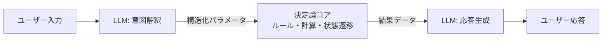

# #11 Deterministic Core, Probabilistic Edge｜決定論コア

!!! abstract "一言"
    システムの中核ロジックは**決定論的コード**で構築し、LLMは周辺の解釈・生成・要約にのみ使う。

## 概要

LLMは柔軟だが非決定論的であり、同じ入力に対して同じ出力を保証できない。決定論コア・確率論エッジは、ビジネスルール・状態遷移・金額計算・権限判定など「間違ってはならない」処理を従来のコードで書き、LLMの利用は自然言語の解釈、非構造データの分類、ユーザー向け文章の生成など「柔軟さが必要な周辺」に限定する構成である。

!!! info "意思決定上の位置づけ"
    - **必要にするフォース**: `[F2]` 失敗コスト・`[F8]` 説明責任・規制
    - **関与する決定**: [相反](../../decisions/tradeoffs.md) の ワークフロー↔エージェント・プロンプト↔コード制御
    - **意思決定の進め方**: [意思決定の進め方](../../decisions/decision-flow.md)

## 設計

入力側の LLM が自然言語を構造化パラメータに変換し（[#14 Structured Output Contract](../03-io-contract/14-structured-output-contract.md)）、決定論コアがビジネスロジックを実行し、出力側の LLM が結果を人間向けに整形する。コアは通常のユニットテスト・型検査・形式検証が適用でき、監査ログも確定的に残せる。

## 解決する課題

`[F2]` 失敗コストが高い処理（金融取引・医療判断・法的手続き）をLLMの確率的出力に委ねるリスクを排除できる。また、`[F8]` 説明責任・規制が求める「なぜその結果になったか」を、決定論コアのコードパスとして説明できるようになる。LLM部分で障害が起きてもコアロジックは影響を受けないため、障害の影響半径を限定できる点も利点である。

## 向き / 不向き

- **向き**: 金融計算、保険査定、医療プロトコル、法的文書処理など、正確性と監査可能性が必須の業務に適している。既存の業務システムにエージェント機能を追加する場面にも有効である。
- **不向き**: 探索的なリサーチやクリエイティブ生成など、タスク全体が確率的推論を本質とする場合には向かない。また、ルール自体が曖昧で事前にコード化できない領域にも適さない。

## 要素技術

- 意図解釈: [#13 Natural Language Boundary Adapter](../03-io-contract/13-natural-language-boundary-adapter.md)、Function Calling
- 決定論コア: ルールエンジン（Drools、OPA）、ステートマシン、従来の業務ロジック
- 契約の境界: [#14 Structured Output Contract](../03-io-contract/14-structured-output-contract.md) でLLMとコアの間をスキーマで契約化
- 応答生成: テンプレートエンジン＋LLM、またはLLM単独

## 選定（相反）

- **全自律エージェント ↔ 決定論コア＋確率論エッジ** — タスクの変動性 `[F6]` が高く事前にルール化できないなら自律度を上げるが、失敗コスト `[F2]` と説明責任 `[F8]` が高いならコアを決定論に保つ。→ [相反の選定基準](../../decisions/tradeoffs.md)

## 関連パターン

- [#3 Workflow Backbone + Agent Node](../01-execution/03-workflow-backbone-agent-node.md) — 骨格を決定論ワークフローにし、ノード単位でLLMを使う類似発想
- [#14 Structured Output Contract](../03-io-contract/14-structured-output-contract.md) — LLMとコアの境界を契約化する手段
- [#30 Policy-as-Code Guardrail](../06-reliability/30-policy-as-code-guardrail.md) — 制約をコード化して判定する関連パターン
