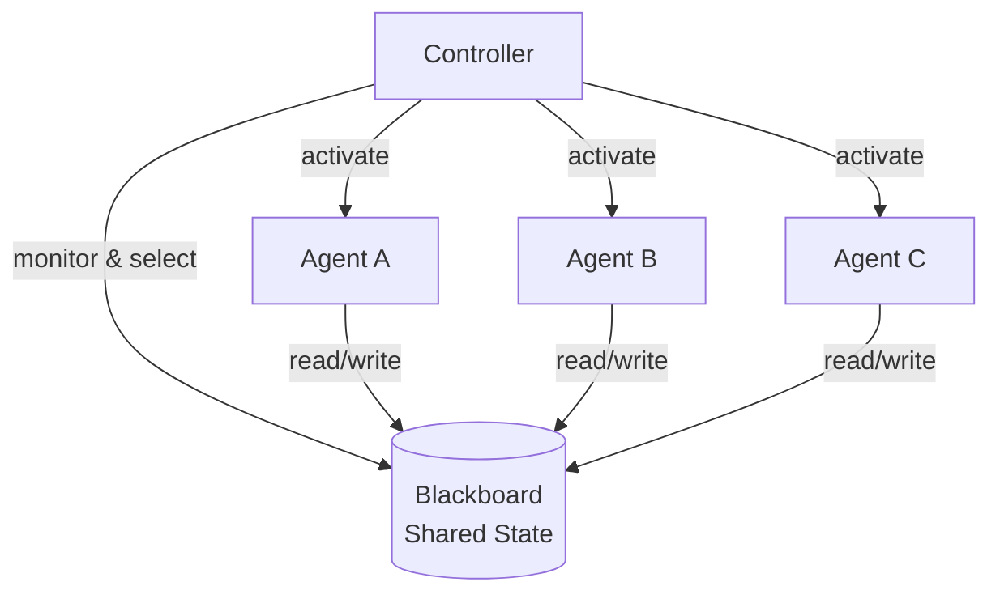

# #12 Blackboard

!!! abstract "TL;DR"
    Multiple agents coordinate in a **loosely coupled** manner through a shared data store (blackboard).

<!-- BEGIN:GEN:meta -->

Metadata (machine-readable) — #12 Blackboard

| Field | Value |
|------|-----|
| **ID** | 12 |
| **Category** | 02-composition — Agent Composition & Division of Labor |
| **Forces** | `[F6]` |
| **Dials** | — |
| **Tradeoffs** | orchestration-vs-choreography |
| **Related Patterns** | #9, #23, #3 |
| **When to Use** | Complex multi-agent analysis, dynamic agent participation, exploratory problem solving |
| **When Not to Use** | Fixed-order workflows (use #3); high-contention concurrent writes |
| **Element Technologies** | Redis, PostgreSQL JSONB, Firebase, Pub/Sub |

<!-- END:GEN:meta -->

## Overview

When multiple agents cooperate to solve a single problem, directly coupling them via invocations causes the number of connections to explode as participants increase. If there is a shared space — like a meeting room whiteboard — where everyone can read and write, this complexity can be avoided.

The Blackboard pattern is a classic AI architecture where agents coordinate indirectly through a shared data store — the blackboard. Each agent (Knowledge Source) reads the blackboard and writes results when it can contribute. A Controller monitors state changes on the blackboard and selects which agent should act next. Agents do not need to know about each other.

!!! info "Position in Decision Framework"
    - **Driving Forces**: `[F6]` Task Variability
    - **Related Decisions**: [Tradeoffs](../../decisions/tradeoffs.md) — Centralized ↔ Choreography
    - **Decision Flow**: [Decision Flow](../../decisions/decision-flow.md)

## Design

The blackboard holds the task's current state — input data, intermediate hypotheses, partial results, final output — in a structured form. Each agent subscribes to specific regions of the blackboard and writes back results when its expertise matches the current state. The Controller triggers the next agent based on blackboard changes (new hypothesis additions, confidence score updates, etc.).

## Problem Solved

This handles exploratory problems where `[F6]` task variability is high and it cannot be predetermined which agent should act in what order. Since adding or removing agents requires only blackboard schema changes, system extensibility is high. Unlike the Supervisor pattern, no single supervisor becomes a bottleneck.

## When to Use / When Not to Use

- **When to Use**: Suitable for complex analytical tasks (agents from different specialties building up partial hypotheses), flexible data pipeline composition, and environments where the number of agents changes dynamically.
- **When Not to Use**: Excessive for routine workflows with clearly determined execution order ([#3 Workflow Backbone](../01-execution/03-workflow-backbone-agent-node.md) is simpler). Also note that in high-concurrency environments where blackboard read/write contention is likely, lock and consistency management costs increase.

## Element Technologies

- Blackboard: Redis, PostgreSQL (JSONB), Firebase Realtime Database, in-memory KV store
- Controller: Event-driven (Pub/Sub, Change Data Capture) or polling
- Agent Registration: Manage participating agents via [#47 Agent Capability Registry](../10-deployment/47-agent-capability-registry.md)
- Schema: Define blackboard state with typed schemas (JSON Schema, Pydantic) to prevent invalid writes

## Related Patterns

- [#9 Supervisor & Specialist Agents](09-supervisor-specialist-agents.md) — A supervisor-based delegation model. The blackboard can be viewed as a decentralized variant
- [#23 Layered Memory](../05-memory-context/23-layered-memory.md) — A perspective positioning the blackboard as a short-term shared memory layer
- [#3 Workflow Backbone + Agent Node](../01-execution/03-workflow-backbone-agent-node.md) — The alternative when execution order is fixed

## References

- Nii, H. P. (1986). "Blackboard Systems" — Classic Blackboard architecture description
