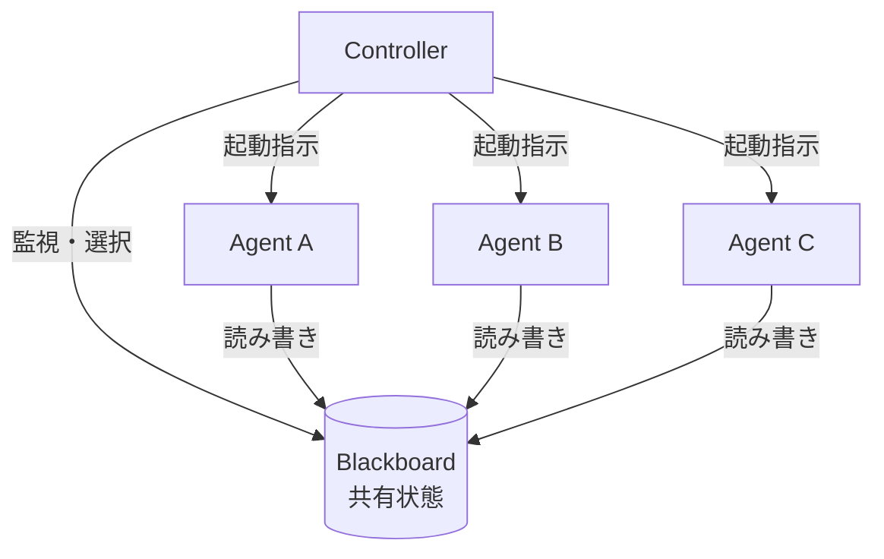

# #12 Blackboard｜共有黒板

!!! abstract "一言"
    共有データストア（黒板）を介して複数エージェントが**疎結合に協調**する。

## 概要

Blackboard パターンは、エージェント間を直接呼び出しで結合するのではなく、共有のデータストア――黒板（Blackboard）――を介して間接的に協調させる古典的AIアーキテクチャである。各エージェント（Knowledge Source）は黒板を読み、自分が貢献できる部分があれば書き込む。コントローラが黒板の状態変化を監視し、次に動くべきエージェントを選択する。エージェント同士は互いの存在を知らなくてよい。

## 設計

黒板はタスクの現在状態――入力データ、中間仮説、部分結果、最終出力――を構造化して保持する。各エージェントは黒板の特定領域を購読し、自分の専門で処理できる状態になったら結果を書き戻す。Controller は黒板の変化（新しい仮説の追加、信頼度の更新など）に基づいて次のエージェントを起動する。

## 解決する課題

`[F6]` タスクの変動性が高く、どのエージェントがどの順序で動くべきか事前に決められない探索的問題に対応する。エージェントの追加・削除が黒板のスキーマ変更だけで済むため、システムの拡張性が高い。Supervisor パターンと異なり、統括役がボトルネックにならない。

## 向き / 不向き

- **向き**: 複合的な分析タスク（異なる専門分野のエージェントが部分仮説を積み上げる）、データパイプラインの柔軟な構成、エージェント数が動的に変わる環境。
- **不向き**: 実行順序が明確に決まっている定型ワークフロー（[#3 Workflow Backbone](../01-execution/03-workflow-backbone-agent-node.md) の方が単純）。黒板への読み書きが競合しやすい高並行環境ではロック・整合性の管理コストが増す。

## 要素技術

- 黒板: Redis・PostgreSQL（JSONB）・Firebase Realtime Database・インメモリ KV ストア
- Controller: イベント駆動（Pub/Sub・Change Data Capture）またはポーリング
- エージェント登録: [#47 Agent Capability Registry](../10-deployment/47-agent-capability-registry.md) で参加エージェントを管理
- スキーマ: 黒板の状態を型付きスキーマ（JSON Schema・Pydantic）で定義し、不正な書き込みを防止

## 関連パターン

- [#9 Supervisor & Specialist Agents](09-supervisor-specialist-agents.md) — 統括型の委譲モデル。黒板は統括役を分散化した変種とも言える
- [#23 Layered Memory](../05-memory-context/23-layered-memory.md) — 黒板を短期共有メモリ層として位置づける見方
- [#3 Workflow Backbone + Agent Node](../01-execution/03-workflow-backbone-agent-node.md) — 実行順序が固定な場合の代替

## 参考

- Nii, H. P. (1986). "Blackboard Systems" — 古典的な Blackboard アーキテクチャの解説
