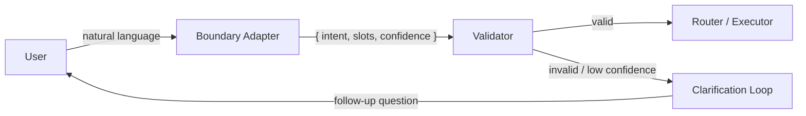

# #13 Natural Language Boundary Adapter

!!! abstract "TL;DR"
    A boundary layer that converts user natural language input into **structured intent representations** (intent + slots), passing them to downstream deterministic processing.

<!-- BEGIN:GEN:meta -->

Metadata (machine-readable) — #13 Natural Language Boundary Adapter

| Field | Value |
|------|-----|
| **ID** | 13 |
| **Category** | 03-io-contract — Input/Output & Contracts |
| **Forces** | `[F5]` |
| **Dials** | — |
| **Tradeoffs** | — |
| **Related Patterns** | #14, #16, #29 |
| **When to Use** | Clear action classification (orders, tickets, searches), finite intent types |
| **When Not to Use** | Free-form creative writing; intent enumeration is ambiguous |
| **Element Technologies** | LLM function calling, Claude tool_use, Rasa, Dialogflow, Amazon Lex, JSON Schema, Pydantic |

<!-- END:GEN:meta -->

## Overview

When a user says "generate last month's sales report," what period does "last month" cover? Which department's "sales"? Does "generate" mean email or display on screen? Natural language always carries such ambiguity and omission, and passing it downstream as-is contaminates the processing logic.

This pattern places a "translation layer" at the front of the input, decomposing free text into intent, parameters (slots), and confidence. Downstream components receive only structured contracts, allowing standard validation and routing to be applied directly.

!!! info "Position in Decision Framework"
    - **Driving Forces**: `[F5]` Input Trustworthiness
    - **Decision Flow**: [Decision Flow](../../decisions/decision-flow.md)

## Design

The Boundary Adapter is implemented using an LLM or rule-based NLU. Output is fixed-schema JSON, and downstream components handle no natural language at all. When confidence falls below the threshold, it delegates to [#16 Ambiguity Negotiation](16-ambiguity-negotiation.md) for clarification.

## Problem Solved

Passing natural language directly to conditionals or tool invocations means intent misinterpretation, prompt injection, and parameter omission can directly lead to side effects. Structuring at the boundary raises `[F5]` input trustworthiness to a controllable level, reducing the defensive cost of downstream components.

## When to Use / When Not to Use

- **When to Use**: Suitable for operations with a clear action taxonomy (order processing, internal workflow triggering, data retrieval). Also effective when input variations are many but intent types are finite.
- **When Not to Use**: Not suited for free-form creative writing or brainstorming where intents cannot be enumerated in advance. If output structuring is the goal, [#14 Structured Output Contract](14-structured-output-contract.md) is more appropriate.

## Element Technologies

- LLM function calling / tool_use (OpenAI Functions, Claude tool_use)
- Rasa / Dialogflow / Amazon Lex (rule-based NLU)
- JSON Schema / Pydantic for slot definition and validation

## Tuning (Dials)

- **Structuring granularity** — Too coarse requires downstream re-interpretation. Too fine reduces conversion accuracy and triggers excessive clarification loops / Deciding factor: `[F5]` / Guideline: 3–7 slots per intent. → [Tuning Dials](../../decisions/tuning-dials.md)

## Related Patterns

- [#14 Structured Output Contract](14-structured-output-contract.md) — Output-side structuring. Pairs with input-side as entry and exit
- [#16 Ambiguity Negotiation](16-ambiguity-negotiation.md) — Negotiation protocol for insufficient confidence
- [#29 Guardrail Sidecar + Self-Correction](../06-reliability/29-guardrail-sidecar-self-correction.md) — Additional inspection on conversion results

## References

- OpenAI Function Calling documentation
- Anthropic Tool Use documentation
