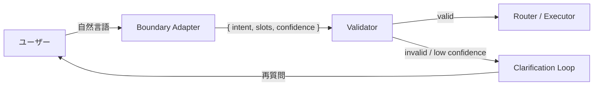

# #13 Natural Language Boundary Adapter｜自然言語境界

!!! abstract "一言"
    ユーザーの自然言語入力を**構造化された意図表現**（インテント＋スロット）へ変換し、下流の決定論的処理に渡す境界層。

<!-- BEGIN:GEN:meta -->

メタデータ（機械可読） — #13 Natural Language Boundary Adapter｜自然言語境界

| 項目 | 値 |
|------|-----|
| **ID** | 13 |
| **カテゴリ** | 03-io-contract — 入出力・契約化 |
| **フォース** | `[F5]` |
| **ダイヤル** | — |
| **二者択一** | — |
| **関連パターン** | #14, #16, #29 |
| **向き** | 明確なアクション分類（注文・チケット・検索）、有限のインテント種別 |
| **不向き** | 自由形式の創作; インテント列挙が曖昧 |
| **要素技術** | LLM function calling, Claude tool_use, Rasa, Dialogflow, Amazon Lex, JSON Schema, Pydantic |

<!-- END:GEN:meta -->

## 概要

ユーザーが「先月の売上レポートを出して」と言ったとき、「先月」はいつからいつまでか、「売上」はどの部門か、「出す」はメール送信なのか画面表示なのか。自然言語にはこうした曖昧さや省略が常につきまとい、そのまま下流に流すと処理ロジックを汚染してしまう。

本パターンは、入力の最前段に「翻訳層」を配置し、自由文を意図（intent）・パラメータ（slots）・確信度（confidence）に分解する。下流は構造化された契約だけを受け取るため、通常のバリデーションやルーティングをそのまま適用できる。

!!! info "意思決定上の位置づけ"
    - **必要にするフォース**: `[F5]` 入力の信頼度
    - **意思決定の進め方**: [意思決定の進め方](../../decisions/decision-flow.md)

## 設計

Boundary Adapter は LLM またはルールベースの NLU で実装する。出力は固定スキーマの JSON で、下流は自然言語を一切扱わない。confidence が閾値を下回る場合は [#16 Ambiguity Negotiation](16-ambiguity-negotiation.md) へ委譲して確認を挟む。

## 解決する課題

自然言語をそのまま条件分岐やツール呼び出しに渡すと、意図の取り違えやプロンプトインジェクション、パラメータ欠損がそのまま副作用に直結してしまう。境界で構造化することにより、`[F5]` 入力の信頼度を制御可能なレベルに引き上げ、下流コンポーネントの防御コストを下げることができる。

## 向き / 不向き

- **向き**: 明確なアクション体系がある業務（注文処理、社内ワークフロー起動、データ検索など）に適している。入力バリエーションが多いが意図の種類は有限な場面にも有効である。
- **不向き**: 自由記述の創作やブレインストーミングなど、意図を事前に列挙できないタスクには向かない。出力の構造化が目的であれば [#14 Structured Output Contract](14-structured-output-contract.md) の方が適切である。

## 要素技術

- LLM による function calling / tool_use（OpenAI Functions, Claude tool_use）
- Rasa / Dialogflow / Amazon Lex（ルールベース NLU）
- JSON Schema / Pydantic によるスロット定義とバリデーション

## 調整（程度）

- **構造化の粒度** — 粗すぎると下流で再解釈が必要になる。一方、細かすぎると変換精度が落ち、確認ループが頻発してしまう / 決め手 `[F5]` / 目安: 1意図あたりスロット3〜7個。→ [程度ダイヤル](../../decisions/tuning-dials.md)

## 関連パターン

- [#14 Structured Output Contract](14-structured-output-contract.md) — 出力側の構造化。入口と出口で対になる
- [#16 Ambiguity Negotiation](16-ambiguity-negotiation.md) — confidence 不足時の交渉プロトコル
- [#29 Guardrail Sidecar + Self-Correction](../06-reliability/29-guardrail-sidecar-self-correction.md) — 変換結果に対する追加検査

## 参考

- OpenAI Function Calling ドキュメント
- Anthropic Tool Use ドキュメント
