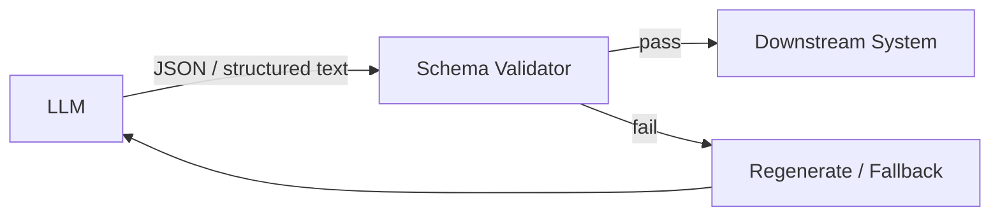

# #14 Structured Output Contract

!!! abstract "TL;DR"
    **Contractualize LLM output with JSON Schema or similar schemas**, guaranteeing that downstream can safely parse it.

<!-- BEGIN:GEN:meta -->

Metadata (machine-readable) — #14 Structured Output Contract

| Field | Value |
|------|-----|
| **ID** | 14 |
| **Category** | 03-io-contract — Input/Output & Contracts |
| **Forces** | `[F8]` |
| **Dials** | — |
| **Tradeoffs** | structured-vs-freeform |
| **Related Patterns** | #13, #15, #30 |
| **When to Use** | API response generation, form input, data extraction, workflow routing |
| **When Not to Use** | Free text (reports, emails); when formatting crushes expressiveness |
| **Element Technologies** | OpenAI response_format, Anthropic tool_use, Pydantic, Zod, JSON Schema, Instructor |

<!-- END:GEN:meta -->

## Overview

Even when asking an LLM to "return JSON," sometimes it includes code block wrappers, other times extra explanatory text, and occasionally slightly different field names — any implementer has experienced this format drift breaking downstream parsing.

This pattern pre-defines an output schema and has the LLM generate schema-compliant structured data. After generation, a validator verifies compliance, triggering regeneration or fallback on non-conformance. It applies to everything downstream that is deterministic processing — API responses, DB writes, workflow transitions.

!!! info "Position in Decision Framework"
    - **Driving Forces**: `[F8]` Accountability & Regulation
    - **Related Decisions**: [Tradeoffs](../../decisions/tradeoffs.md) — Structured ↔ Free-form Output
    - **Decision Flow**: [Decision Flow](../../decisions/decision-flow.md)

## Design

Schemas are defined using JSON Schema, Pydantic models, Protocol Buffers, etc. Using the LLM's structured output mode (OpenAI `response_format`, Anthropic tool_use) increases compliance at generation time, but validation should never be skipped.

## Problem Solved

Unstructured output risks cascading from parse failures to silent errors and invalid data contamination. From the `[F8]` audit and compliance perspective, being unable to verify and record that output conforms to a contract means accountability cannot be fulfilled. Schema contracts also improve testability, pairing well with [#34 Evaluation CI/CD](../07-observability/34-evaluation-ci-cd.md).

## When to Use / When Not to Use

- **When to Use**: Suitable for all cases where downstream mechanically parses — API response generation, form input assistance, data extraction, workflow decision intermediate output.
- **When Not to Use**: Not suited for free-form text generation (reports, email compositions). Avoid when forcing format would reduce expressiveness.

## Element Technologies

- OpenAI Structured Outputs (`response_format: { type: "json_schema" }`)
- Anthropic tool_use / forced tool call
- Pydantic / Zod / JSON Schema for validation
- Instructor library (LLM output → typed object conversion)

## Related Patterns

- [#13 Natural Language Boundary Adapter](13-natural-language-boundary-adapter.md) — Input-side structuring. Pairs with output-side as entry and exit
- [#15 Inverted Structured Output](15-inverted-structured-output.md) — A variant that structures intermediate decisions rather than final output
- [#30 Policy-as-Code Guardrail](../06-reliability/30-policy-as-code-guardrail.md) — Layers policy checks on top of schema validation

## References

- OpenAI Structured Outputs documentation
- Instructor library (Python / TypeScript)
