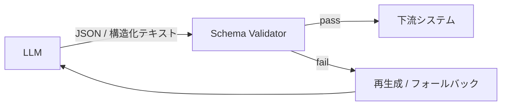

# #14 Structured Output Contract｜構造化出力契約

!!! abstract "一言"
    LLM の出力を**JSON Schema 等のスキーマで契約化**し、下流が安全にパースできることを保証する。

## 概要

LLMの自由文出力をそのまま後続処理に渡すと、フォーマット崩れやフィールド欠損、型違反によって下流が壊れてしまう。本パターンでは、出力スキーマを事前に定義し、LLMにスキーマ準拠の構造化データを生成させる。生成後にバリデータで検証し、不適合であれば再生成またはフォールバックを行う。API応答・DB書き込み・ワークフロー遷移など、後続が決定論的な処理であればすべてに適用できる。

!!! info "意思決定上の位置づけ"
    - **必要にするフォース**: `[F8]` 説明責任・規制
    - **関与する決定**: [相反](../../decisions/tradeoffs.md) の 構造化↔自由出力
    - **意思決定の進め方**: [意思決定の進め方](../../decisions/decision-flow.md)

## 設計

スキーマは JSON Schema・Pydantic モデル・Protocol Buffers 等で定義する。LLM の structured output モード（OpenAI `response_format`、Anthropic tool_use）を使えば生成段階で準拠率が上がるが、バリデーションは省略しない。

## 解決する課題

構造化されていない出力は、パース失敗からサイレントエラー、不正データ混入へと連鎖するリスクがある。`[F8]` 監査・コンプライアンスの観点でも、出力が契約に適合していることを検証・記録できなければ説明責任を果たせない。また、スキーマ契約はテスト可能性も高めるため、[#34 Evaluation CI/CD](../07-observability/34-evaluation-ci-cd.md) との相性がよい。

## 向き / 不向き

- **向き**: APIレスポンス生成、フォーム入力補助、データ抽出、ワークフロー判断の中間出力など、後続が機械的にパースするすべてのケースに適している。
- **不向き**: 自由記述の文章生成（レポート、メール文面など）には向かない。フォーマットを強制すると表現力が落ちる場面では避けた方がよい。

## 要素技術

- OpenAI Structured Outputs（`response_format: { type: "json_schema" }`）
- Anthropic tool_use / forced tool call
- Pydantic / Zod / JSON Schema によるバリデーション
- Instructor ライブラリ（LLM出力→型付きオブジェクト変換）

## 関連パターン

- [#13 Natural Language Boundary Adapter](13-natural-language-boundary-adapter.md) — 入力側の構造化。入口と出口で対になる
- [#15 Inverted Structured Output](15-inverted-structured-output.md) — 最終出力でなく中間判断を構造化する変形
- [#30 Policy-as-Code Guardrail](../06-reliability/30-policy-as-code-guardrail.md) — スキーマ検証の上位にポリシー検査を重ねる

## 参考

- OpenAI Structured Outputs ドキュメント
- Instructor ライブラリ（Python / TypeScript）
