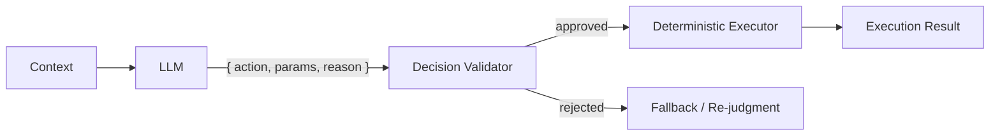

# #15 Inverted Structured Output

!!! abstract "TL;DR"
    Have the LLM output **intermediate decisions, plans, and branching conditions** as structured output rather than the final execution result, with deterministic code handling the execution.

<!-- BEGIN:GEN:meta -->

Metadata (machine-readable) — #15 Inverted Structured Output

| Field | Value |
|------|-----|
| **ID** | 15 |
| **Category** | 03-io-contract — Input/Output & Contracts |
| **Forces** | `[F2]` |
| **Dials** | — |
| **Tradeoffs** | llm-vs-tool |
| **Related Patterns** | #14, #3, #19 |
| **When to Use** | Approval, classification, routing decisions — judgment only (execution by code) |
| **When Not to Use** | When LLM generates the final artifact (code, text); when choices are infinite |
| **Element Technologies** | Function calling, Enum actions, deterministic executor |

<!-- END:GEN:meta -->

## Overview

When an LLM was allowed to directly execute a refund, a hallucination triggered a refund for a non-existent order — such accidents happen when the LLM is entrusted with both "judgment" and "execution." If judgment alone is delegated and execution entrusted to reliable code, misjudgments can be caught before execution.

This pattern inverts the typical Structured Output approach: instead of having the LLM produce the final artifact, it outputs only "what to do next" or "which branch to take" as structured decisions. The actual execution, data manipulation, and side effects are handled by deterministic code.

!!! info "Position in Decision Framework"
    - **Driving Forces**: `[F2]` Failure Cost
    - **Related Decisions**: [Tradeoffs](../../decisions/tradeoffs.md) — LLM Reasoning ↔ Tool Delegation
    - **Decision Flow**: [Decision Flow](../../decisions/decision-flow.md)

## Design

The LLM's output is a decision record like `{ action: "approve_refund", params: { order_id: "...", amount: 1200 }, reason: "..." }`, and the actual refund processing is performed by deterministic code. The reason field is recorded in audit logs.

## Problem Solved

When the LLM directly executes operations with side effects, hallucinations or misjudgments immediately produce irreversible results. In `[F2]` high-failure-cost operations (payments, contract changes, data deletion), separating judgment from execution and providing a buffer to verify judgment validity is essential.

## When to Use / When Not to Use

- **When to Use**: Suitable for operations where judgment results are enumerable and execution can be written deterministically — approval, classification, routing, condition evaluation. Also effective as a pre-stage for high-cost operations.
- **When Not to Use**: Not suited for cases where the LLM itself generates the final artifact (document writing, code generation). Also not appropriate for tasks where judgment choices cannot be predefined, being too exploratory.

## Element Technologies

- LLM function calling / tool_use used as "judgment declaration"
- Enum-typed action definitions (Pydantic `Literal` / TypeScript union)
- Deterministic execution engine (state machine, workflow engine)

## Selection (Tradeoffs)

- **LLM Executes ↔ LLM Judges Only** — Balancing failure cost `[F2]` against implementation cost. When failure cost is low and speed is priority, direct execution; when high, judgment separation. → [Tradeoff Selection Criteria](../../decisions/tradeoffs.md)

## Related Patterns

- [#14 Structured Output Contract](14-structured-output-contract.md) — Built on the shared foundation of output structuring
- [#3 Workflow Backbone + Agent Node](../01-execution/03-workflow-backbone-agent-node.md) — A typical application where judgment nodes are embedded in a deterministic backbone
- [#19 Dry-Run First Tool Execution](../04-tools-mcp/19-dry-run-first-tool-execution.md) — Additional reinforcement by layering "simulate → approve" after the judgment

## References

- The design philosophy of "injecting probabilistic judgment into a deterministic core" is shared with [#11 Deterministic Core, Probabilistic Edge](../02-composition/11-deterministic-core-probabilistic-edge.md)
