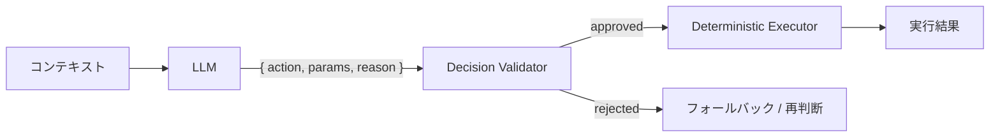

# #15 Inverted Structured Output｜反転構造化出力

!!! abstract "一言"
    LLM に最終的な実行結果ではなく**中間の判断・計画・分岐条件**を構造化出力させ、実行は決定論的コードが担う。

<!-- BEGIN:GEN:meta -->

メタデータ（機械可読） — #15 Inverted Structured Output｜反転構造化出力

| 項目 | 値 |
|------|-----|
| **ID** | 15 |
| **カテゴリ** | 03-io-contract — 入出力・契約化 |
| **フォース** | `[F2]` |
| **ダイヤル** | — |
| **二者択一** | llm-vs-tool |
| **関連パターン** | #14, #3, #19 |
| **向き** | 承認・分類・ルーティング判断、判断のみ（実行はコード） |
| **不向き** | LLMが最終成果物を生成する場合（コード・テキスト）; 選択肢が無限 |
| **要素技術** | Function calling, Enum actions, 決定論的 executor |

<!-- END:GEN:meta -->

## 概要

返金処理をLLMに直接実行させたら、ハルシネーションで存在しない注文に対して返金が走ってしまった――そんな事故は、LLMに「実行」まで任せてしまうことで起きる。判断だけを任せて、実行は信頼できるコードに委ねれば、誤判断があっても実行前に食い止められる。

本パターンでは、通常の Structured Output とは逆に、LLMに最終成果物ではなく「次に何をすべきか」「どの分岐を取るか」という判断だけを構造化で出力させる。実際の実行・データ操作・副作用は決定論的なコードが担う。

!!! info "意思決定上の位置づけ"
    - **必要にするフォース**: `[F2]` 失敗コスト
    - **関与する決定**: [相反](../../decisions/tradeoffs.md) の LLM推論↔ツール委譲
    - **意思決定の進め方**: [意思決定の進め方](../../decisions/decision-flow.md)

## 設計

LLM の出力は `{ action: "approve_refund", params: { order_id: "...", amount: 1200 }, reason: "..." }` のような判断レコードであり、実際の返金処理は決定論的コードが実行する。reason フィールドは監査ログに記録される。

## 解決する課題

LLMに直接副作用を持つ操作を実行させると、ハルシネーションや誤判断が即座に不可逆な結果を生んでしまう。`[F2]` 失敗コストが高い業務（決済、契約変更、データ削除など）では、判断と実行を分離し、判断の妥当性を検証するバッファを設けることが不可欠になる。

## 向き / 不向き

- **向き**: 承認・分類・ルーティング・条件判定など、判断結果が列挙可能で実行を決定論的に書ける業務に適している。失敗コストが高い操作の前段としても有効である。
- **不向き**: LLM自体が最終成果物を生成するケース（文章作成、コード生成）には向かない。また、判断の選択肢が事前に定義できないほど探索的なタスクにも適さない。

## 要素技術

- LLM の function calling / tool_use を「判断表明」として利用
- Enum 型のアクション定義（Pydantic `Literal` / TypeScript union）
- 決定論側の実行エンジン（ステートマシン、ワークフローエンジン）

## 選定（相反）

- **LLM が実行 ↔ LLM は判断のみ** — 失敗コスト `[F2]` と実装コストのバランス。失敗コストが低く速度優先なら直接実行、高ければ判断分離。→ [相反の選定基準](../../decisions/tradeoffs.md)

## 関連パターン

- [#14 Structured Output Contract](14-structured-output-contract.md) — 出力の構造化という共通基盤の上に成り立つ
- [#3 Workflow Backbone + Agent Node](../01-execution/03-workflow-backbone-agent-node.md) — 決定論骨格に判断ノードとして組み込む典型的な適用先
- [#19 Dry-Run First Tool Execution](../04-tools-mcp/19-dry-run-first-tool-execution.md) — 判断の先に「模擬実行→承認」を重ねる補強

## 参考

- 「決定論コアに確率的判断を注入する」設計思想は [#11 Deterministic Core, Probabilistic Edge](../02-composition/11-deterministic-core-probabilistic-edge.md) と共通
