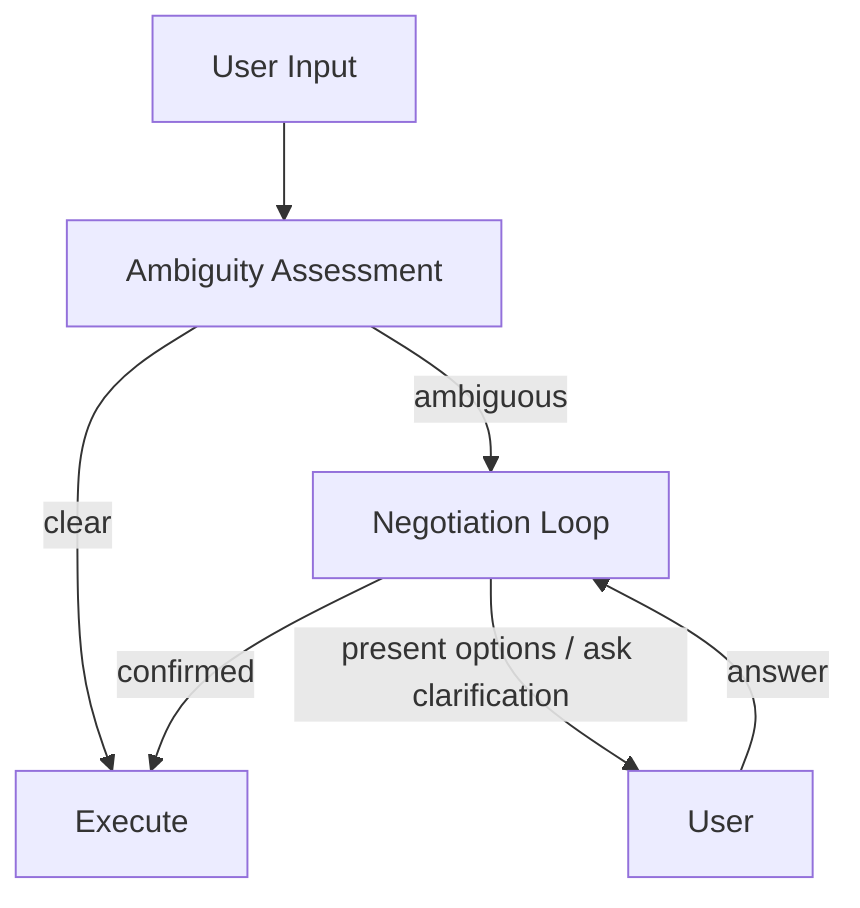

# #16 Ambiguity Negotiation

!!! abstract "TL;DR"
    When input is ambiguous, do not guess — **confirm and negotiate with the user** before proceeding.

<!-- BEGIN:GEN:meta -->

Metadata (machine-readable) — #16 Ambiguity Negotiation

| Field | Value |
|------|-----|
| **ID** | 16 |
| **Category** | 03-io-contract — Input/Output & Contracts |
| **Forces** | `[F1]`, `[F2]` |
| **Dials** | — |
| **Tradeoffs** | — |
| **Related Patterns** | #13, #31, #51 |
| **When to Use** | Reversible operations, multiply-interpretable input (file deletion), input with missing slots |
| **When Not to Use** | Real-time immediate response; pre-structured form input |
| **Element Technologies** | Confidence/logprobs, slot fill rate, interactive UI |

<!-- END:GEN:meta -->

## Overview

When told "delete this file" and there are 3 candidates, which should be deleted? If the agent guesses "probably this one" and executes, and an important file is deleted, it cannot be undone.

This pattern suspends execution when user input ambiguity exceeds a threshold, presenting options or asking clarifying questions to negotiate intent with the user. The negotiation result is passed downstream as a structured confirmed intent.

!!! info "Position in Decision Framework"
    - **Driving Forces**: `[F1]` Reversibility, `[F2]` Failure Cost
    - **Decision Flow**: [Decision Flow](../../decisions/decision-flow.md)

## Design

Ambiguity assessment is performed using LLM confidence scores, slot fill rates, or explicit classifiers. The negotiation loop has a maximum round limit, and if it does not converge, escalation occurs.

## Problem Solved

Executing based on guesswork with ambiguous input leads to irreversible consequences for `[F1]` low-reversibility operations. For `[F2]` high-failure-cost operations (deletion, transfer, contract changes), it does not pay to skip one confirmation that could prevent an accident for the sake of "UX fluency." However, excessive confirmation degrades UX, so graduated intervention based on ambiguity level is necessary.

## When to Use / When Not to Use

- **When to Use**: Suitable for operations with side effects, commands open to multiple interpretations, and input with missing slots. Particularly effective for high-failure-cost operations.
- **When Not to Use**: Not suited for cases requiring real-time response with no room for confirmation. Also unnecessary when input is sufficiently structured (form input, etc.).

## Element Technologies

- LLM confidence / logprobs used as ambiguity indicators
- Mechanical assessment via slot fill rate (count of unfilled required slots)
- Chat UI option carousels / inline forms
- Maximum negotiation round count and timeout settings

## Tuning (Dials)

- **Confirmation threshold** — Too low asks for confirmation every time, degrading UX. Too high increases execution based on wrong guesses / Deciding factor: `[F2]` / Guideline: lower the threshold in proportion to failure cost. → [Tuning Dials](../../decisions/tuning-dials.md)

## Related Patterns

- [#13 Natural Language Boundary Adapter](13-natural-language-boundary-adapter.md) — The boundary layer detects ambiguity and delegates to this pattern
- [#31 Human Approval Checkpoint](../06-reliability/31-human-approval-checkpoint.md) — Risk-based approval rather than ambiguity-based. Often used in combination
- [#51 Agent-to-Human Escalation](../11-ux/51-agent-to-human-escalation.md) — The final escalation destination when negotiation fails to converge

## References

- Slot Filling / Clarification research in dialogue systems
