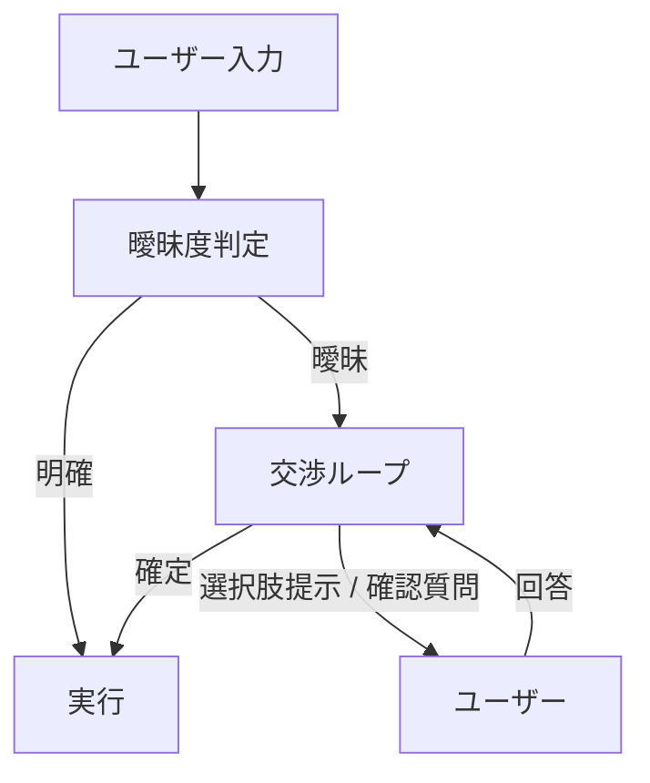

# #16 Ambiguity Negotiation｜曖昧性交渉

!!! abstract "一言"
    入力が曖昧なとき、推測で実行せず**ユーザーに確認・交渉してから**進む。

<!-- BEGIN:GEN:meta -->

メタデータ（機械可読） — #16 Ambiguity Negotiation｜曖昧性交渉

| 項目 | 値 |
|------|-----|
| **ID** | 16 |
| **カテゴリ** | 03-io-contract — 入出力・契約化 |
| **フォース** | `[F1]`, `[F2]` |
| **ダイヤル** | — |
| **二者択一** | — |
| **関連パターン** | #13, #31, #51 |
| **向き** | 可逆な操作、複数解釈可能な入力（ファイル削除）、スロット不足の入力 |
| **不向き** | リアルタイム即時応答; 事前構造化されたフォーム入力 |
| **要素技術** | Confidence/logprobs, スロット充填率, インタラクティブUI |

<!-- END:GEN:meta -->

## 概要

「このファイルを削除して」と言われたとき、候補が3つあったらどれを消すべきか。エージェントが「たぶんこれだろう」と推測して実行した結果、大切なファイルが消えてしまったら取り返しがつかない。

本パターンでは、ユーザー入力の曖昧度が閾値を超えた場合に実行を保留し、選択肢の提示や確認質問によってユーザーと意図を交渉する。交渉の結果は構造化された確定意図として下流に渡す。

!!! info "意思決定上の位置づけ"
    - **必要にするフォース**: `[F1]` 可逆性・`[F2]` 失敗コスト
    - **意思決定の進め方**: [意思決定の進め方](../../decisions/decision-flow.md)

## 設計

曖昧度の判定は、LLM の confidence スコア、スロット充足率、あるいは明示的な分類器で行う。交渉ループには最大ラウンド数を設定し、収束しなければエスカレーションする。

## 解決する課題

曖昧な入力を推測で実行すると、`[F1]` 可逆性が低い操作では取り返しがつかなくなる。`[F2]` 失敗コストが高い業務（削除、送金、契約変更）では、1回の確認で防げる事故を「UXの流暢さ」のために省略するのは割に合わない。一方で、過剰な確認はUXを損なうため、曖昧度に応じた段階的な介入が必要になる。

## 向き / 不向き

- **向き**: 副作用を伴う操作、複数の解釈が成立しうるコマンド、スロット欠損がある入力に適している。特に失敗コストが高い業務で効果を発揮する。
- **不向き**: リアルタイム応答が必須で確認を挟む余裕がないケースには向かない。また、入力が十分に構造化されている場面（フォーム入力など）にも不要である。

## 要素技術

- LLM の confidence / logprobs を曖昧度指標に利用
- スロット充足率による機械的判定（必須スロットの未充足数）
- チャットUIでの選択肢カルーセル / インラインフォーム
- 最大交渉ラウンド数とタイムアウトの設定

## 調整（程度）

- **確認の閾値** — 低すぎると毎回確認を求めることになりUXが劣化する。一方、高すぎると誤推測による実行が増加する / 決め手 `[F2]` / 目安: 失敗コストに比例して閾値を下げる。→ [程度ダイヤル](../../decisions/tuning-dials.md)

## 関連パターン

- [#13 Natural Language Boundary Adapter](13-natural-language-boundary-adapter.md) — 境界層が曖昧度を検出し、本パターンへ委譲する
- [#31 Human Approval Checkpoint](../06-reliability/31-human-approval-checkpoint.md) — 曖昧性でなくリスクに基づく承認。組み合わせて使うことが多い
- [#51 Agent-to-Human Escalation](../11-ux/51-agent-to-human-escalation.md) — 交渉で収束しない場合の最終エスカレーション先

## 参考

- Slot Filling / Clarification に関する対話システム研究
