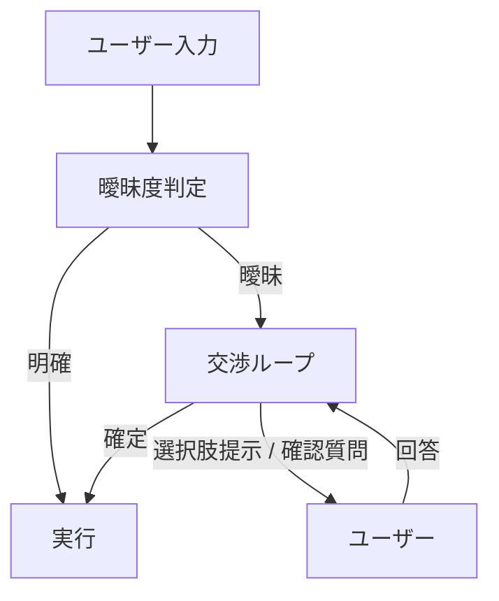

# #16 Ambiguity Negotiation｜曖昧性交渉

!!! abstract "一言"
    入力が曖昧なとき、推測で実行せず**ユーザーに確認・交渉してから**進む。

## 概要

ユーザー入力には省略・多義性・暗黙の前提が含まれる。エージェントが「たぶんこうだろう」と推測して実行すると、不可逆な誤操作や期待外れの結果を招く。本パターンは、曖昧度が閾値を超えた場合に実行を保留し、選択肢の提示や確認質問によってユーザーと意図を交渉する。交渉の結果は構造化された確定意図として下流に渡す。

## 設計

曖昧度の判定は、LLM の confidence スコア、スロット充足率、あるいは明示的な分類器で行う。交渉ループには最大ラウンド数を設定し、収束しなければエスカレーションする。

## 解決する課題

曖昧な入力を推測実行すると、`[F1]` 可逆性が低い操作で取り返しがつかない。`[F2]` 失敗コストが高い業務（削除、送金、契約変更）では、1回の確認で防げる事故を「UXの流暢さ」のために省略するのは割に合わない。一方で過剰な確認はUXを損なうため、曖昧度に応じた段階的な介入が必要になる。

## 向き / 不向き

- **向き**: 副作用を伴う操作、複数解釈が成立しうるコマンド、スロット欠損がある入力。特に失敗コストが高い業務。
- **不向き**: リアルタイム応答が必須で確認を挟む余裕がないケース。入力が十分構造化されている（フォーム入力など）場面。

## 要素技術

- LLM の confidence / logprobs を曖昧度指標に利用
- スロット充足率による機械的判定（必須スロットの未充足数）
- チャットUIでの選択肢カルーセル / インラインフォーム
- 最大交渉ラウンド数とタイムアウトの設定

## 調整（程度）

- **確認の閾値** — 低すぎると毎回確認でUX劣化 ⇔ 高すぎると誤推測実行が増加 / 決め手 `[F2]` / 目安: 失敗コストに比例して閾値を下げる。→ [程度ダイヤル](../../decisions/tuning-dials.md)

## 関連パターン

- [#13 Natural Language Boundary Adapter](13-natural-language-boundary-adapter.md) — 境界層が曖昧度を検出し、本パターンへ委譲する
- [#31 Human Approval Checkpoint](../06-reliability/31-human-approval-checkpoint.md) — 曖昧性でなくリスクに基づく承認。組み合わせて使うことが多い
- [#51 Agent-to-Human Escalation](../11-ux/51-agent-to-human-escalation.md) — 交渉で収束しない場合の最終エスカレーション先

## 参考

- Slot Filling / Clarification に関する対話システム研究
