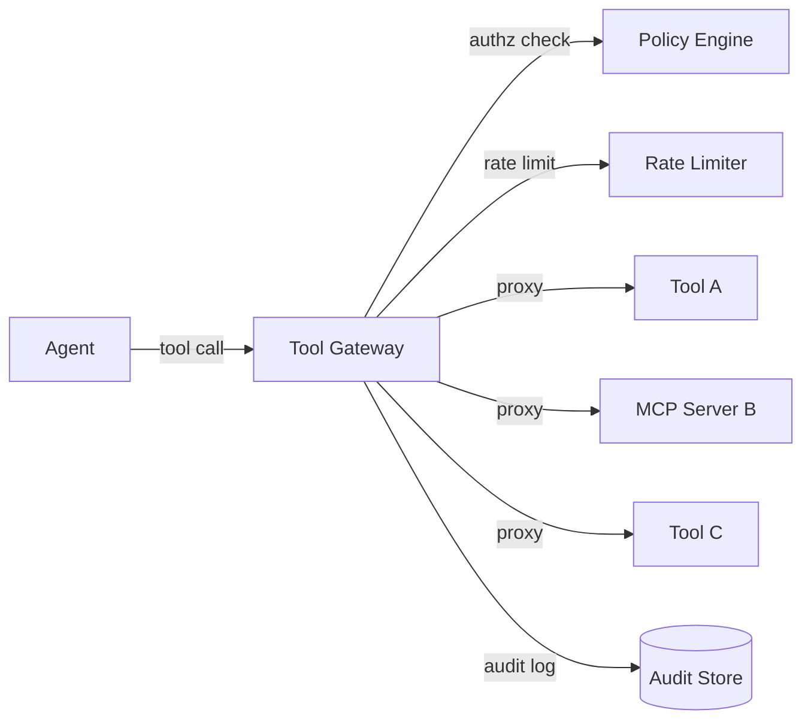

# #17 Tool / MCP Gateway

!!! abstract "TL;DR"
    **Consolidate all agent-to-tool and MCP server connections through a single gateway**, providing centralized authorization, rate limiting, and audit logging.

<!-- BEGIN:GEN:meta -->

Metadata (machine-readable) — #17 Tool / MCP Gateway

| Field | Value |
|------|-----|
| **ID** | 17 |
| **Category** | 04-tools-mcp — Tools, MCP & External System Integration |
| **Forces** | `[F5]`, `[F8]` |
| **Dials** | — |
| **Tradeoffs** | — |
| **Related Patterns** | #18, #21, #32 |
| **When to Use** | Multiple tools/MCP systems, multi-tenant, centralized authorization and auditing needed |
| **When Not to Use** | 1–2 tools; no authentication needed; ultra-low-latency intolerant |
| **Element Technologies** | MCP Gateway/Proxy, Kong, Envoy, AWS API Gateway, OPA/Cedar, OpenTelemetry |

<!-- END:GEN:meta -->

## Overview

Agents can use a wide variety of tools — search APIs, databases, email sending, file operations. Connecting to each individually makes it difficult to track "who called which tool when," and authorization policies tend to fragment across tools.

This pattern unifies all tool invocations through a gateway, handling authentication, authorization, rate limiting, and I/O logging in a single layer. When new tools are added, simply registering them with the gateway applies existing policies automatically.

!!! info "Position in Decision Framework"
    - **Driving Forces**: `[F5]` Input Trustworthiness, `[F8]` Accountability & Regulation
    - **Decision Flow**: [Decision Flow](../../decisions/decision-flow.md)

## Design

The gateway acts as a reverse proxy, performing sequentially for each request: (1) authorization check, (2) rate limiting, (3) input sanitization, (4) proxy forwarding, (5) response logging. The gateway also consolidates tool definitions (schemas and descriptions), exposing them centrally to agents.

## Problem Solved

Direct tool connections carry three simultaneous risks: authorization gaps, invocation explosion, and audit inability. Introducing a gateway limits the attack surface from `[F5]` prompt injection calling unintended tools, and makes `[F8]` all invocations auditable. Additionally, circuit breaking on tool failures can be managed centrally at the gateway.

## When to Use / When Not to Use

- **When to Use**: Suitable for production systems connecting multiple tools or MCP servers. Particularly effective in multi-tenant environments requiring per-tenant tool restrictions.
- **When Not to Use**: Excessive for prototype stages with only 1–2 tools and no authorization requirements. Also not suited for ultra-low-latency paths where gateway latency is unacceptable.

## Element Technologies

- MCP Gateway / MCP Proxy (official implementations)
- API Gateway (Kong, Envoy, AWS API Gateway) repurposed for the tool layer
- OPA / Cedar for policy evaluation
- OpenTelemetry for trace and log collection

## Tuning (Dials)

- **Gateway inspection depth** — Shallow (header-only authorization) ⇔ Deep (I/O content inspection) / Deciding factors: `[F5][F8]` / Guideline: inspect deeply for side-effecting tools, shallowly for read-only. → [Tuning Dials](../../decisions/tuning-dials.md)

## Related Patterns

- [#18 Least-Privilege Tool Binding](18-least-privilege-tool-binding.md) — The permission policy design that the gateway enforces
- [#21 MCP Adapter Isolation](21-mcp-adapter-isolation.md) — Further isolates MCP adapters behind the gateway
- [#32 Agent Trace](../07-observability/32-agent-trace.md) — Integrates gateway logs into traces

## References

- MCP Specification (Model Context Protocol)
- API Gateway Pattern (Microservice Design)
