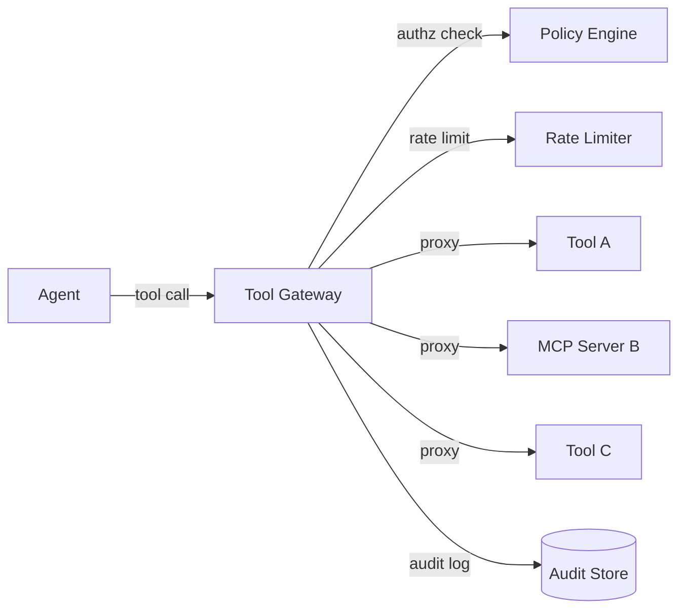

# #17 Tool / MCP Gateway｜ツール・MCPゲートウェイ

!!! abstract "一言"
    エージェントからツール・MCP サーバーへの接続を**単一ゲートウェイに集約**し、認可・レート制限・監査ログを一元管理する。

<!-- BEGIN:GEN:meta -->

メタデータ（機械可読） — #17 Tool / MCP Gateway｜ツール・MCPゲートウェイ

| 項目 | 値 |
|------|-----|
| **ID** | 17 |
| **カテゴリ** | 04-tools-mcp — ツール・MCP・外部システム接続 |
| **フォース** | `[F5]`, `[F8]` |
| **ダイヤル** | — |
| **二者択一** | — |
| **関連パターン** | #18, #21, #32 |
| **向き** | 複数ツール/MCPシステム、マルチテナント、認可・監査の一元化が必要 |
| **不向き** | 1–2ツール; 認証不要; 超低レイテンシ不許容 |
| **要素技術** | MCP Gateway/Proxy, Kong, Envoy, AWS API Gateway, OPA/Cedar, OpenTelemetry |

<!-- END:GEN:meta -->

## 概要

エージェントが使えるツールは、検索API、データベース、メール送信、ファイル操作など多岐にわたる。これらに個別に接続していると、「誰がどのツールをいつ呼んだか」の追跡が困難になり、認可ポリシーもツールごとにバラバラになりがちである。

本パターンでは、すべてのツール呼び出しをゲートウェイ経由に統一し、認証・認可・レート制限・入出力ログを単一のレイヤーで処理する。新しいツールを追加する際も、ゲートウェイに登録するだけで既存のポリシーがそのまま適用される。

!!! info "意思決定上の位置づけ"
    - **必要にするフォース**: `[F5]` 入力の信頼度・`[F8]` 説明責任・規制
    - **意思決定の進め方**: [意思決定の進め方](../../decisions/decision-flow.md)

## 設計

ゲートウェイはリバースプロキシとして動作し、各リクエストに対して (1) 認可判定、(2) レート制限、(3) 入力サニタイズ、(4) プロキシ転送、(5) レスポンスログ記録を順に行う。また、ツール定義（スキーマや説明文）もゲートウェイが集約し、エージェントに対して一元的に公開する。

## 解決する課題

ツールへの直接接続は、認可漏れ・呼び出しの爆発・監査不能という3つのリスクを同時に抱えている。ゲートウェイを導入することで、`[F5]` プロンプトインジェクションによって意図しないツールが呼ばれる攻撃面を制限し、`[F8]` すべての呼び出しを監査可能にできる。さらに、ツール障害時の回路遮断（circuit breaker）もゲートウェイで一元的に管理できる。

## 向き / 不向き

- **向き**: 複数のツールや MCP サーバーを接続する本番システムに適している。特にマルチテナント環境でテナントごとにツール制限を設ける必要がある場合に有効である。
- **不向き**: ツールが1〜2個で認可要件もないプロトタイプ段階では過剰になりやすい。また、ゲートウェイによるレイテンシが許容できない超低遅延パスにも向かない。

## 要素技術

- MCP Gateway / MCP Proxy（公式実装）
- API Gateway（Kong, Envoy, AWS API Gateway）をツール層に転用
- OPA / Cedar によるポリシー判定
- OpenTelemetry によるトレース・ログ収集

## 調整（程度）

- **ゲートウェイの検査深度** — 浅い（ヘッダ認可のみ）⇔ 深い（入出力の内容検査まで）/ 決め手 `[F5][F8]` / 目安: 副作用ツールは深く、読み取り専用は浅く。→ [程度ダイヤル](../../decisions/tuning-dials.md)

## 関連パターン

- [#18 Least-Privilege Tool Binding](18-least-privilege-tool-binding.md) — ゲートウェイが適用する権限ポリシーの設計
- [#21 MCP Adapter Isolation](21-mcp-adapter-isolation.md) — ゲートウェイの背後で MCP アダプタをさらに分離する
- [#32 Agent Trace](../07-observability/32-agent-trace.md) — ゲートウェイのログをトレースに統合する

## 参考

- MCP 仕様（Model Context Protocol）
- API Gateway パターン（マイクロサービス設計）
