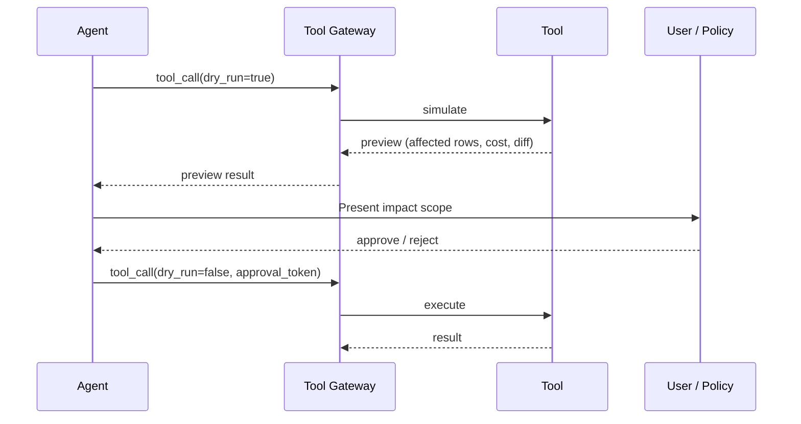

# #19 Dry-Run First Tool Execution

!!! abstract "TL;DR"
    **Simulate (dry-run) side-effecting tool invocations first**, presenting the impact scope before proceeding to actual execution.

<!-- BEGIN:GEN:meta -->

Metadata (machine-readable) — #19 Dry-Run First Tool Execution

| Field | Value |
|------|-----|
| **ID** | 19 |
| **Category** | 04-tools-mcp — Tools, MCP & External System Integration |
| **Forces** | `[F1]`, `[F2]` |
| **Dials** | — |
| **Tradeoffs** | — |
| **Related Patterns** | #4, #31, #15 |
| **When to Use** | Data changes (deletion, API writes), infrastructure changes (Terraform-like operations) |
| **When Not to Use** | Read-only; low failure cost; real-time speed priority |
| **Element Technologies** | --dry-run flag, DB transaction→result→rollback, API dryRun parameter, diff-view UI |

<!-- END:GEN:meta -->

## Overview

When the agent decides to "delete 10,000 records from the production database," what happens if that operation executes immediately? If the judgment was wrong, the irreversible result is directly applied.

This pattern splits side-effecting operations into two phases. The first phase (dry run) does not make actual changes but computes and presents "what would happen." The second phase (actual execution) proceeds only after obtaining approval from the user or an auto-approval policy.

!!! info "Position in Decision Framework"
    - **Driving Forces**: `[F1]` Reversibility, `[F2]` Failure Cost
    - **Decision Flow**: [Decision Flow](../../decisions/decision-flow.md)

## Design

Ideally, the tool side supports a `--dry-run` flag, but the gateway can also implement this via a start transaction → get results → rollback approach.

## Problem Solved

When agents directly execute `[F1]` irreversible operations (deletion, transfer, publication), there is no undo. The higher the `[F2]` failure cost of an operation, the greater the value of the buffer that "shows what will happen before execution." Dry-run results can also serve as the basis for human approval ([#31](../06-reliability/31-human-approval-checkpoint.md)) decisions.

## When to Use / When Not to Use

- **When to Use**: Suitable for all operations with side effects — data changes, API calls, infrastructure operations. Same philosophy as Terraform plan or SQL `EXPLAIN`.
- **When Not to Use**: Unnecessary for read-only operations. Also not suited when real-time speed is paramount and there is no room for a preview step, or when simulation cost equals the actual execution cost.

## Element Technologies

- Terraform `plan` / Pulumi `preview` (IaC dry runs)
- DB transaction + ROLLBACK for simulation
- API `?dryRun=true` parameter (Google Cloud API, etc.)
- Diff view UI

## Selection (Tradeoffs)

- **Dry Run ↔ Immediate Execution** — Trade-off between reversibility `[F1]` and speed `[F4]`. Reversible or low-failure-cost operations can execute immediately. → [Tradeoff Selection Criteria](../../decisions/tradeoffs.md)

## Related Patterns

- [#4 Agent Saga](../01-execution/04-agent-saga.md) — Compensating transactions for when dry-run didn't prevent the issue
- [#31 Human Approval Checkpoint](../06-reliability/31-human-approval-checkpoint.md) — The convergence point where humans approve based on dry-run results
- [#15 Inverted Structured Output](../03-io-contract/15-inverted-structured-output.md) — Shared philosophy of separating judgment and execution

## References

- Terraform Plan documentation
- Google Cloud API dryRun parameter
