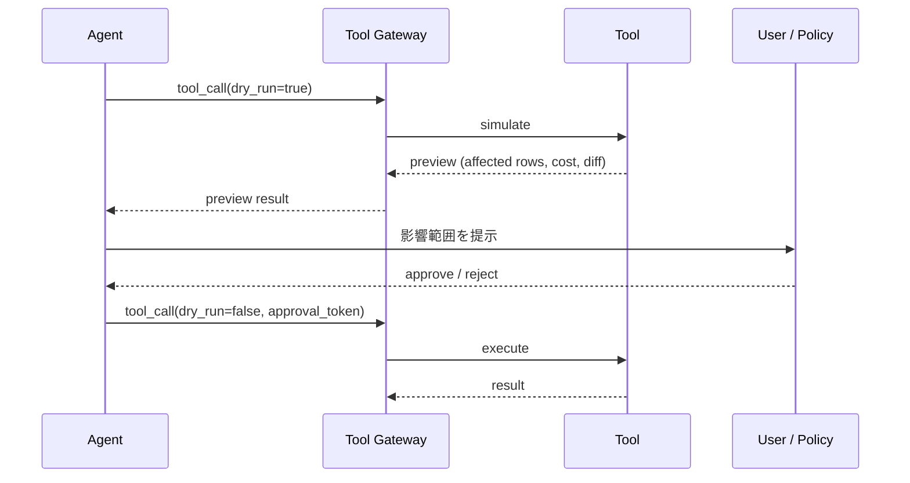

# #19 Dry-Run First Tool Execution｜ドライラン優先実行

!!! abstract "一言"
    副作用を伴うツール呼び出しを**まず模擬実行（ドライラン）**し、影響範囲を提示してから本実行に進む。

## 概要

エージェントがツールを呼ぶとき、いきなり本実行すると誤判断が即座に副作用になる。本パターンでは、副作用を持つ操作を2フェーズに分ける。第1フェーズ（ドライラン）では実際の変更を行わず「何が起きるか」を算出・提示する。第2フェーズ（本実行）はユーザーまたは自動承認ポリシーの承認後にのみ実行する。

!!! info "意思決定上の位置づけ"
    - **必要にするフォース**: `[F1]` 可逆性・`[F2]` 失敗コスト
    - **意思決定の進め方**: [意思決定の進め方](../../decisions/decision-flow.md)

## 設計

ドライランの実装はツール側が `--dry-run` フラグをサポートするのが理想だが、ゲートウェイ側でトランザクションを開始→結果取得→ロールバックする方式でも実現できる。

## 解決する課題

`[F1]` 不可逆な操作（削除、送金、公開）をエージェントが直接実行すると、やり直しがきかない。`[F2]` 失敗コストが高い操作ほど、「実行前に何が起きるか見せる」バッファの価値が大きい。ドライランは人間承認（[#31](../06-reliability/31-human-approval-checkpoint.md)）の判断材料にもなる。

## 向き / 不向き

- **向き**: データ変更・API呼び出し・インフラ操作など副作用がある操作全般。Terraform plan、SQL の `EXPLAIN` と同じ思想。
- **不向き**: 読み取り専用の操作。リアルタイム性が最優先でプレビューを挟む余裕がない場面。模擬実行のコストが本実行と同等な場合。

## 要素技術

- Terraform `plan` / Pulumi `preview`（IaCのドライラン）
- DB トランザクション + ROLLBACK による模擬
- API の `?dryRun=true` パラメータ（Google Cloud API等）
- 差分表示UI（diff view）

## 選定（相反）

- **ドライラン ↔ 即時実行** — 可逆性 `[F1]` と速度 `[F4]` のトレードオフ。可逆な操作や失敗コストが低い操作は即時実行でよい。→ [相反の選定基準](../../decisions/tradeoffs.md)

## 関連パターン

- [#4 Agent Saga](../01-execution/04-agent-saga.md) — ドライランで防げなかった場合の補償トランザクション
- [#31 Human Approval Checkpoint](../06-reliability/31-human-approval-checkpoint.md) — ドライラン結果を見て人間が承認する合流点
- [#15 Inverted Structured Output](../03-io-contract/15-inverted-structured-output.md) — 判断と実行の分離という共通思想

## 参考

- Terraform Plan ドキュメント
- Google Cloud API dryRun パラメータ
