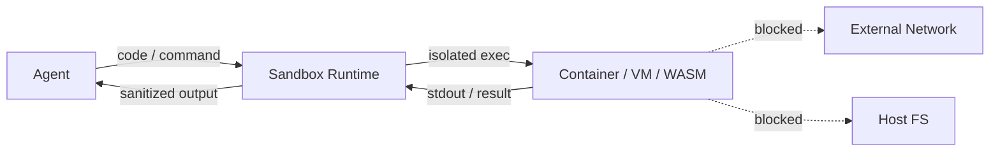

# #20 Sandboxed Tool Runtime

!!! abstract "TL;DR"
    Execute code and external operations generated by the agent in an **isolated sandbox environment**, containing impact to the host system.

<!-- BEGIN:GEN:meta -->

Metadata (machine-readable) — #20 Sandboxed Tool Runtime

| Field | Value |
|------|-----|
| **ID** | 20 |
| **Category** | 04-tools-mcp — Tools, MCP & External System Integration |
| **Forces** | `[F5]` |
| **Dials** | — |
| **Tradeoffs** | — |
| **Related Patterns** | #18, #21, #43 |
| **When to Use** | Code execution agents, data analysis, user-provided code, CI/CD |
| **When Not to Use** | Direct FS/network access is essential; deployment/sysadmin native operations |
| **Element Technologies** | Docker gVisor, Firecracker, WASM, AWS Lambda, Cloud Run, Modal, cgroups/seccomp |

<!-- END:GEN:meta -->

## Overview

If an agent's generated Python script is executed directly in the host environment, it is entirely possible for an infinite loop to exhaust CPU or for unintended files to be deleted. Code generated by LLMs is not always correct, and malicious code may be injected via prompt injection.

This pattern confines tool execution within isolated environments — containers, VMs, WASM — applying resource limits on filesystem, network, and CPU/memory. Only execution results are returned to the agent via a safe channel.

!!! info "Position in Decision Framework"
    - **Driving Forces**: `[F5]` Input Trustworthiness
    - **Decision Flow**: [Decision Flow](../../decisions/decision-flow.md)

## Design

The following constraints are applied to the sandbox: (1) filesystem writes limited to temp directory only, (2) network whitelisted, (3) execution time and memory capped, (4) sandbox destroyed after termination.

## Problem Solved

Code generated by LLMs is not always as intended, and `[F5]` prompt injection may introduce malicious code. Without a sandbox, a single misexecution could compromise the entire system. An isolation environment provides the structural guarantee that "no matter what is executed, damage stays within the sandbox."

## When to Use / When Not to Use

- **When to Use**: Suitable for code execution agents, data analysis tasks, user-provided code execution, and agent operations within CI/CD pipelines.
- **When Not to Use**: Not suited for operations that inherently require direct host filesystem or network access (deployment, system administration, etc.). However, even then, restricting permissions via [#18 Least-Privilege Tool Binding](18-least-privilege-tool-binding.md) is advisable.

## Element Technologies

- Containers: Docker (gVisor runtime), Firecracker microVM
- WASM: Wasmtime, WasmEdge (lightweight, fast startup)
- Cloud Services: AWS Lambda, Google Cloud Run Jobs, E2B, Modal
- Resource Limits: cgroups, seccomp, network policies

## Tuning (Dials)

- **Isolation strength** — Weak (process-level isolation only) ⇔ Strong (VM-level isolation) / Deciding factor: `[F5]` / Guideline: VM-level for user-provided code; container-level for agent-self-generated code. → [Tuning Dials](../../decisions/tuning-dials.md)

## Related Patterns

- [#18 Least-Privilege Tool Binding](18-least-privilege-tool-binding.md) — Minimizes accessible resources even within the sandbox
- [#21 MCP Adapter Isolation](21-mcp-adapter-isolation.md) — Per-MCP-adapter isolation. Different isolation granularity than sandboxes
- [#43 Confused-Deputy Damage Limitation](../09-security/43-confused-deputy-damage-limitation.md) — The sandbox is a physical implementation of blast radius limitation

## References

- gVisor / Firecracker documentation
- E2B (Code Interpreter sandbox)
