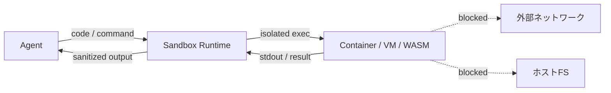

# #20 Sandboxed Tool Runtime｜サンドボックス実行

!!! abstract "一言"
    エージェントが生成・実行するコードや外部操作を**隔離されたサンドボックス環境**で実行し、ホストシステムへの影響を封じ込める。

## 概要

エージェントがコード生成・シェル操作・ファイル操作を行う場合、ホスト環境で直接実行するとファイルシステム破壊・ネットワーク悪用・リソース枯渇のリスクがある。本パターンでは、ツール実行をコンテナ・VM・WASM 等の隔離環境に閉じ込め、ファイルシステム・ネットワーク・CPU/メモリにリソース制限を適用する。実行結果だけを安全なチャネルで返す。

!!! info "意思決定上の位置づけ"
    - **必要にするフォース**: `[F5]` 入力の信頼度
    - **意思決定の進め方**: [意思決定の進め方](../../decisions/decision-flow.md)

## 設計

サンドボックスには以下の制約を適用する: (1) ファイルシステムは一時ディレクトリのみ書き込み可、(2) ネットワークはホワイトリスト制、(3) 実行時間・メモリに上限を設定、(4) 終了後にサンドボックスを破棄。

## 解決する課題

LLM が生成するコードは意図通りとは限らず、`[F5]` プロンプトインジェクションで悪意あるコードが混入する可能性もある。サンドボックスなしでは、1回の誤実行がシステム全体を侵害し得る。隔離は「何が実行されても被害がサンドボックス内に留まる」という構造的保証を与える。

## 向き / 不向き

- **向き**: コード実行エージェント、データ分析タスク、ユーザー提供コードの実行、CI/CDパイプライン内のエージェント操作。
- **不向き**: ホストのファイルシステムやネットワークへの直接アクセスが本質的に必要な操作（デプロイ、システム管理）。ただしその場合も [#18 Least-Privilege Tool Binding](18-least-privilege-tool-binding.md) で権限を絞る。

## 要素技術

- コンテナ: Docker（gVisor ランタイム）、Firecracker microVM
- WASM: Wasmtime, WasmEdge（軽量・高速起動）
- クラウドサービス: AWS Lambda, Google Cloud Run Jobs, E2B, Modal
- リソース制限: cgroups, seccomp, ネットワークポリシー

## 調整（程度）

- **隔離の強度** — 弱い（プロセス分離のみ）⇔ 強い（VM分離）/ 決め手 `[F5]` / 目安: ユーザー提供コードは VM 級、エージェント自己生成コードはコンテナ級。→ [程度ダイヤル](../../decisions/tuning-dials.md)

## 関連パターン

- [#18 Least-Privilege Tool Binding](18-least-privilege-tool-binding.md) — サンドボックス内でもアクセス可能なリソースを最小化する
- [#21 MCP Adapter Isolation](21-mcp-adapter-isolation.md) — MCP アダプタ単位での隔離。サンドボックスの適用単位が異なる
- [#43 Confused-Deputy Damage Limitation](../09-security/43-confused-deputy-damage-limitation.md) — サンドボックスは被害半径制限の物理的実装

## 参考

- gVisor / Firecracker ドキュメント
- E2B（Code Interpreter サンドボックス）
