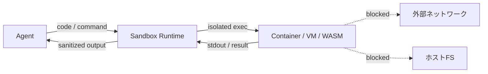

# #20 Sandboxed Tool Runtime｜サンドボックス実行

!!! abstract "一言"
    エージェントが生成・実行するコードや外部操作を**隔離されたサンドボックス環境**で実行し、ホストシステムへの影響を封じ込める。

<!-- BEGIN:GEN:meta -->

メタデータ（機械可読） — #20 Sandboxed Tool Runtime｜サンドボックス実行

| 項目 | 値 |
|------|-----|
| **ID** | 20 |
| **カテゴリ** | 04-tools-mcp — ツール・MCP・外部システム接続 |
| **フォース** | `[F5]` |
| **ダイヤル** | — |
| **二者択一** | — |
| **関連パターン** | #18, #21, #43 |
| **向き** | コード実行エージェント、データ分析、ユーザー提供コード、CI/CD |
| **不向き** | 直接FS/ネットアクセスが必須; デプロイ/sysadmin ネイティブ |
| **要素技術** | Docker gVisor, Firecracker, WASM, AWS Lambda, Cloud Run, Modal, cgroups/seccomp |

<!-- END:GEN:meta -->

## 概要

エージェントが生成したPythonスクリプトをホスト環境でそのまま実行したら、無限ループでCPUを食い尽くしたり、意図しないファイルを削除したりする事態は十分にありうる。LLMが生成するコードは常に正しいとは限らず、プロンプトインジェクションで悪意あるコードが混入する可能性もある。

本パターンでは、ツール実行をコンテナ・VM・WASM などの隔離環境に閉じ込め、ファイルシステム・ネットワーク・CPU/メモリにリソース制限を適用する。エージェントには実行結果だけを安全なチャネル経由で返す。

!!! info "意思決定上の位置づけ"
    - **必要にするフォース**: `[F5]` 入力の信頼度
    - **意思決定の進め方**: [意思決定の進め方](../../decisions/decision-flow.md)

## 設計

サンドボックスには以下の制約を適用する: (1) ファイルシステムは一時ディレクトリのみ書き込み可、(2) ネットワークはホワイトリスト制、(3) 実行時間・メモリに上限を設定、(4) 終了後にサンドボックスを破棄。

## 解決する課題

LLM が生成するコードは必ずしも意図通りとは限らず、`[F5]` プロンプトインジェクションによって悪意あるコードが混入する可能性もある。サンドボックスがなければ、たった1回の誤実行でシステム全体が侵害されかねない。隔離環境を設けることで、「何が実行されても被害がサンドボックス内に留まる」という構造的な保証を得られる。

## 向き / 不向き

- **向き**: コード実行エージェント、データ分析タスク、ユーザー提供コードの実行、CI/CDパイプライン内でのエージェント操作に適している。
- **不向き**: ホストのファイルシステムやネットワークへの直接アクセスが本質的に必要な操作（デプロイやシステム管理など）には向かない。ただし、その場合でも [#18 Least-Privilege Tool Binding](18-least-privilege-tool-binding.md) で権限を絞ることが望ましい。

## 要素技術

- コンテナ: Docker（gVisor ランタイム）、Firecracker microVM
- WASM: Wasmtime, WasmEdge（軽量・高速起動）
- クラウドサービス: AWS Lambda, Google Cloud Run Jobs, E2B, Modal
- リソース制限: cgroups, seccomp, ネットワークポリシー

## 調整（程度）

- **隔離の強度** — 弱い（プロセス分離のみ）⇔ 強い（VM分離）/ 決め手 `[F5]` / 目安: ユーザー提供コードは VM 級、エージェント自己生成コードはコンテナ級。→ [程度ダイヤル](../../decisions/tuning-dials.md)

## 関連パターン

- [#18 Least-Privilege Tool Binding](18-least-privilege-tool-binding.md) — サンドボックス内でもアクセス可能なリソースを最小化する
- [#21 MCP Adapter Isolation](21-mcp-adapter-isolation.md) — MCP アダプタ単位での隔離。サンドボックスの適用単位が異なる
- [#43 Confused-Deputy Damage Limitation](../09-security/43-confused-deputy-damage-limitation.md) — サンドボックスは被害半径制限の物理的実装

## 参考

- gVisor / Firecracker ドキュメント
- E2B（Code Interpreter サンドボックス）
