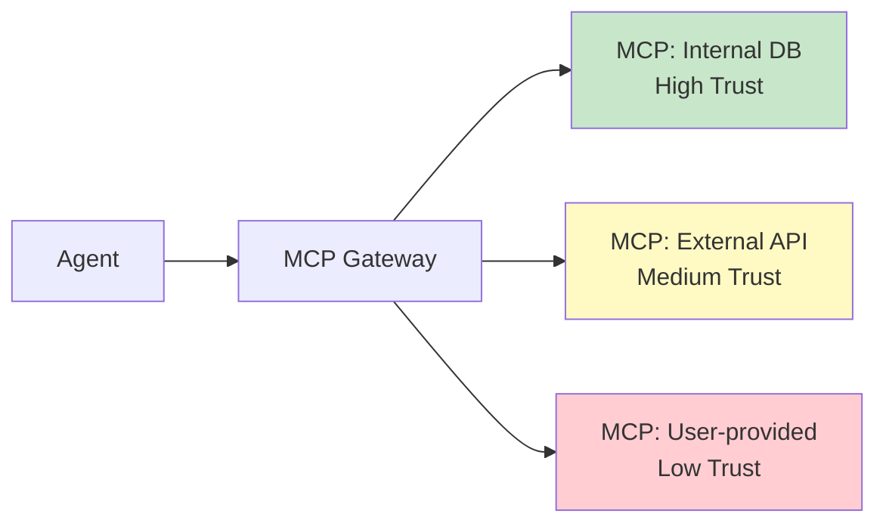

# #21 MCP Adapter Isolation

!!! abstract "TL;DR"
    **Isolate MCP servers (adapters) into independent processes or containers per trust boundary** to prevent lateral movement from compromises.

<!-- BEGIN:GEN:meta -->

Metadata (machine-readable) — #21 MCP Adapter Isolation

| Field | Value |
|------|-----|
| **ID** | 21 |
| **Category** | 04-tools-mcp — Tools, MCP & External System Integration |
| **Forces** | `[F5]`, `[F8]` |
| **Dials** | — |
| **Tradeoffs** | — |
| **Related Patterns** | #17, #20, #41 |
| **When to Use** | Mixed-trust-level adapters (internal DB + external API), PCI-DSS regulated data |
| **When Not to Use** | Single adapter; all at same trust level; isolation cost exceeds benefit |
| **Element Technologies** | Kubernetes Pod/Sidecar, Docker Compose, stdio/SSE MCP transport, Vault, AWS Secrets Manager |

<!-- END:GEN:meta -->

## Overview

What happens if the internal database MCP server and the MCP server connecting to an external third-party API run in the same process? If the external API adapter's vulnerability is exploited, the attacker could gain access to the internal DB's credentials.

This pattern isolates MCP servers with different trust levels, data classifications, and failure domains into separate processes or containers. A gateway ([#17](17-tool-mcp-gateway.md)) handles routing, and each adapter operates only within its own trust boundary.

!!! info "Position in Decision Framework"
    - **Driving Forces**: `[F5]` Input Trustworthiness, `[F8]` Accountability & Regulation
    - **Decision Flow**: [Decision Flow](../../decisions/decision-flow.md)

## Design

The basic separation granularity is per trust level, though regulatory requirements may dictate isolation as fine as one process per MCP server. Each adapter has individually applied network policies, secret scopes, and resource limits.

## Problem Solved

When MCP adapters run in the same process, `[F5]` injection attacks via external API adapters could access internal DB adapter credentials. From the `[F8]` audit perspective, if per-adapter access logs are not separated, responsibility tracing becomes difficult. Furthermore, isolating adapters limits the blast radius during failures.

## When to Use / When Not to Use

- **When to Use**: Suitable for systems connecting multiple MCP servers at different trust levels. Particularly effective when internal data and external services are used from the same agent, or when handling PCI-DSS regulated data.
- **When Not to Use**: Unnecessary when there is only one MCP server, or when all operate at the same trust level and the isolation overhead is not justified.

## Element Technologies

- Container Isolation: Docker Compose, Kubernetes Pod / Sidecar
- MCP official stdio / SSE transport (naturally enables process isolation)
- Network Policies: Kubernetes NetworkPolicy, AWS Security Groups
- Secret Management: Vault, AWS Secrets Manager (scoped per adapter)

## Related Patterns

- [#17 Tool / MCP Gateway](17-tool-mcp-gateway.md) — Handles routing and authorization to isolated adapter groups
- [#20 Sandboxed Tool Runtime](20-sandboxed-tool-runtime.md) — Code execution isolation. Adapter isolation is service-level isolation
- [#41 Tenant-Isolated Agent Runtime](../09-security/41-tenant-isolated-agent-runtime.md) — Combined with tenant-level isolation for defense-in-depth

## References

- MCP Specification (Model Context Protocol) Transport Layer
- Microservice Bulkhead Pattern
