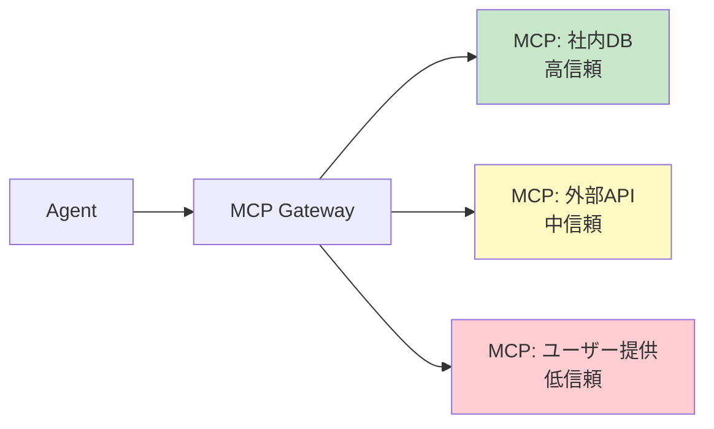

# #21 MCP Adapter Isolation｜MCPアダプタ分離

!!! abstract "一言"
    MCP サーバー（アダプタ）を**信頼境界ごとに独立したプロセス・コンテナに分離**し、侵害の横展開を防ぎます。

<!-- BEGIN:GEN:meta -->

メタデータ（機械可読） — #21 MCP Adapter Isolation｜MCPアダプタ分離

| 項目 | 値 |
|------|-----|
| **ID** | 21 |
| **カテゴリ** | 04-tools-mcp — ツール・MCP・外部システム接続 |
| **フォース** | `[F5]`, `[F8]` |
| **ダイヤル** | — |
| **二者択一** | — |
| **関連パターン** | #17, #20, #41 |
| **向き** | 信頼度が異なるアダプタの混在（内部DB＋外部API）、PCI-DSS規制データ |
| **不向き** | 単一アダプタ; 全て同一信頼レベル; 分離コストが利益を超える |
| **要素技術** | Kubernetes Pod/Sidecar, Docker Compose, stdio/SSE MCP transport, Vault, AWS Secrets Manager |

<!-- END:GEN:meta -->

## 概要

社内データベースのMCPサーバーと、外部の第三者APIを接続するMCPサーバーを同じプロセスで動かしていたらどうなるでしょうか。外部APIアダプタの脆弱性を突かれた場合、攻撃者が社内DBのクレデンシャルまで手に入れてしまう可能性があります。

本パターンでは、信頼レベル・データ分類・障害ドメインの異なる MCP サーバーを個別のプロセスまたはコンテナに分離します。ゲートウェイ（[#17](17-tool-mcp-gateway.md)）がルーティングを担い、各アダプタは自身の信頼境界内でのみ動作します。

!!! info "意思決定上の位置づけ"
    - **必要にするフォース**: `[F5]` 入力の信頼度・`[F8]` 説明責任・規制
    - **意思決定の進め方**: [意思決定の進め方](../../decisions/decision-flow.md)

## 設計

分離の粒度は信頼レベルごとに分けるのが基本ですが、規制要件によっては MCP サーバー1つにつき1プロセスまで細かく分離することもあります。各アダプタにはネットワークポリシー・シークレットスコープ・リソース制限を個別に適用します。

## 解決する課題

MCP アダプタが同一プロセスで動いていると、`[F5]` 外部 API アダプタ経由のインジェクション攻撃によって社内 DB アダプタのクレデンシャルにアクセスされてしまうおそれがあります。`[F8]` 監査の観点でも、アダプタごとのアクセスログが分離されていなければ責任の追跡が困難になります。さらに、アダプタを分離しておくことで、障害時の影響範囲（ブラスト半径）も限定できます。

## 向き / 不向き

- **向き**: 信頼レベルが異なる複数の MCP サーバーを接続するシステムに適しています。特に、社内データと外部サービスを同一エージェントから使う場合や、PCI-DSS などの規制対象データを扱う場合に有効です。
- **不向き**: MCP サーバーが1つだけの場合や、すべて同一の信頼レベルで運用しており、分離の負荷に見合わない場合には不要です。

## 要素技術

- コンテナ分離: Docker Compose, Kubernetes Pod / Sidecar
- MCP 公式の stdio / SSE トランスポート（プロセス分離が自然にできる）
- ネットワークポリシー: Kubernetes NetworkPolicy, AWS Security Groups
- シークレット管理: Vault, AWS Secrets Manager（アダプタごとにスコープ）

## 関連パターン

- [#17 Tool / MCP Gateway](17-tool-mcp-gateway.md) — 分離されたアダプタ群へのルーティングと認可を担う
- [#20 Sandboxed Tool Runtime](20-sandboxed-tool-runtime.md) — コード実行の隔離。アダプタ分離はサービス単位の隔離
- [#41 Tenant-Isolated Agent Runtime](../09-security/41-tenant-isolated-agent-runtime.md) — テナント単位の分離と組み合わせて多層防御を構成する

## 参考

- MCP 仕様（Model Context Protocol）Transport 層
- マイクロサービスの Bulkhead パターン
