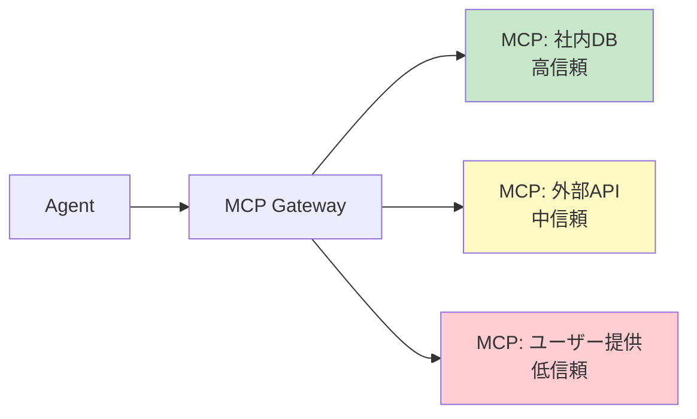

# #21 MCP Adapter Isolation｜MCPアダプタ分離

!!! abstract "一言"
    MCP サーバー（アダプタ）を**信頼境界ごとに独立したプロセス・コンテナに分離**し、侵害の横展開を防ぐ。

## 概要

MCP（Model Context Protocol）はエージェントと外部ツールをつなぐ標準プロトコルだが、すべての MCP サーバーを同一プロセスで動かすと、1つのアダプタの脆弱性や障害が他のアダプタに波及する。本パターンでは、信頼レベル・データ分類・障害ドメインの異なる MCP サーバーを個別のプロセスまたはコンテナに分離する。ゲートウェイ（[#17](17-tool-mcp-gateway.md)）がルーティングし、各アダプタは自身の信頼境界内でのみ動作する。

!!! info "意思決定上の位置づけ"
    - **必要にするフォース**: `[F5]` 入力の信頼度・`[F8]` 説明責任・規制
    - **意思決定の進め方**: [意思決定の進め方](../../decisions/decision-flow.md)

## 設計

分離の粒度は信頼レベルごとが基本だが、規制要件によっては MCP サーバー1つ1プロセスまで細かくする。各アダプタにはネットワークポリシー・シークレットスコープ・リソース制限を個別に適用する。

## 解決する課題

MCP アダプタが同一プロセスで動くと、`[F5]` 外部 API アダプタ経由のインジェクションが社内 DB アダプタのクレデンシャルにアクセスできてしまう。`[F8]` 監査観点でも、アダプタごとのアクセスログが分離されていないと責任追跡が困難になる。アダプタ障害時のブラスト半径も限定できる。

## 向き / 不向き

- **向き**: 信頼レベルが異なる複数の MCP サーバーを接続するシステム。社内データと外部サービスを同一エージェントから使う場合。PCI-DSS 等の規制対象データを扱う場合。
- **不向き**: MCP サーバーが1つだけ、または全て同一信頼レベルで運用負荷に見合わない場合。

## 要素技術

- コンテナ分離: Docker Compose, Kubernetes Pod / Sidecar
- MCP 公式の stdio / SSE トランスポート（プロセス分離が自然にできる）
- ネットワークポリシー: Kubernetes NetworkPolicy, AWS Security Groups
- シークレット管理: Vault, AWS Secrets Manager（アダプタごとにスコープ）

## 関連パターン

- [#17 Tool / MCP Gateway](17-tool-mcp-gateway.md) — 分離されたアダプタ群へのルーティングと認可を担う
- [#20 Sandboxed Tool Runtime](20-sandboxed-tool-runtime.md) — コード実行の隔離。アダプタ分離はサービス単位の隔離
- [#41 Tenant-Isolated Agent Runtime](../09-security/41-tenant-isolated-agent-runtime.md) — テナント単位の分離と組み合わせて多層防御を構成する

## 参考

- MCP 仕様（Model Context Protocol）Transport 層
- マイクロサービスの Bulkhead パターン
