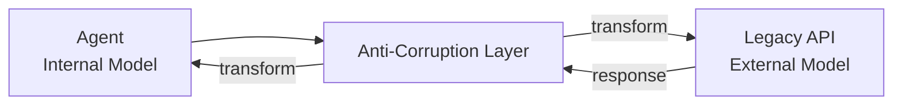

# #22 Anti-Corruption Layer

!!! abstract "TL;DR"
    Introduce a **translation layer** at the connection with legacy systems and external services, preventing the agent's internal model from being contaminated by external concepts, terminology, and constraints.

<!-- BEGIN:GEN:meta -->

Metadata (machine-readable) — #22 Anti-Corruption Layer

| Field | Value |
|------|-----|
| **ID** | 22 |
| **Category** | 04-tools-mcp — Tools, MCP & External System Integration |
| **Forces** | `[F8]` |
| **Dials** | — |
| **Tradeoffs** | — |
| **Related Patterns** | #48, #17, #14 |
| **When to Use** | Legacy system integration, normalizing external API models |
| **When Not to Use** | External model matches internal; transformation overhead is negligible |
| **Element Technologies** | Adapter/Facade pattern, MCP as ACL, Protocol Buffers, GraphQL schema transformation |

<!-- END:GEN:meta -->

## Overview

The legacy ERP calls customer IDs `CUST_NO`, the CRM uses `customer_id`, and the accounting system uses `KNR` — when such disparate naming and data formats flow directly into agent prompts and tool definitions, prompts become bloated and model comprehension accuracy drops.

Anti-Corruption Layer (ACL) is a pattern originating from Domain-Driven Design that inserts a translation layer between external models and the agent's internal model. The agent side deals only with its own domain vocabulary, while the ACL handles bidirectional conversion.

!!! info "Position in Decision Framework"
    - **Driving Forces**: `[F8]` Accountability & Regulation
    - **Decision Flow**: [Decision Flow](../../decisions/decision-flow.md)

## Design

The ACL serves three roles: (1) request transformation (internal to external), (2) response transformation (external to internal), (3) error normalization. External API field name changes or version upgrades are absorbed within the ACL, so the agent's prompts and logic remain unaffected.

## Problem Solved

When legacy system terminology (e.g., the difference between `CUST_NO` and `customer_id`) and data formats (SOAP XML, fixed-length records, etc.) leak into agent prompts and tool definitions, prompts bloat and model comprehension accuracy degrades. From the `[F8]` audit perspective, if agent behavior logs are contaminated with external terminology, they become difficult to interpret when fulfilling accountability requirements. Introducing an ACL blocks change propagation and also facilitates phased legacy modernization ([#48 Strangler Fig](../10-deployment/48-strangler-fig.md)).

## When to Use / When Not to Use

- **When to Use**: Suitable for legacy system integration. Effective when external API models are outside your team's control, or when you want to handle multiple external services uniformly.
- **When Not to Use**: Unnecessary when the external system's model sufficiently matches the agent's internal model and the transformation adds no value.

## Element Technologies

- Adapter Pattern / Facade Pattern (GoF)
- Implement MCP servers as ACL (expose tool definitions in internal model vocabulary, internally transforming to external API)
- Protocol Buffers / GraphQL schema transformation layers
- ETL / data pipeline transformation layers

## Related Patterns

- [#48 Strangler Fig](../10-deployment/48-strangler-fig.md) — A migration strategy using ACL to gradually replace legacy systems
- [#17 Tool / MCP Gateway](17-tool-mcp-gateway.md) — The gateway may embed the ACL, or the ACL may sit behind the gateway
- [#14 Structured Output Contract](../03-io-contract/14-structured-output-contract.md) — ACL output is also contractualized with schemas

## References

- Eric Evans, *Domain-Driven Design*, Chapter 14: Maintaining Model Integrity
- Anti-Corruption Layer Pattern in Microservices (Microsoft Architecture Center)
