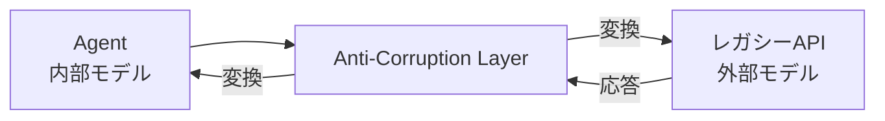

# #22 Anti-Corruption Layer｜アンチコラプション層

!!! abstract "一言"
    レガシーシステムや外部サービスとの接続に**翻訳層**を設け、エージェントの内部モデルが外部の概念・用語・制約に汚染されるのを防ぐ。

<!-- BEGIN:GEN:meta -->

メタデータ（機械可読） — #22 Anti-Corruption Layer｜アンチコラプション層

| 項目 | 値 |
|------|-----|
| **ID** | 22 |
| **カテゴリ** | 04-tools-mcp — ツール・MCP・外部システム接続 |
| **フォース** | `[F8]` |
| **ダイヤル** | — |
| **二者択一** | — |
| **関連パターン** | #48, #17, #14 |
| **向き** | レガシーシステム統合、外部APIモデルの正規化 |
| **不向き** | 外部モデルが内部と一致; 変換オーバーヘッドが無視できる |
| **要素技術** | Adapter/Facade パターン, MCP as ACL, Protocol Buffers, GraphQL スキーマ変換 |

<!-- END:GEN:meta -->

## 概要

レガシーERPでは顧客IDが `CUST_NO`、CRMでは `customer_id`、会計システムでは `KNR` と呼ばれている――こうしたバラバラな命名やデータ形式が、エージェントのプロンプトやツール定義にそのまま流れ込むと、プロンプトが肥大化しモデルの理解精度が下がってしまう。

Anti-Corruption Layer（ACL）はドメイン駆動設計に由来するパターンで、外部モデルとエージェント内部モデルの間に翻訳層を挟む。エージェント側は自分のドメイン語彙だけを扱い、ACL が双方向の変換を担う。

!!! info "意思決定上の位置づけ"
    - **必要にするフォース**: `[F8]` 説明責任・規制
    - **意思決定の進め方**: [意思決定の進め方](../../decisions/decision-flow.md)

## 設計

ACL は (1) リクエスト変換（内部から外部へ）、(2) レスポンス変換（外部から内部へ）、(3) エラー正規化の3つの役割を担う。外部 API のフィールド名変更やバージョンアップは ACL の内部で吸収するため、エージェント側のプロンプトやロジックには影響が及ばない。

## 解決する課題

レガシーシステムの用語（たとえば `CUST_NO` と `customer_id` の違い）やデータ形式（SOAP XML、固定長レコードなど）がエージェントのプロンプトやツール定義に混入すると、プロンプトが肥大化し、モデルの理解精度が低下する。`[F8]` 監査の観点でも、エージェントの行動ログが外部用語で汚染されると、説明責任を果たす際に解読が困難になる。ACL を導入すれば変更の波及を遮断でき、レガシー刷新時の段階的な移行（[#48 Strangler Fig](../10-deployment/48-strangler-fig.md)）も容易になる。

## 向き / 不向き

- **向き**: レガシーシステムとの統合に適している。外部 API のモデルが自チームの制御外にある場合や、複数の外部サービスを統一的に扱いたい場合に有効である。
- **不向き**: 外部システムのモデルがエージェントの内部モデルと十分に一致しており、変換による付加価値がない場合には不要である。

## 要素技術

- Adapter パターン / Facade パターン（GoF）
- MCP サーバーを ACL として実装（ツール定義を内部モデル語彙で公開し、内部で外部 API に変換）
- Protocol Buffers / GraphQL のスキーマ変換層
- ETL / データパイプラインの変換レイヤー

## 関連パターン

- [#48 Strangler Fig](../10-deployment/48-strangler-fig.md) — ACL を使いながらレガシーを段階的に置換する移行戦略
- [#17 Tool / MCP Gateway](17-tool-mcp-gateway.md) — ゲートウェイが ACL を内包するか、ACL がゲートウェイの背後に位置する
- [#14 Structured Output Contract](../03-io-contract/14-structured-output-contract.md) — ACL の出力もスキーマで契約化する

## 参考

- Eric Evans『Domain-Driven Design』Chapter 14: Maintaining Model Integrity
- マイクロサービスにおける Anti-Corruption Layer パターン（Microsoft Architecture Center）
